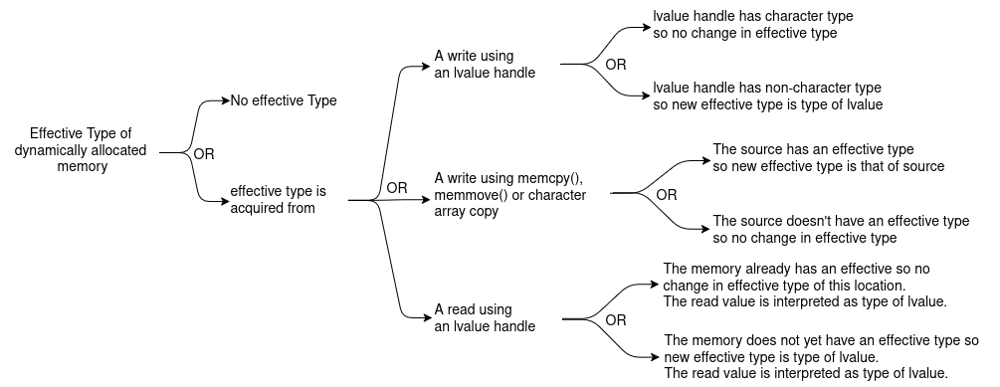
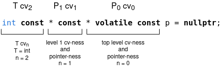
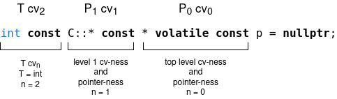
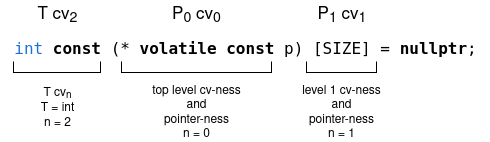
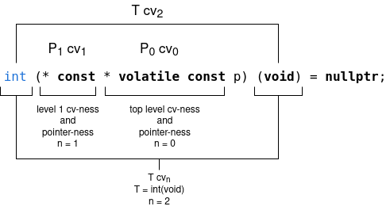

# Aliasing rules and compiler optimisations
- What is aliasing in C/C++?
  - A storage location in memory for a data type is defined through a variable definition
  - This location is labelled and referred to by a symbolic name corresponding to the variables name
  - Aliasing happens when the same location is also labelled and referred to by another symbolic name
    - ```c
      int x = 10;
      int* px = &x;
      printf("%d and %d", x, *px);
      ```
    - Both `x` and `*px` refer to the value `10` at the same memory location
  - Aliasing happens with references as well with just a difference of syntactic notation
    - ```cpp
      int x = 10;
      int& rx = x;
      std::cout << x << " and " << rx;
      ```
    - Both `x` and `rx` refer to the value `10` at the same memory location
  - What are judicious reasons for allowing aliasing?
    - The presence of pointers as a language feature makes aliasing occur naturally in code
      - ```cpp
        int x = 10;
        void func(int* y) {
          // here *y aliases x
        };
        // if func() is called like this
        func(&x);
        ```
      - ```cpp
        struct A{ float f; int i;} a;
        void func(struct A* ap, int* ip) {
          // here ap->i aliases *ip
        };
        // if func() is called like this
        func(&a, &a.i);
        ```
    - Type punning is a valid requirement in some low level code
      - Type punning is interpreting a sequence of bytes as a different type effectively resulting in aliasing
      - This is needed in cases like serialisation, de-serialisation and hardware programming
      - The Berkeley sockets library uses carefully done type punning for mapping a socket to the correct socket type
- What is the problem with aliasing
  - The C and C++ languages have some rules based on the object model and type system
    - Each named object is uniquely identified by its name and no other identifier denotes the same object
    - The addresses of two distinct objects have to be not equal to each other nor equal to `NULL`
    - All objects have a type and their value can only be meaningfully interpreted within that type or a compatible type
    - Every object has a non zero size and its value can be accessed only within the boundary marked by its size
  - Compilers try to optimize away costly memory reads while compiling the source code to object code
    - Compilers try to deduce some results based on the assumption that the above language rules will be followed
    - Aliasing can play foul with this assumption and the optimised object code can give unexpected results
    - In the presence of indiscriminate aliasing compilers have to act paranoid and give up on optimisation opportunities
  - Examples of how aliasing can play foul with optimisations
    - The constant propagation optimisation
      - ```cpp
        extern int a[];
        extern int b[];

        int f(int i, int j)
        {
          int t = a[i];    // #1
          b[j] = 0;        // #2
          return a[i] - t; // #3
        }
        ```
      - Since `a` and `b` are distinct array objects they can not alias each other and the compiler can choose to optimise
        - Line #2 cannot change `a` in any way so line #3 is returning 0 and line #1 is considered dead code
        - ```asm
          Dump of assembler code for function f(int, int):
            0x0000000000001370 <+0>:	endbr64
            0x0000000000001374 <+4>:	movsxd rsi,esi
            0x0000000000001377 <+7>:	lea    rax,[rip+0x2c92]        # 0x4010 <b>
            0x000000000000137e <+14>:	mov    DWORD PTR [rax+rsi*4],0x0
            0x0000000000001385 <+21>:	xor    eax,eax                 # return 0
            0x0000000000001387 <+23>:	ret
          End of assembler dump.
          ```
        - The compiler removes line #1 and optimises the return to 0
      - If either `a` or `b` or both are of type `int *` then this assumption of non-aliasing does not hold
      - ```cpp
        extern int *a; // a and
        extern int *b; // b are pointers now

        int f(int i, int j)
        {
          int t = a[i];    // #1
          b[j] = 0;        // #2
          return a[i] - t; // #3
        }
        ```
      - Now it is allowed for `a` and `b` to both point to the same location and line #2 could actually modify `a`
      - The compiler has to play safe and give up on the earlier optimisation opportunity
        - ```asm
          Dump of assembler code for function f(int, int):
            0x0000000000001380 <+0>:	endbr64
            0x0000000000001384 <+4>:	mov    rax,QWORD PTR [rip+0x2cc5]  # 0x4050 <a> not dead code
            0x000000000000138b <+11>:	mov    rcx,QWORD PTR [rip+0x2cb6]  # 0x4048 <b>
            0x0000000000001392 <+18>:	movsxd rdi,edi
            0x0000000000001395 <+21>:	movsxd rsi,esi
            0x0000000000001398 <+24>:	lea    rax,[rax+rdi*4]
            0x000000000000139c <+28>:	mov    edx,DWORD PTR [rax]
            0x000000000000139e <+30>:	mov    DWORD PTR [rcx+rsi*4],0x0
            0x00000000000013a5 <+37>:	mov    eax,DWORD PTR [rax]
            0x00000000000013a7 <+39>:	sub    eax,edx                     # subtraction
            0x00000000000013a9 <+41>:	ret
          End of assembler dump.
          ```
      - If two function parameters are incompatible type pointers then aliasing between them is not allowed
        - ```cpp
          int f (int *a, long *b)
          {
            int t = *a;      // can be considered as dead code
            *b = 0;          // legally this cannot change *a
            return *a - t;   // can be folded to return zero
          }
          ```
        - The compiler can validly choose to perform the suggested optimisations
        - Now if the function is called with a deliberate aliasing violation like the following
          - ```cpp
            int x = 10;
            std::cout << f(&x, reinterpret_cast<long*>(&x)); // causes UB in the function
            ```
        - The program is not going to perform expected operations resulting in undefined behaviour
          - Since the standard does not specify or preclude any compiler optimisations it cannot define what will happen
    - The loop optimisations
      - If loop variables that are read do not alias those that are written to then values can be register cached
        - ```cpp
          void scan(int *len, float *arr) { // *len and *arr can't alias legally
            float sum = 0.0f;
            for (int i = 0; i < *len; i++) {
              sum += arr[i];
              arr[i] = sum;
            }
          }
          ```
        - Since `*len` is free from aliasing it cannot be modified in the loop and hence is cached in `eax` register
        - ```asm
          Dump of assembler code for function scan(int*, float*):
            0x0000000000001330 <+0>:	endbr64
            0x0000000000001334 <+4>:	mov    eax,DWORD PTR [rdi]            # *len is cached in eax
            0x0000000000001336 <+6>:	test   eax,eax
            0x0000000000001338 <+8>:	jle    0x1362 <scan(int*, float*)+50>
            0x000000000000133a <+10>:	sub    eax,0x1
            0x000000000000133d <+13>:	pxor   xmm0,xmm0
            0x0000000000001341 <+17>:	lea    rax,[rsi+rax*4+0x4]
            0x0000000000001346 <+22>:	cs nop WORD PTR [rax+rax*1+0x0]
            0x0000000000001350 <+32>:	addss  xmm0,DWORD PTR [rsi]
            0x0000000000001354 <+36>:	add    rsi,0x4
            0x0000000000001358 <+40>:	movss  DWORD PTR [rsi-0x4],xmm0
            0x000000000000135d <+45>:	cmp    rsi,rax
            0x0000000000001360 <+48>:	jne    0x1350 <scan(int*, float*)+32>
            0x0000000000001362 <+50>:	ret
          End of assembler dump.
          ```
    - Access to variables that are free from aliasing can be reordered for cache access optimisation
      - In this case if the variables are actually aliasing then this results in incorrect operations
- Strict aliasing rules
  - Aliasing has an inherent conflict between its advantages and drawbacks
  - The standards have categorised some aliasing as permissible and some as prohibited to achieve a reasonable balance
  - This categorisation has been done based on observations of valid and reasonable usage across historical codebases
  - The categorisation is different for the C standard and for the C++ standard
  - Allowed aliasing as per C23 standard
    - Largely the *effective type* of an object is used to categorise which aliasing is ok and which is not
    - Historically around C99 the *effective type* of an object was formalised to address this
    - Understanding *Effective Type*
      - If a storage location has a declared type, then that type is the effective type of the location
        - ```c
          int i; // location &i has effective type int
          struct S {
            int si; // location &(s.si) has effective type int
            float sf; // location &(s.sf) has effective type float
          } s; // location &s has effective type struct S
          ```
        - Effective type of a location with a declared type does not change
      - Dynamically allocated blocks of memory do not have an effective type when they are allocated
      - Their effective type can change over the life time of the allocated block
        - 
        - A write to an allocated block gives its type to the block as the new effective type of the block
          - A write using an lvalue of character type is an exception and does not give its type to the block
          - This is to allow low level bit pattern copying using character types in order to replicate other types
          - This does not mutilate the effective type of the larger types being copied through character copying
        - Similarly, larger type copying can be achieved using `memcpy()` without mutilating the underlying larger type
        - The character types are specified to be simple types that will be suitable for this copying
          - One way of looking at 'No Effective Type' is that it is equivalent to character types
          - It does not have any type specific value representation rules that can otherwise be applicable to other types
        - A read from an allocated block tries to read a value of the type of the lvalue handle used to perform the read
          - This is irrespective of the presence or absence of an underlying effective type of the allocated block
          - If the allocated block does not have an effective type then the lvalue handle type becomes its effective type
    - Understanding *Compatible Type*
      - In the C language if the same type is defined in two different translation units they are considered different
      - This is common when a type definition is placed in a header and included in multiple translation units
        - For the program it is the same type but for the compiler they are different types
      - The concept of compatible type was introduced to support the use of these types interchangeably
      - Two types are compatible if
        - They are the same type with the same name
        - If they are `struct`s, `union`s or `enum` type then all their corresponding members should have
          - The same corresponding name
          - The same compatible types
          - The same alignment specifiers
          - Be in the same order
      - This seems like a concept that has legalese relevance for compilers rather than programmers
    - The C23 aliasing rules
      - The value of an object can be accessed only by an lvalue expression that has one of the following types
        - a type compatible with the effective type of the object
          - ```c
            int x = 1; // for declared objects
            int *p = &x;
            printf("%d", *p); // *p is type compatible with x
            ```
        - a more cv-qualified version of a type compatible with the effective type of the object
          - ```c
            int x = 1;
            const int *p = &x;
            printf("%d", *p); // *p is more cv-qualified int than x
            ```
        - a signed or unsigned version of the effective type of the object
          - ```c
            int x = 1;
            unsigned int *p = (unsigned int *)&x;
            printf("%d", *p); // *p is unsigned version of int x
            ```
        - a combination of above two, more cv-qualified and signed-ness
        - a `struct` or `union` that has a compatible member that can alias in one of above ways
          - ```c
            struct S {
              int x;
            } s;
            void func(struct S *sp, int *ip) {
              // sp->x is allowed to alias *ip
            };
            func(&s, &s.x);
            ```
          - ```c
            union U {
              int i;
              float f;
            } u;
            u.f = 3.14f;       // write to one member
            printf("%d", u.i); // this is permitted aliasing
            ```
          - The following use of union though is not permitted aliasing under C
          - ```c
            int func(int *p, float *q) {
              int t = *p;
              *q = 1.1f;     // assumed to not modify *p
              return t - *p; // can be folded to 0
            }
            union U {
              int i;
              float f;
            } u;
            u.f = 3.14f;      // access through union is allowed
            int *ip = &u.i;   // but not through pointers to union members
            float *fp = &u.f;
            func(ip, fp);     // this causes UB in func
            ```
        - a character type
          - ```c
            int x = 1;
            char *p = (char *)&x;
            printf("%c", *p ); // *p is allowed to alias x
            ```
          - The value printed by `*p` is not portably consistent and depends on hardware endian-ness
          - This special status is given to `char` to allow for low level bit wise copying of larger types
      - An access through any other kind of alias amounts to undefined behaviour
  - Allowed aliasing as per C++23 standard
    - In C++ permitted aliases are defined in terms of *dynamic type* and *type similarity*
    - Understanding *Type Similarity*
      - Any type can be analysed as a sequence of cv-qualified pointer indirections to some basic or user defined type
        - This is defined as a *qualification decomposition* of a type
        - 
        - `p` is a -- const volatile pointer to -- const pointer to -- const int
        - At any level a pointer-ness Pi can be in the form of a pointer to member
        - 
        - `p` is a -- const volatile pointer to -- const member pointer to -- const int
        - At any level a pointer-ness Pi can be in the form of a sized or unsized array
        - 
        - `p` is a -- const volatile pointer to -- sized array of -- const int
        - The order of evaluation is altered due to the presence of parenthesis
        - Here P1 pointer-ness is in the form of a sized array
        - Here cv1, the cv-ness of the array, takes up the value of cv2 which is `const` in this case
        - The final pointed to type can also be a function type
        - 
        - `p` is a -- const volatile pointer to -- const pointer to -- function taking void and returning int
      - Two types T1 and T2 are considered similar if the following requirements hold
        - Their full qualification decompositions have the same levels of pointer/array indirection
        - Their qualification decompositions have all corresponding Pi matching among them
          - If P1i is a pointer to member of C then P2i is also a pointer to member of C
          - If P1i is a sized or unsized array then P2i is also a sized or unsized array
        - The ultimate pointed to type is the same for both qualification decompositions
        - For similarity the above rules ignore cv-qualifications at all levels
        - Following are a few examples
          - ```cpp
            const int * const * p1;
            int * * p2;
            // types of p1 and p2 are similar
            ```
            - Level of indirection is 2 in both cases
            - Pointer-ness matches at all levels
            - Ultimate pointed to target is `int` in both cases
          - ```cpp
            int (* p1)(int *);
            int (* p2)(const int *);
            // types of p1 and p2 are not similar
            ```
            - Ultimate pointed to types `int(int *)` and `int(const int *)` are different function types
              - The two function signatures are semantically distinct for function overloading
          - ```cpp
            int (* p1)(int *);
            int (* p2)(int * const);
            // types of p1 and p2 are similar
            ```
            - Level of indirection is 1 in both cases and both have a pointer at level 0
            - Ultimate pointed to types `int(int *)` and `int(int * const)` are the same function types
              - A `const` modifier on a pass-by-value function parameter is ignored for function overloading
              - A pass-by-value parameter is local to the function body and it's const-ness doesn't affect the caller
      - A more intuitive recursive definition of similarity of types
        - Types T1 and T2 are similar if any one of the following is recursively true
          - Both types are the same
          - Both are pointers and they point to types that are similar
          - Both are same class member pointers and they point to types that are similar
          - Both are arrays and the elements they contain are similar
    - The C++23 aliasing rules
      - The value of an object can be accessed only by a glvalue expression of a type similar to the following
        - The dynamic type of the object
          - ```cpp
            void *p = malloc( sizeof(int) ); // *p does not have a type
            const int *ip = new (p) int{0};  // now *p has dynamic type int
            std::cout << *ip;                // *ip has similar type as the dynamic type of object
            ```
        - Signed or unsigned type corresponding to the dynamic type of the object
          - ```cpp
            void *p = malloc( sizeof(int) ); // *p does not have a type
            int *ip = new (p) int{0};        // now *p has dynamic type int
            const unsigned int *uip = reinterpret_cast<unsigned int *>(ip);
            std::cout << *uip;               // *uip has similar type as the
                                             // unsigned version of dynamic type of object
            ```
        - A `char`, `unsigned char`, or `std::byte` type
          - ```cpp
            void *p = malloc( sizeof(int) ); // *p does not have a type
            int *ip = new (p) int{0};        // now *p has dynamic type int
            unsigned char *ucp = reinterpret_cast<unsigned char *>(ip);
            std::cout << *ucp;               // *ucp has type unsigned char
            ```
          - Aliasing an object of any type with the above character types is ok but the reverse is not
          - ```cpp
            alignas(int) char data[sizeof(int)];      // int aligned char array
            new (data) int{10};                       // create int in char[]
            int *ip = reinterpret_cast<int *>(&data); // illegal aliasing
            std::cout << *ip;                         // this is UB
            ```
      - An access through any other kind of alias amounts to undefined behaviour
  - The aliasing rules for C and C++ broadly say the same thing but have subtle differences
    - In C the rules deal with *effective type* while in C++ they deal with the *dynamic type*
    - In C the type of a block can be changed with a write to the block where as in C++ placement new is required
      - ```c
        // This is legal in C but not in C++
        void *p = malloc(sizeof(float));
        float f = 1.0f;
        memcpy( p, &f, sizeof(float)); // memcpy can be used to copy values

        float *fp = p;
        *fp = 1.0f; // lvalue of float type can be used to write a float
        ```
      - ```cpp
        // C++ requires placement new because new invokes construction semantics
        void *p = malloc(sizeof(float));
        float *fp = new (p) float{1.0f} ; // dynamic type of *p is now float
        ```
      - In C++ object life time rules are also relevant and hence a constructor call is required through `new`
    - Writing to one member of a union and reading from another is valid in C but not in C++
      - ```c
        // this is legal in C but not in C++
        union {
          double d;
          int i;
        } u;

        u.d = 3.0;         // writing to one member of a union and
        printf("%d", u.i); // reading from other member of the union is allowed in C
        ```
      - This is not supported in C++ even if one of the members is `unsigned char[]`
        - Popular compilers support this as an extension but then the code is not portable
- Special aliasing permissions for character types under C and C++
  - The types permitted under C23 to alias other types
    - Under C, the types  `char`, `signed char` and `unsigned char` are called character types
    - These are like raw bits that are interpreted as char encodings
    - All bits participate in value representation of the char encodings
    - No bits are left out or have special meaning
    - No value representation is used as a trap value
    - All distinct bit patterns represent unique encoding values
    - Under C the character types have special permission to alias any other type
      - The standard specifies these to have the capability to read the bit representation of other types
  - The types permitted under C++23 to alias other types
    - Under C++, the types `char`, `unsigned char` and `std::byte` are allowed to read object representations
    - The `signed char` type is considered to be an integer type and hence not included in this list
    - The `unsigned char` type is specified to retain the value bit pattern of any other type
    - This value is restored into an object of the same type when copied from `unsigned char`
    - The `char` type is either signed or unsigned depending on what is most efficient for the platform
    - The `std::byte` type is more suited for holding raw binary data that is not interpreted as any other type
    - Overall the `unsigned char` type is most suitable for aliasing other types for reading the object representation
  - The cost of the aliasing exemption provided to the char types
    - `std::string` is a wrapper for a `char *` that holds the allocation for the string
    - This internal `char *` has the allowance from the standard to alias an object of any other type
    - This causes unexpected loss of optimisation opportunity is cases like the following
      - ```cpp
        int x = 10;
        int f(std::string &str) {
            int t = x;
            str = "";     // assumed to alias x
            return t - x; // not folded to zero
        }
        ```
      - A write to `std::string` is assumed by the compiler to possibly alias any other object
      - ```asm
        Dump of assembler code for function f(std::string&):
          0x00000000000014f0 <+0>:	endbr64
          0x00000000000014f4 <+4>:	mov    rdx,QWORD PTR [rdi]
          0x00000000000014f7 <+7>:	mov    eax,DWORD PTR [rip+0x2b13]  # 0x4010 <x> read once
          0x00000000000014fd <+13>:	mov    QWORD PTR [rdi+0x8],0x0
          0x0000000000001505 <+21>:	mov    BYTE PTR [rdx],0x0
          0x0000000000001508 <+24>:	sub    eax,DWORD PTR [rip+0x2b02]  # 0x4010 <x> read again
          0x000000000000150e <+30>:	ret
        End of assembler dump.
        ```
  - Even though types `int8_t` and `uint8_t` are different from `char` they may be implemented using `char`
    - Depending on how these are implemented, these may behave like `char`
    - Since `char` is allowed to legally alias other types this can cause surprising de-optimisations
- Type punning and the correct way to do it in C++
  - Traditionally type punning has been done using pointer casting to the target type and then dereferencing it
    - Under C++ this runs into undefined behaviour due to various reasons if not done carefully
      - Violation of aliasing rules
        - ```cpp
          static_assert(sizeof(float) == sizeof(int));
          int x = 1;
          float *fp = reinterpret_cast<float*>(&x); // Not legal aliasing
          std::cout << *fp; // this is UB due to illegal aliasing
          ```
        - Due to illegal aliasing the optimiser might optimise the operations around, and this may not work as expected
      - Object lifetime rules
        - ```cpp
          struct S { float f;};
          static_assert(sizeof(S) == sizeof(int));
          int x = 1;
          S *sp = reinterpret_cast<S*>(&x); // This does not construct an S object
          std::cout << sp->f; // dereferencing a member outside the objects life time is UB
          ```
      - Data alignment rules
        - ```cpp
          static_assert(sizeof(char[4]) == sizeof(int));
          char c[4] = {0x0F, 0x00, 0x00, 0x00}; // this can be aligned on any boundary
          int *ip = reinterpret_cast<int*>(&c); // also illegal aliasing
          std::cout << *ip; // this is UB as char alignment may not be suitable for int
          ```
        - Misaligned data access can actually raise errors on some platforms
      - Value representation rules
        - ```cpp
          static_assert(sizeof(float) == sizeof(int));
          int x = get_some_int();
          float *fp = reinterpret_cast<float *>(&x); // bits of every int may not make a valid float
          std::cout << *fp; // this float dereference is UB
          ```
        - On most platforms `int` is 2's compliment and `float` is IEEE 754, so reinterpretation may work
        - But the value representations of types is not specified by the standard
        - Some platforms may have `float` with trap representations which may actually cause an error
  - The correct way to achieve different use cases of type punning in C++
    - The C++ standard needs some work before it can fully support all kinds of type punning
      - As of now some scenarios are supported with some interpretational push and pull of the wordings of standard
      - There are still some explicit holes that need to be plugged and proposals are in process
      - Using `union` and reading the inactive member for type punning is undefined behaviour under C++
      - Using `reinterpret_cast<unsigned char *>` for type punning is also undefined behaviour under C++
      - Most compilers will still practically support type punning use cases as custom extensions
    - Generally the safe way to achieve the results of type punning is to use `memcpy()`
      - This is technically not type punning but achieves the same result by copying memory contents around
        - It does not treat the memory of one type as another type so it is not pure type punning
        - Pure type punning does not go well with the C++ object model and its rules
      - Even though this is a copy operation, it actually does not end up doing a copy in most cases
      - This is an idiomatic pattern that compilers recognize and generate optimised code for type reinterpretation
        - ```cpp
          static_assert(sizeof(double) == sizeof(long));
          double d = 3.14;
          long l;
          std::memcpy(&l, &d, sizeof(double));
          std::cout << l;
          ```
        - This is still not completely free of all impediments and pit falls of possible undefined behaviour
          - Since separate allocations are made aliasing is not involved and alignment is taken care of
          - Issues related to object lifetime and valid value representation still lurk around
      - The standard supports copying around of object bit representation while maintaining object semantics
        - This is supported for trivially copyable objects
        - The bit copying is supported via array of `char`/`unsigned char`/`std::byte` of same size as the object
        - When this bit representation is restored into the object it's original value is restored
      - Under C++20 `std::bit_cast()` was introduced to handle such cases of type punning
        - This is essentially a templated wrapper around `memcpy()` enabled if some conditions hold
        - The `sizeof` of the source and target types should be equal
        - The source and target types should be trivially copyable
        - The target type has to have a value representation for all value bit patterns of the source type
          - Casting between `float` and `int` works on platforms where floats are IEEE 754 and ints are 2's compliment
          - Casting `char *` to `int *` is not generally valid as a valid `int *` needs a modulo 4 address
        - `std::bit_cast()` semantically returns a separate object with the same bit pattern eliminating aliasing
          - The optimiser may be able to eliminate the memory copy operation but rules wise it is still a different object
    - Type punning is typically employed in four kinds of use cases
      - The need to use the bits of one type as another type
        - This has utility in implementing fast algorithms with bit hacks
        - The most popular example is fast inverse sqrt used in graphics rendering applications
        - ```cpp
          float InverseSquareRoot_with_UB(float x)
          {
            float xhalf = 0.5f * x;
            int32_t i = *(int32_t *)&x; // this is illegal aliasing and UB
            i = 0x5f3759df - (i >> 1);
            x = *(float *)&i; // this again is illegal aliasing and UB
            x = x * (1.5f - xhalf * x * x);
            return x;
          }
          ```
        - The safest way to do this under C++ is to use `memcpy()` and under C++20 `std::bit_cast()` can be used
        - ```cpp
          float InverseSquareRoot(float x)
          {
            const auto xhalf = 0.5f * x;
            auto i = std::bit_cast<uint32_t>(); // use of bit_cast in place of C style cast
            assert(sizeof(x) == sizeof(i));
            i = 0x5f375a86 - (i >> 1);
            x = std::bit_cast<float>(i); // use of bit_cast in place of C style cast
            x = x * (1.5f - xhalf * x * x);
            return x;
          }
          ```
        - `std::bit_cast()` has use where one live object's bits are to be used to create another live object
          - The lifetimes of both source and destination objects remain active after the call
      - De-serialise raw bytes to some known type
        - Most common scenario for this is converting a network byte stream to some `struct`
        - ```cpp
          void process(Stream *stream) {
            std::unique_ptr<char[]> buffer = stream->read();
            if (buffer[0] == WIDGET) {
              processWidget(reinterpret_cast<Widget *>(buffer.get())); // this is UB
            }
          }
          ```
        - Typical impediment in this case is undefined behaviour due to object life time rules
          - A `Widget` object does not start its life time automatically in place of a `char[]`
          - Also alignment requirement of the larger type is an issue
        - Under C++23 this use case is specifically enabled through `std::start_lifetime_as()`
          - It supports implicit creation of objects by some special functions including `malloc()`
          - It requires that the memory has suitable alignment
          - ```cpp
            void process(Stream *stream) {
              std::unique_ptr<char[]> buffer = stream->read();
              if (buffer[0] == WIDGET) {
                processWidget(std::start_lifetime_as<Widget>(buffer.get())); // requires C++23
              }
            }
            ```
          - Stream buffers are typically dynamically allocated and have alignment of `std::max_align_t`
          - `std::start_lifetime_as()` has use where the same memory block has to be used as a new live object
            - Once the new object is live the older object's life time is considered to have ended
            - Accessing the older object from its lvalue expression can amount to undefined behaviour
        - This use case can also be covered using `std::bit_cast()` with an intermediate `struct` hack
          - The following is an approach to construct an `unsigned int` from an array of `unsigned char`
          - ```cpp
            static_assert(sizeof(unsigned int) == 4);

            // the intermediate struct
            struct four_chars {
              unsigned char arr[4] = {};
            };

            unsigned int cast_to_uint(unsigned char *p) {
              four_chars f;
              std::memcpy(f.arr, p, 4);
              unsigned int result = bit_cast<unsigned int>(f);
              return result;
            }
            ```
      - Accessing object representations - objects to byte[]
        - A reasonable use case for this is to implement a hex viewer for object memory
        - The usual way to do this is to alias the object with an `unsigned char *`
        - ```cpp
          void printBitRepresentation(float f) {
            auto * buf = reinterpret_cast<unsigned char *>(&f); // this aliasing is allowed
            for (int i = 0; i < sizeof(float); ++i)
              std::cout << buf[i]; // but this is UB
          }
          ```
        - The standard does not guarantee that `buf` points to the first byte of the representation of the object
        - Also since no array exists at `buf` doing pointer arithmetic to access the bytes is also undefined behaviour
        - This case has to be handled with an explicit `memcpy()` call
        - ```cpp
          void printBitRepresentation(float f) {
            unsigned char buf[sizeof(float)];
            std::memcpy(&buf, &f, sizeof(float));
            for (auto c : buf)
              std::cout << c;
          }
          ```
        - We can not use `std::bit_cast()` here as a C-style array can not be returned from a function in C++
        - This is a use case that is well supported by compilers and has no problems to be supported
        - P1839R7 is a proposal in process for handling this by fixing the standard wording
      - Map the bits of one type to another set of types with matching representations
        - A use case for this could be converting an array of floats to SIMD structures for vectorised processing
          - ```cpp
            struct __m128 { /* four floats in an SIMD pack */ };
            void processBlock(float * data) {
              auto * simdBlock = reinterpret_cast<__m128 *>(data); // this is illegal aliasing
              processVectorised(simdBlock); // resulting in UB here
            }
            ```
          - As of now this case also has to be covered by by `memcpy()`
        - This kind of use case is specifically supported by the standard for `std::complex<T>` but not in general
          - An `std::complex<T>` can be cast to `T[2]` since there is actually an array of two `T` in `std::complex`
          - An array of `std::complex<T>` can also be cast to `T[]` as this is specifically supported by the standard
        - But in general this is not yet supported by the standard for user defined types
- Special aliasing permission for common initial sequence of union in C++
  - Normally in a union, access is permitted only for the active member
    - Accessing the non-active member is undefined behaviour making union unusable for type punning
  - A valid use of unions in C++ is for discriminated unions
    - ```cpp
      enum class DataType { CHAR, INT, FLOAT };

      struct DiscriminatedUnion {
        DataType tag;
        union {
          char c_val;
          int i_val;
          float f_val;
        } data;
      };
      ```
    - `tag` is used to identify the active member of the union so that only correct accesses are made
    - But depending on the platform requirement, padding can creep up between `tag` and `data`
  - Common Initial Sequence
    - This is a shared property of a set of structs and is the list of initial layout compatible fields among them
    - The fields in the common initial sequence have layout-compatible types with same alignment requirements
    - Access to the common initial sequence fields is allowed even from the inactive members of the union
  - The special concession for common initial sequence fields allows us to pull the discriminator tag into the union
    - ```cpp
      enum class DataType { CHAR, INT, FLOAT };

      // tag is the common initial sequence between following structs
      struct Char_T { DataType tag; char val; };
      struct Int_T { DataType tag; int val; };
      struct Float_T { DataType tag; float val; };

      union U {
        Char_T t1;
        Int_T t2;
        Float_T t3;
      };
      U u = {.t3 = {DataType::FLOAT, 3.14f}}; // t3 is the active member of u

      if (u.t1.tag == DataType::CHAR) {} // access to tag via t1 is allowed
      ```
- Detecting strict aliasing violations
  - Aliasing detection and analysis is a complex task and no single tool can do a perfect job as yet
  - Most tools do a partial detection job with false positives and false negatives
  - GCC option and warnings
    - GCC provides the optimisation option `-fstrict-aliasing`
    - The `-fstrict-aliasing` option is enabled at optimisation levels `-O2`, `-O3`, `-Os`
    - This assumes that strict aliasing rules are followed and enables the optimisations that take advantage of this assumption
    - GCC provides the warning option `-Wstrict-aliasing`
    - This is enabled as part of the `-Wall` option
    - The warning option works in conjunction with the optimisation option
    - The warning option has levels that can be set `-Wstrict-aliasing=n`
      - `1` - Most aggressive; can have lots of false positives/negatives; useful if other levels are not catching errors
      - `2` - Faster than the default; may have some false positives/negatives
      - `3` - The default; takes time for the rigorous analysis; least false positives/negatives
  - Address Sanitiser
    - When compiled with clang the option `-fsanitize=address` enables the address sanitiser
    - This detects misaligned loads and stores and these can be an indicator of incorrect aliasing
- Bye-passing the strict aliasing rules
  - The standard requires that the strict aliasing rules be followed and provides no means of bye-passing them
  - Some compilers do provide options to tell the compiler that the code does not follow strict aliasing rules
    - This can be useful in practical cases where legacy code is known to not follow them
    - Using these is not recommended for newer code as there are alternative ways of achieving the intended goal
  - GCC option `-fno-strict-aliasing`
    - The default optimisation level for GCC is `-O0` where `-fstrict-aliasing` is not turned on
    - If an optimisation level of `-O2` or higher is requested this turns on `-fstrict-aliasing`
    - If the code gives unexpected results at this level then option `-fno-strict-aliasing` is used for diagnostics
    - This makes the compiler avoid assumptions regarding non-aliasing of objects of different types
    - This causes loss of optimisation opportunity for the compilation unit
    - The option does not give up all assumptions of non-aliasing so this also has to be used carefully

### References:
1. [Aliasing](https://en.wikipedia.org/wiki/Aliasing_(computing))
1. [C23 Standard](https://www.open-std.org/jtc1/sc22/wg14/www/docs/n3220.pdf)
1. [C++23 Standard](https://www.open-std.org/jtc1/sc22/wg21/docs/papers/2023/n4950.pdf)
1. [Objects and alignment](https://en.cppreference.com/w/c/language/object.html)
1. [Understanding Effective Type Aliasing in C](https://www.open-std.org/jtc1/sc22/WG14/www/docs/n3519.pdf)
1. [What is the Strict Aliasing Rule and Why do we care?](https://gist.github.com/shafik/848ae25ee209f698763cffee272a58f8)
1. [Understanding C/C++ Strict Aliasing](http://dbp-consulting.com/tutorials/StrictAliasing.html)
1. [Rationale for ANSI C](https://www.open-std.org/jtc1/sc22/wg14/www/C99RationaleV5.10.pdf)
1. [What is a composite type in C?](https://stackoverflow.com/questions/16417928/what-is-a-composite-type-in-c)
1. [Type punning](https://en.wikipedia.org/wiki/Type_punning)
1. [When are type-punned pointers safe in practice?](https://stackoverflow.com/questions/50870581/when-are-type-punned-pointers-safe-in-practice)
1. [Implicit conversions](https://en.cppreference.com/w/cpp/language/implicit_conversion.html)
1. [Violating of strict-aliasing in C, even without any casting?](https://stackoverflow.com/questions/39757658/violating-of-strict-aliasing-in-c-even-without-any-casting)
1. [strict-aliasing](https://gcc.gnu.org/onlinedocs/gcc/Optimize-Options.html#index-fstrict-aliasing)
1. [Aliasing through unions](https://stackoverflow.com/questions/55254998/aliasing-through-unions)
1. [Strict Aliasing and Unions in C](https://stackoverflow.com/questions/79091407/strict-aliasing-and-unions-in-c)
1. [Type accessibility](https://en.cppreference.com/w/cpp/language/reinterpret_cast.html#Type_aliasing)
1. [C++ Character types](https://en.cppreference.com/w/cpp/language/types.html)
1. [What is the purpose of std::byte?](https://stackoverflow.com/questions/47481231/what-is-the-purpose-of-stdbyte)
1. [Using this pointer causes strange deoptimization in hot loop](https://stackoverflow.com/questions/26295216/using-this-pointer-causes-strange-deoptimization-in-hot-loop)
1. [Why does std::memcpy not cause undefined behaviour?](https://stackoverflow.com/questions/58209852/why-does-stdmemcpy-as-an-alternative-to-type-punning-not-cause-undefined-beh)
1. [Type punning in modern C++ - Timur Doumler](https://www.youtube.com/watch?v=_qzMpk-22cc)
1. [What's a proper way of type-punning a float to an int and vice-versa?](https://stackoverflow.com/questions/17789928/whats-a-proper-way-of-type-punning-a-float-to-an-int-and-vice-versa)
1. [Is reinterpret_cast type punning actually undefined behavior?](https://stackoverflow.com/questions/53995657/is-reinterpret-cast-type-punning-actually-undefined-behavior)
1. [Can you std::bit_cast to a std::array to obtain the bytes of an object?](https://stackoverflow.com/questions/58320316/can-you-stdbit-cast-to-a-stdarray-to-obtain-the-bytes-of-an-object)
1. [Accessing object representations](https://www.open-std.org/jtc1/sc22/wg21/docs/papers/2025/p1839r7.html)
1. [How to use bit_cast to type pun a unsigned char array](https://gist.github.com/shafik/a956a17d00024b32b35634eeba1eb49e)
1. [Any useful difference between std::bit_cast and std::start_lifetime_as?](https://stackoverflow.com/questions/58254009/any-useful-difference-between-stdbit-cast-and-stdstart-lifetime-as)
1. [common initial sequence](https://eel.is/c++draft/class.mem#general-27)
1. [The joys and perils of C and C++ aliasing](https://developers.redhat.com/blog/2020/06/02/the-joys-and-perils-of-c-and-c-aliasing-part-1)
1. [The joys and perils of aliasing in C and C++](https://developers.redhat.com/blog/2020/06/03/the-joys-and-perils-of-aliasing-in-c-and-c-part-2)
1. [constant folding and constant propagation](https://en.wikipedia.org/wiki/Constant_folding)
1. [Loop optimization](https://en.wikipedia.org/wiki/Loop_optimization)
1. [Optimization and Strict Aliasing](https://gcc.gnu.org/onlinedocs/gcc-4.8.4/gnat_ugn/Optimization-and-Strict-Aliasing.html)
1. [Does this really break strict-aliasing rules?](https://stackoverflow.com/questions/27003727/does-this-really-break-strict-aliasing-rules)
1. [What optimizations does the strict aliasing rule facilitate?](https://langdev.stackexchange.com/questions/2998/what-optimizations-does-the-strict-aliasing-rule-facilitate)
