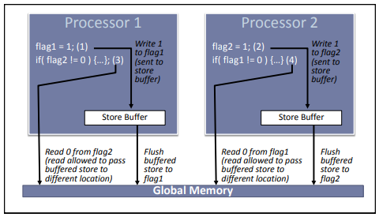
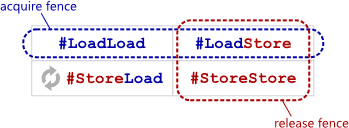
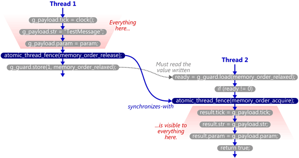
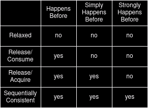
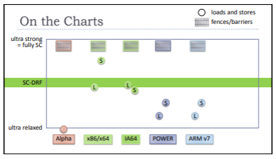
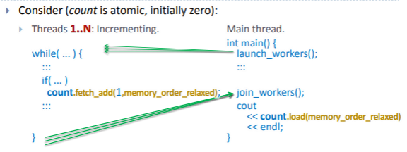
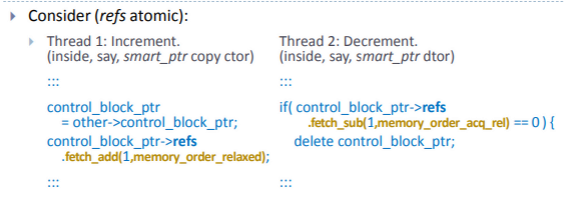

# Understanding concurrency and memory ordering

## The reality of hardware and code execution
- The model of a machine that programmers code for is simple
  - One or more cores attached to main memory
  - Code executes in program order
  - Memory operations from multiple cores occur one at a time
  - Multiple cores accessing shared memory interleave predictably due to mutexes
- Hardware does not execute code in the written program order
  - Code in execution is reordered for performance
    - Running code in source code order is bad for processor throughput
      - Memory access is slow so having many of them lined up is efficient
      - Code can be executed ahead of time to optimise throughput 
      - Processor reorders the code to achieve optimal performance
    - Compilers and processors reorder code while maintaining the as-if rules
      - The code of each thread appears to execute in source code order
      - Multithreaded execution is some sequentially consistent interleaving of the multiple threads of execution
      - All memory writes are atomically and globally visible simultaneously to all processors
      - The observable behaviour of the program does not change
      - Volatile memory accesses are made strictly as per source code ordering
      - Data written to files is the same as it would be written if code is executed in source code order
      - Prompt data written to interactive devices is written before input is read from the device
      - The requirements to maintain these illusions are collectively called the as-if rule
      - All restrictions of the as-if rule are applicable only to valid programs with no UB
      - Also the as-if rule is relaxed for copy/move elision
    - The code reordering done by compilers is visible in the assembly code
    - Generally it is not possible to observe code reordering in the processor (SC-DRF compliant)
      - Processor does it keeping the illusion of source order for each thread
      - It also maintains sequential consistency across threads 
      - In correct, data race free, sequentially consistent code, reordering is not observable
      - Code reordering is only observable as reordering of memory operations when dealing with lock free programming
      - Correct lock free programming manages this reordering by putting just enough restrictions on it
  - Compiler optimisations can reorder, introduce or remove code
    - Sub-expression elimination - pre-compute an expression
    - Loop optimisations - change nesting or access patterns
    - Register allocation - promoting a variable to register
  - The processor can reorder code
    - Prefetch - getting data and instructions to cache before required
    - Speculative execution - execute code before hand
    - Overlap writes - fire multiple writes before completion of previous writes
  - Memory operations can get reordered because of cache effect
    - Memory is organised in cache hierarchy because main memory is slow compared to the CPU
    - Each core has a store buffer to buffer writes as writes are more costly
    - Caches are maintained typically in memory blocks called cache lines
    - Cache coherency
      - Requirement to keep all cached copies of shared data in sync
      - Propagation of writes across all cache copies
      - All cores should see the same serialisation of shared memory operations
      - Coherency is maintained by the processor hardware
  - Reordering of memory operations is real and unavoidable
    - Processors maintain the illusion of in order execution for one thread
      - Control and data dependency can be detected for one thread
      - The required dependency is maintained as part of the illusion
    - Semantic ordering requirements between cross thread shared memory accesses is not detectable by the processor
      - 
      - The ordering association between writing of flag1 and reading of flag2 is not known to a single processor
      - Even without compiler and other processor re-orderings, just the presence of a write buffer can reorder memory access
  - The programmer needs to tell the compiler to prevent unwanted reordering of shared memory access by using mutexes and atomics
    - Any synchronisation puts restrictions on and works against the useful optimisations done by the processor
    - We should use minimal restrictions to express the required correctness semantics
  - Debugger view concept to understand data race and re-orderings
    - Threads will run their code any way they like and we don't get to know because the sequential consistency illusion is maintained
    - Only when a debugger is running and watching the threads execution we get to observe the seemingly weird code modifications done by the thread
    - The debugger thread creates a data race with every variable that is being watched and thus the sequential consistency illusion is broken
- Abstract machine definition used for providing a language specification
  - Different real hardware architectures have differing features and behaviours for code execution
    - For the purpose of providing a specification the C++ standard defines a parameterized nondeterministic abstract machine
    - The expected behaviour is defined against this abstract machine
    - Real hardware implementations are expected to mimic this abstract machine behaviour as per the as-if rule
  - Properties of the abstract machine
    - Implementation defined behaviour
      - These are the parameters of the abstract machine that each implementation has to provide
      - The behaviour for these is expected to differ across different implementations
      - Common examples are `sizeof(char)`, `sizeof(int)`, `sizeof(long)`
    - Unspecified behaviour
      - Some aspects of the language specification are left unspecified by the standard
      - Implementations are free to adopt one of the multiple options available for themselves
      - These make the abstract machine's behaviour non-deterministic allowing more than one possible executions
      - One example is the order of evaluation of function arguments
    - Undefined behaviour
      - Many aspects of the language specification are reasonably disallowed erroneous behaviours
      - Exactly what happens if this erroneous behaviour is reached is left undefined
      - An example is modifying a const object
  - Implementations that conform to the standard are expected to behave as follows
    - Implementations have to conform to the abstract machine's observable behaviour
    - This requires emulating one of the possible ways in which the execution of the abstract machine may proceed
    - If this execution runs into an undefined behaviour then no requirements are enforced on the implementation
    - The observable behaviour includes
      - Results of volatile variable access that is required to follow source code order
      - Results of stream input and output like file read/write or device read/write


## Basic terms to understand
- Side effect
  - The term is carried from the world of functional versus imperative languages
  - An expression or function evaluation can do the following things
    - Compute or evaluate to a value 
    - Affect other changes to the execution environment
  - Changes that persist beyond the evaluation of the expression are called side effects
  - Pure functional languages do not allow side effects
  - ```cpp
    int foo(int a, int b) { return a + b; } // has no side effects
    ```
  - ```cpp
    int bar(int &a, int &b) { return ++a + b; } // has side effects
    ```
- Data race
  - One memory location is accessed by two threads and at least one is writing to it
  - The memory location is not atomic and involves multi step writing/reading that can be interrupted mid way
  - Both threads access the location simultaneously which means there is no defined ordering between the accesses
  - A data race can cause torn reads and writes resulting in UB
- Modification order of an atomic
  - All writes from all threads that happen to an atomic variable are visible to all threads in that same order
  - These writes maintain their modification order visibility even if relaxed memory ordering is used
  - Atomics are implemented with special locked instructions that enforce this modification order
  - These locked instructions enforce the minimal requirements for atomic operations
    - Operations are atomic and cannot be partially done by being interrupted mid way
    - Data races with torn reads and writes don't happen
    - Memory locations are read and written directly without depending on cache for performance
    - Memory bus locks are taken to prevent concurrent modifications
    - Concurrent operations happen one after the other and enforce a clear modification total order
    - Total modification order of one atomic variable is maintained across all threads
  - Total order of modification across threads implies the following
    - Not necessarily every thread sees every modification as that depends on read and write timing
    - Not every thread sees the modifications necessarily at the same time as the relative order is relevant not timing
    - The standard doesn't require atomic writes to be visible to cross thread atomic reads instantaneously
    - The standard just recommends that atomic writes should be visible to atomic reads within a reasonable amount of time
    - If a thread sees two values in a certain order then other threads that see both values will see them in the same order
  - The modification order is a concept that is used to define constraints on value visibility across threads
    - Implementations may not necessarily track an explicit modification order
    - Conceptually in a scenario with many writes and very few reads, multiple distinct modification orders can be valid
    - The modification order is better seen as a post execution static conceptual construct
      - Seeing it as a construct that is incrementally formed at runtime is prone to misinterpretations
  - The implicit total modification order applies only to one atomic variable
    - A common total modification order across multiple atomic variables is expensive to maintain
    - This is maintained across all `memory_order_seq_cst` accesses to all atomic variable
- Sequenced before
  - A relation between expression evaluations that specifies execution precedence between them
    - This is applicable only within the context of a single thread of execution
    - Pre C++11 this relation was expressed in terms of 'sequence points'
  - If expression evaluation A is *sequenced before* B then execution of A precedes execution of B
    - The relation is asymmetric and transitive
    - The relation is deduced from the source code order of expressions
    - This defines the observed behaviour of a thread of execution that has to be maintained by the as-if rule
    - This is a relation that is established at compile time and is honoured at run time by the as-if rule
  - Un-sequenced expression evaluations
    - It is possible that neither A nor B is *sequenced before* each other
    - Within the same thread the execution of A and B can overlap
    - The compiler can interleave the instructions that A and B compile to
    - ```cpp
      a + b // the expressions a and b may be evaluated overlapped
      ```
  - Indeterminately sequenced expression evaluations
    - In some cases the sequencing between A and B is unspecified
    - Execution of A and B expressions cannot overlap, but A and B can execute in any order
    - ```cpp
      f(a++, b--) // since C++17 either a++ or b-- can execute first
      ```
  - Un-sequenced evaluations that modify the same memory location constitute UB
    - ```cpp
      int j = ++i + i++; // this is undefined behaviour
      ```
    - `++i` and `i++` can potentially be processed simultaneously in pipelined CPUs
- Carries dependency to
  - A relation between expression evaluations that identifies data dependency between them
    - A subset of *sequenced before* relations are also *carries dependency to* relations
    - This is also applicable only within the context of a single thread of execution
    - This is a relation that is established at compile time and is honoured at run time by the as-if rule
  - If expression evaluation A *carries dependency to* B then execution of B is data dependent on execution of A
  - Execution of B is data dependent on execution of A under following conditions
    - If evaluation of B reads a scalar value that evaluation of A has written
    - If evaluation of B uses the value of A as an operand
      - This excludes logical operators (`||`, `&&`, `?:`) as they constitute control dependency not data dependency
      - This excludes use of `std​::​kill_dependency()` as this is specifically used to eliminate dependency
    - If A and B are transitively related via another intermediate evaluation X
- Synchronizes with
  - A relation between two operations in two different threads
    - Majority of operations across different threads have no implicit relation and provide no mutual ordering guarantees
    - Some operations are special and they have the capability to synchronize across threads
    - *Synchronizes with* is a runtime relation that establishes and enforces it's guarantees at run time
    - If operation A in thread TA *synchronizes with* operation B in thread TB then
      - All values written in TA before A are guaranteed to be visible to all operations after B in TB
    - The *synchronizes with* relation is a special case of *happens before* relation that occurs across threads
  - Operations that establish a *synchronizes with* relation
    - Mutex operations
      - A mutex unlock operation in thread A *synchronizes with* a mutex lock operation in thread B
      - The effect of the critical section operations in thread A are visible in thread B's critical section after the lock succeeds
      - Which thread locks the mutex after which thread's unlock is determined at run time
      - The requirements to make the changes visible across threads is also determined at runtime
    - Thread operations
      - A thread constructor on the spawning thread *synchronizes with* the first operation of the thread function on the newly created thread
      - The last operation of the thread function *synchronizes with* the return of `join()` function on the thread that joins with this thread
    - Atomic operations
      - Atomic operations with specific memory orders establish *synchronizes with* relations
      - A release operation is an atomic operation with `memory_order_release`, `memory_order_acq_rel` or `memory_order_seq_cst`
      - An acquire operation is an atomic operation with `memory_order_acquire`, `memory_order_acq_rel` or `memory_order_seq_cst`
      - A consume operation is an atomic operation with `memory_order_consume`
        - The specification for `memory_order_consume` is under review and it is recommended to use `memory_order_acquire` instead
        - `memory_order_consume` is more complex to use correctly with not enough performance gain
        - `memory_order_acquire` provides stronger guarantees than `memory_order_consume` and is semantically safer
        - Current implementations on most platforms give no practical performance benefit for `memory_order_consume`
      - A store release operation A on thread TA *synchronizes with* a load acquire operation B on thread TB
        - If B reads the value written by A
        - If B reads a value written in the release sequence of A
      - Relaxed atomic operations do not establish a *synchronizes with* relation
    - Atomic fences
      - Atomic fences with release and acquire semantics also establish *synchronizes with* relations
      - A release fence A on thread TA *synchronizes with* an acquire fence B on thread TB
        - If an atomic read operation before B in TB reads a value written by an atomic write operation X after A in TA
        - If there is a chain of atomic read-modify-write operations headed by X, one of whose value is read by B in TB
      - A release fence A on thread TA *synchronizes with* a read acquire operation B on thread TB
        - If B in TB reads a value written by an atomic write operation X after A in TA
        - If there is a chain of atomic read-modify-write operations headed by X, one of whose value is read by B in TB
      - A write release operation A on thread TA *synchronizes with* an acquire fence B on thread TB
        - If an atomic read operation before B in TB reads a value written by A or it's release sequence
    - Thread and mutex operations unconditionally establish *synchronizes with* relations
    - Atomic operations and fences conditionally establish *synchronizes with* relations
- Release sequence
  - Release sequence is relevant in the case of release/acquire synchronization on an atomic variable
    - There are scenarios where an older store release would need to synchronize with a much later load acquire
    - Release sequence allows for intervening modification operations on the atomic to not break this synchronization
    - Read-modify-write operations that read a variable and then modify it based on the read value capture semantic chaining of values
      - E.g. maintain a counter with increments and decrements without losing count
      - E.g. logical OR multiple flags in a status word as flags are set one by one
      - If all intervening operations are read-modify-write then this chain maps to the variable's total modification order
      - A read-modify-write operation on any thread always reads the write from the last read-modify-write operation that completed before this one gets to start
      - A read-modify-write operation is also atomic making it uninterruptible and indivisible between the read and write
      - The limited and stricter modification required for semantic value chaining is well represented by read-modify-write operations
    - Release sequences are used in the implementation of reference counting
      - The resource creating thread will store release the reference counter from 0 to 1
      - Multiple intervening threads may read-modify-write increment or decrement the reference counter
      - The final thread read-modify-write acquire decrements the counter to 0
      - This thread needs to clean up the created resource and is ensured that it is visible
  - A release sequence is a chain of a release operation followed by multiple read-modify-write operations on an atomic variable
    - The intervening read-modify-write operations can occur on different threads
    - The release operation that heads the chain *synchronizes with* any read-modify-write acquire operation in this chain
    - Such read-modify-write acquire does not break the chain for others down the chain
    - A relaxed read-modify-write will not break the chain either
    - Although a relaxed read-modify-write will not be a synchronization point for the release store that heads the chain
    - Any read-modify-write release operation in this chain forms a release sequence of its own without breaking the earlier one
    - The release operation that heads the chain *synchronizes with* any load acquire operation if it reads a value from this chain 
    - Such load acquire operations do not interfere with the continuity of the chain as they are not modifications
    - The chain is broken when the atomic variable is modified by a non-RMW atomic store
  - Release sequences initially allowed other stores by the same thread that did the first store release
    - It was initially considered an addon without any extra cost for the prominent architectures of the time
    - This was removed in C++20 because of the following reasons
      - It imposed unwanted constraints for newer weaker architectures that were building conformance for the C++ standard
      - It was considered not to have any compelling use cases for the constraints it imposed for newer weaker architectures
      - Relaxed stores by same thread was a brittle requirement
        - Some operations down the call tree could run on a separate thread (e.g. if async/task is used)
  - Even C++20 release sequence specification has a limitation that renders it unreliable
    - The synchronization achieved can still get broken by an unrelated thread doing a non-RMW write to the atomic variable
    - All related threads may use read-modify-write correctly till the final thread does an acquire
      - This maintains the synchronization and value semantics are maintained
    - But if some unrelated thread performs a non-RMW store on the atomic somewhere in between that chain then the chain can get broken
    - This is considered bad because it makes C++ code hard to reason about in the following scenario
      - Existing code is correct and also works correctly
      - Someone adds new code that adds a new unrelated thread that does a non-RMW write to the same variable
      - This is an extension (non modification of existing code) to the code
      - General software engineering principles recommend favouring extension over modification
      - If an extension breaks existing behaviour then that's not good
- Visible side effect
  - This definition is relevant for value visibility of writes to non atomic variables in cross thread contexts
    - Visibility of side effects is of non trivial interest only in a cross thread scenario
    - In a single threaded context the *sequenced before* relation trivially determines value visibility
    - Side effect of operation A is always visible to operations sequenced after A due to the as-if rule
    - Even if operations are reordered the net effect will honour the source code ordering as per the as-if rule
  - A side effect A on a non atomic variable is visible to a value computation B if
    - A *happens before* B, and
    - There isn't a side effect X such that A *happens before* X and X *happens before* B
      - No other side effect after A becomes visible to B before B sees A
  - In a cross thread context the *happens before* relation determines the value visibility of non atomic variables
    - Read and write of the same variable across different threads makes it a shared variable
    - Cross thread operations on a shared non atomic variable need to have *happens before* ordering between them
      - If there is no *happens before* ordering then they become potentially concurrent
      - This amounts to data race which leads to undefined behaviour
      - This can also be seen as an ambiguity regarding the visibility of side effects
    - The *happens before* ordering is usually achieved by synchronising access to the shared non atomic variable
    - A value computation of a non atomic variable always reads the value of the visible side effect
      - If there is no visible side effect then this is indicative of data race and undefined behaviour
      - In this case the value actually read will be ambiguous
  - For shared atomic variables the value read by an operation B is generally non-deterministic
    - B can read the value from any side effect A as long as B does not *happen before* A
    - This leaves many candidate side effects which can be read by B depending on run time conditions
- Coherence rules
  - These are common sense rules that are formalized to put restrictions on atomic instruction reordering
  - These rules are in four flavours
    - Write-write coherence
      - For two atomic writes A and B on M if A *happens before* B
      - Then A will precede B in the modification order of M
    - Read-read coherence
      - For two atomic reads A and B on M if A *happens before* B
      - And if A reads a value written by another atomic write X
      - And if B reads a value written by another atomic write Y
      - Then X will precede Y in the modification order of M
    - Read-write coherence
      - If A is an atomic read that *happens before* an atomic write B
      - And A reads it's value written by X
      - Then X precedes B in the modification order of M
    - Write-read coherence
      - If A is an atomic write that *happens before* an atomic read B
      - And B reads it's value from another atomic write Y
      - Then A precedes Y in the modification order of M
  - Generally the total modification order of an atomic variable M can take any sequence of modifications at run time
    - For a run all threads see the same modification order
    - The sequence can be different across different runs
  - Due to the above rules a *happens before* relation between two atomic operations enforces some ordering guarantees
    - Trivially within the same thread it prevents the reordering of two atomic operation on the same atomic variable
      - This is because *sequenced before* is trivial *happens before*


## Some of the complex concepts
- What is the "out-of-thin-air" (OOTA) problem?
  - The specification of `memory_order_relaxed` operations is not precise enough to formally forbid some counter intuitive executions
    - The operation ordering relaxation with `memory_order_relaxed` allows certain executions that introduce causal cycles
    - One value gets computed from another and that in turn gets computed from the first one introducing the causal cycle
    - Some problem scenarios
      - The current standard theoretically allows the following code to result in `x == y == 42` or any other random value
      - ```cpp
        std::atomic<int> x = 0, y = 0;
        // thread 1
        r1 = x.load(memory_order_relaxed);
        y.store(r1, memory_order_relaxed);
        // thread 2
        r2 = y.load(memory_order_relaxed);
        x.store(r2, memory_order_relaxed);
        ```
        - A cache miss on `x` and `y` can trigger speculative value prediction as an optimisation which can both predict 42
        - The 42 gets stored to `x` and `y` both and which in turn end up confirming the initial value predictions
        - Problem here is that `x` and `y` can get assigned values that are never calculated in the code
      - The current standard theoretically allows the following code to result in `x == y == 1`
      - ```cpp
        std::atomic<int> x = 0, y = 0;
        // thread 1
        if (x.load(memory_order_relaxed))
          y.store(1, memory_order_relaxed);
        // thread 2
        if (y.load(memory_order_relaxed))
          x.store(1, memory_order_relaxed);
        ```
        - Speculative branch prediction can cause both the stores to execute
        - The loads later read the values 1 and confirm the branch taken to be valid
        - The problem here is that this execution is counter intuitive
          - The same code with non-atomics leaves `x == y == 0`
          - With non-atomics the above code doesn't have a data race and the compiler and hardware are not allowed to invent one
      - The worst scenario is where OOTA loads theoretically result in precondition violations for some opaque third-party library functions
      - ```cpp
        // x and y are only assigned 0,1,2 in the code
        std::atomic<int> x = 0, y = 0;
        // f() and g() are opaque functions that have UB if their argument has a value outside 0,1,2 range
        // thread 1
        r1 = x.load(memory_order_relaxed);
        f(r1);
        // thread 2
        r2 = y.load(memory_order_relaxed);
        g(r2);
        ```
        - Speculative value prediction optimisation can get any out of range values like 42
        - When these get passed to `f()` and `g()` they will trigger undefined behaviour
        - This UB can include writing 42 to `y` and `x` respectively in turn validating the value predictions
        - The problem here is that this common scenario is very hard to avoid for programmers
  - This is more of a thought experiment problem and not a problem on real compiler and hardware implementations
    - This is not known to be an observed problem on any real hardware and compiler implementations
    - This is a problem only for formal verification of programs that use `memory_order_relaxed`
    - The standard does not mention speculative execution optimisations since these are implementation features
      - It only requires that the as-if rule should be honoured by the implementations
      - Implementations can allow an execution only if it's allowed on the C++ abstract machine
      - Speculative execution is not allowed to invent an execution that is not allowed on the abstract machine
      - The implementations have to manage the effects of mis-speculation reaching code not allowed for execution
    - Most common hardware architectures inherently prevent OOTA
      - Out of order execution on real hardware preserves program order in order to satisfy the as-if rule
      - Two threads running on different logical cores don't see the effects of each other's speculative execution
        - Effect of speculative execution on one core is not made visible to other cores unless it becomes non speculative
        - Hardware prevents stores from becoming visible to other threads before the loads on which they depend are made visible
      - Two threads running on same logical core will not see each other's speculative execution
        - There would be an inherent happens before relation between operations of the two threads
        - A dependency cycle won't be allowed as the value of a later write will not be read by an earlier read
      - The OOTA executions require something like value prediction or branch prediction causing value dependency cycles
        - But premature cross thread visibility is restricted by hardware preventing the cycles
  - Why is this a problem if it is not a real problem on hardware
    - There are no precise rules to define such problematic executions with cyclic value dependencies 
    - Precise rules are required for formal verification of code to certify absence of some kinds of exploits
    - Java as a language supports execution of untrusted code in a trusted context
      - Rules of formal verification are required to validate that such code is free of compromising exploits
      - In the absence of such verification, OOTA values could potentially compromise sensitive data
    - C++ has scenarios of concern where undefined behaviour gets triggered due to OOTA
      - UB due to precondition violation in third party functions is hard to avoid in the presence of OOTA
    - In general allowing OOTA values makes it difficult to reason about any code
    - In case of C++ the OOTA values limitation surfaces only for non-synchronizing atomic operations
  - Difficulty in providing a clear specification
    - C++11 had rules that prohibited OOTA but ended up making `memory_order_relaxed` as strict as `memory_order_seq_cst`
      - The specification was revised in C++14 to remove these restrictions 
      - Now the specification only gives a note asking implementations to not allow such executions
      - Implementations should ensure that no “out-of-thin-air” values are computed that circularly depend on their own computation
    - Hardware has a clear and reliable notion of value dependency chains
      - If operation A can affect the outcome of operation B then B depends on A
      - Dependency in hardware covers the *carries dependency to* relationship definition from the C++ memory model
      - In addition it also includes control dependency as it does affect the value computation
        - Operations in a branch are considered to depend on the operations in the branch condition
      - Hardware is able to detect and manage these dependency chains and not let them form a cycle
    - For the language standard a definition of value dependency on these lines conflicts with common optimisations
      - The *carries dependency to* definition removes control dependencies making it hard to mimic hardware dependency management
      - Including control dependencies in the definition and enforcing the new dependency ordering is impractical
        - Common compiler optimisation routinely eliminate such dependencies in code
        - ```cpp
          if (x) {
            a[i++] = 1;
          } else {
            a[i++] = 2;
          }
          ```
          - Compiler optimisation can move address calculation of `a[i++]` out of the if block
          - This removes the dependency of `i` on `x`
          - Restricting such optimisation can adversely affect performance in a big way
      - The above example doesn't represent a real value dependency between `x` and `i`
        - The fact that it can be optimised out implies that it is a pseudo dependency
        - It is just an example of how value dependency chaining in code conflicts with code optimisations
    - The concept of value dependency is hard to define at the level of language specification and code
      - A useful definition will have to distinguish between real value dependencies and pseudo ones
      - Whether or not one value really depends on another can be sensitive to the calling context
        - ```cpp
          int f(int x, int y) { 
            return x - y;
          }
          ```
          - The return value of `f()` can be considered to depend on `x` and `y` in general
          - If `f()` is called in a context where `x==y` then it may not if the compiler inlines and optimises the call
        - Compilers can create clones and specialisations of functions further complicating this matter
  - Why doesn't this happen in case of non-atomics
    - In case of non atomics, execution that allows `r1 == r2 == 42` would imply existence of unsynchronized read and write
    - This is spelt out as undefined behaviour in the standard for non-atomic variables
    - The definition of data race UB for unsynchronised shared variable use is not applicable in case of atomics
    - Hence the current standard is said to be allowing such executions for relaxed atomics


## Memory Barriers and Memory Fences
- The terms barrier and fence are often considered as synonymous but some subtle differences do exist
  - Barriers
    - These are architecture specific actual machine instructions that prevent reordering of neighbouring instructions
    - These are a lower level concept closer to hardware and are typically not portable
      - The Linux kernel code provides barrier macros that can be considered portable but translate to platform specific instructions
    - These are also used to ensure completion of previous instructions before execution of subsequent instructions
      - This has relevance in device drivers where memory mapped I/O is used
  - Fences
    - These are defined on a higher level abstraction like the C++ standard's abstract machine
    - These define cross thread data visibility guarantees in a portable manner
    - These guarantees generally do not translate to any kind of instruction execution timing guarantees
    - The visibility guarantees of fences are typically implemented on different architectures using different barrier instructions
      - On strongly ordered architectures like x86 some barriers (eg LoadLoad barrier) are implicit with each instruction
      - On such architectures not all fence translations will need an explicit barrier instruction
  - Compiler barriers
    - These are compiler specific instructions that prevent reordering of operations in the compiled instructions
    - The behaviour for these is non standard and differs across compilers
    - Explicit compiler barriers
      - In GCC `asm volatile("" ::: "memory");` acts as a compiler only barrier
      - In MSVC++ `_ReadWriteBarrier();` acts as a compiler only barrier
      - The barrier `_mm_mfence();` is supported by multiple compilers and also inserts a hardware barrier
    - Some kinds of instructions or operations may be treated as compiler barriers and compilers may not reorder around these
      - Platform specific embedded assembly memory barriers will be treated as compiler barriers as well
      - Compilers may treat external function calls as compiler barriers for reordering
      - All the same this behaviour is compiler specific and not guaranteed by the standard
- Types of Memory Barriers
  - The barrier types described below are conceptual types
    - Actual barrier instructions on specific architectures can be a combination or variant of these
    - 
  - LoadLoad barrier
    - This ensures ordering of memory load operations
    - Load operations before the barrier will not be reordered with load operations after the barrier
    - This guarantees that loads after the barrier will not read values that are older than the ones read before the barrier
      - This does not mean that either of the loads will read the latest value
      - It just guarantees the ones read after will be at least as fresh as the ones read before
      - It guarantees that the source code ordering of operations within one thread is maintained across the barrier
  - StoreStore barrier
    - This ensures ordering of memory store operations
    - Store operations before the barrier will not be reordered with store operations after the barrier
    - This guarantees that two stores with a semantic dependency on ordering are not reordered
      - This guarantee is required in publish subscribe kind of arrangements
      - This guarantee is required in device level memory mapped I/O
  - LoadLoad and StoreStore guarantees are needed where a value is being published and a flag is being set to signal publication
    - ```cpp
      void publish() {
        Value = x;
        STORESTORE_BARRIER(); // prevents setting IsPublished before actually storing Value
        IsPublished = 1;  
      }
      void read_published() {
        if (IsPublished) {
          LOADLOAD_BARRIER(); // prevents reading Value before reading IsPublished = 1
          return Value;
        }
      }
      ```
  - LoadStore barrier
    - This ensures ordering of a load followed by a store
    - Load operation before the barrier will not be reordered with a store operation after the barrier
    - This guarantees that the semantic dependency between the load and store is maintained
      - This kind of reordering is performed if the compiler and hardware determine that the load and store are unrelated
      - The hardware can take up subsequent unrelated stores for execution if there is a cache miss on the previous load
  - StoreLoad barrier
    - This ensures ordering of a store followed by a load
    - Store operation before the barrier will not be reordered with a load operation after the barrier
    - This guarantees that
      - Stores before the barrier are made visible to other processors before the load is executed
      - The load after the barrier at least reads values made visible up to the barrier
      - The semantic dependency between the store and load is maintained
      - These guarantees are useful in cases like Peterson Lock
    - StoreLoad barriers are typically more expensive than the other barrier types
      - This involves two way deep syncing of this thread's stores as well as stores of other threads for the subsequent load
      - This is represented in the diagrams with the two circular arrows
- Types of memory fences
  - Fences help in achieving cross thread synchronization using lighter than sequential consistency atomic operations
    - Atomic fences can be used to achieve visibility guarantees across other relaxed atomic operations
    - These tend to be less restrictive for concurrency compared to sequentially consistent atomic operations
  - Fences map onto the functionality of one or more barriers
  - 
  - Release fence
    - Prevents the reordering of any reads or writes before it with any write that is after it
    - Works as a combination of LoadStore + StoreStore barriers
  - Acquire fence
    - Prevents the reordering of any read before it with any reads or writes that are after it
    - Works as a combination of LoadLoad + LoadStore barriers
  - Release and acquire fences are different from release and acquire operations with significantly differing semantics
    - A fence operation is neither a load nor a store to be a release or acquire operation
  - 
    - The following is one approach to understand the synchronization that is achieved
    - Operations in the red cone in Thread 1 are persisted to higher visibility storage by the release fence
      - This is like a one way deep sync push of writes from Thread 1's side
    - The subsequent store operation is completed by Thread 1
    - The store takes it's own time to propagate and become visible to Thread 2
    - When the store is read by Thread 2 the subsequent acquire fence synchronizes with the release fence
      - This is like the corresponding one way deep sync pull from Thread 2's side
    - This guarantees that the operations in the red cone in Thread 2 have the visibility of operations in the red cone in Thread 1
      - If Thread 2 has read the value written by Thread 1 then a deep pull on Thread 2 will get all values deep pushed by Thread 1 before it did the write


## Different flavours of "happens before"
- Happens before
  - *Happens before* is a relation between any two operations in a multi threaded program
  - If operation A *happens before* operation B then the side effects of A are visible to B
    - This relation is used to reason about visibility of side effects in the face of memory reordering
    - In spite of memory reordering side effects of A will be made visible to B
  - There are two flavours of *happens before*
    - *sequenced before* - in the context of a single thread
    - *Inter thread happens before* - in a cross thread context
  - *Happens before* is **not** a transitive relation
    - It might seem like *happens before* should be transitive as *sequenced before* and *inter thread happens before* are
    - But some sequences of *inter thread happens before* and *sequenced before* break the *happens before* chain
    - A *happens before* B and B *happens before* C doesn't always mean A *happens before* C
  - *Happens before* does not imply actually happening before
    - Operation A might have a *happens before* relation with operation B
    - The compiler and / or the hardware may reorder the operations if the as-if rule allows it
    - The net effect of the execution will still be as if A executed before B
  - Actually happening before does not imply *happens before*
    - An operation B might read a value written by an operation A at run time
    - If A does not have a *happens before* relation with B then this is just incidental and not guaranteed in general
- Dependency ordered before
  - Similar to *synchronizes with* this is a cross thread relation
  - This is applicable to atomic variables as it involves release consume operations
  - Operation A in one thread is *dependency ordered before* operation B in another thread
    - If A performs a store release and B performs a load consume that reads the value written by A
    - If A has a *dependency ordered before* relation with X and X *carries dependency to* B
  - This is similar to *synchronizes with* but uses a release-consume instead of release-acquire
  - This can be a chain of *dependency ordered before* followed by any number of *carries dependency to*
  - Compared to *synchronizes with* this requires lesser ordering guarantees to be enforced
  - If operation A in thread TA is *dependency ordered before* operation B in thread TB then
    - All values written in TA before A are guaranteed to be visible **only to** operations in TB that are data dependent on B 
- Inter thread happens before
  - This is a combination of the two inter thread synchronization flavours
    - It includes *synchronizes with* and *dependency ordered before*
    - It supports extending the chain with prefixes and suffixes with some practical exceptions
  - This extends the concept of *happens before* across multiple threads and is used to reason about the related visibility guarantees
    - Includes chains of *synchronizes with*, *dependency ordered before* and *sequenced before*
    - There are some chain combinations that are disallowed
      - Chains ending in *dependency ordered before* followed by *sequenced before* are not allowed
        - Because *dependency ordered before* extends the *happens before* only to data dependent operations
      - Chains containing only *sequenced before* are not allowed
        - *Sequenced before* itself is not applicable in a cross thread context
    - The following are valid combinations for *inter thread happens before*
      - A suffix of *sequenced before* is allowed only after *synchronizes with* (not *dependency ordered before*)
      - A prefix of *sequenced before* is allowed before any flavour of *inter thread happens before*
      - Any two *inter thread happens before* relations can be chained to form a third one
        - *Inter thread happens before* is transitive
- Simply happens before
  - This variant eliminates the lack of transitivity problem with *happens before*
    - *Happens before* includes consume operations through *inter thread happens before*
    - *Simply happens before* excludes relations formed through a consume operation
  - In the absence of consume operations *happens before* is same as *simply happens before*
  - This variant corresponds to chaining of *synchronizes with* and *sequenced before*
  - Operation A *simply happens before* operation B
    - If A is *sequenced before* B
    - If A *synchronizes with* B
    - If A *simply happens before* X, and X *simply happens before* B
      - *Simply happens before* is transitive
  - This relation is used to more definitively reason about cross thread visibility of side effects in the face of memory reordering
    - If operation A *simply happens before* operation B then 
      - A and B don't race with each other as they have a defined ordering among them
      - Side effects of A will be visible to B
    - This relation drives the limited visibility guarantee across two threads running the two related operations
      - This does not guarantee total modification ordering visibility across all threads which is driven by *strongly happens before*
    - In the absence of consume operations *happens before* serves the same purpose as *simply happens before*
    - In presence of consume operations *happens before* falls weak for this due to lack of transitivity
- Strongly happens before
  - The current definition of this relation was introduced in C++20
    - Pre C++20 *strongly happens before* was what is now defined as *simply happens before*
    - *Strongly happens before* is used across the library to define ordering guarantees
    - *Strongly happens before* is used to define the ordering for sequentially consistent atomic operations in their total modification order
    - C++20 eliminated some cases from this definition because
      - They were expensive to implement correctly on weakly ordered architectures
      - The eliminated cases enforced memory ordering that did not represent compelling use cases for the extra cost
      - **TODO validate** - It forced the inclusion of release/acquire based operations into the total ordering of sequentially consistent operations (possible ex here https://stackoverflow.com/a/50442797/2130670)
  - Operation A *strongly happens before* operation B
    - If A is *sequenced before* B
      - This is the trivial case applicable for a single thread
    - If A *synchronizes with* B through sequentially consistent atomic operations
      - This leaves out cross thread operations that enforce weaker *happens before* relations
      - Having to including these in the total modification ordering of sequentially consistent atomic operations is avoided
    - If A and B are in a chain - A *sequenced before* X *simply happens before* Y *sequenced before* B
      - This sub case is specifically included after the above exclude of weaker *happens before* cases
      - X and Y may be weakly synchronized and hence left out of *strongly happens before*
      - But operations before X and after Y in their own threads have a stronger *happens before* between them
      - This is due to the visibility guarantees enforced by *synchronizes with*
      - **TODO validate** - still not clear why this should be included even if they are weaker atomic operations
        - https://stackoverflow.com/a/50442797/2130670 might have a hint
    - If A *strongly happens before* X, and X *strongly happens before* B
      - *Strongly happens before* is transitive
- Coherence ordered before
  - This relation is defined between atomic reads and writes on one atomic variable M
    - A total ordering exists between all writes to one atomic variable M
    - This relation conceptually places some of the reads also along the line of total ordering driven by the coherence rules
  - It is used along with *strongly happens before* to define the total ordering of sequentially consistent atomic operations across all atomic variables
    - The position of an operation that *strongly happens before* another is fixed in the total ordering
    - The remaining operations find their position based on incidental *coherence ordered before* relations
  - Atomic operation A is *coherence ordered before* atomic operation B
    - If A is a write operation and B is a read operation and B reads the value written by A
      - This conceptually corresponds to the trivial case of write-read coherence
      - This is also known as B *reads from* A (alternatively A *write seen by* B)
      - A and B do not have any other ordering relation that enforces B to read from A
      - B just happens to read from A due to non-deterministic runtime conditions
    - If A and B both are write operations and A is before B in the modification order of M
      - This conceptually corresponds to the inverse of write-write coherence rule
      - A and B do not have any other ordering relation that enforces their relative place in the modification order
      - A just happens to land before B in the modification order due to non-deterministic runtime conditions
    - If A is a read operation and B is a write operation and A reads a value written by another write operation before B overwrites it
      - This conceptually corresponds to the read-write coherence case
      - This is also called A *reads before* B
      - A and B do not have any other ordering relation that enforces A to read before B's overwrite
      - A just happens to read the existing value before B overwrites it due to non-deterministic runtime conditions
    - If A is *coherence ordered before* B transitively via an intermediate operation X
  - The definition of this relation has some parallels with three of the four coherence rules
    - Coherence ordering between two reads cannot be established based on the values they read
      - Hence the read-read coherence rule doesn't generate a condition for this relation
    - Coherence rules drive the total ordering of writes based on *happens before* relations between operations
    - This relation defines coherence ordering based on actual values read and written by operations at runtime
- TODO diagram


## Memory ordering semantics
- What is memory consistency
  - The natural expectation that
    - Memory operations will be performed in the order as specified in source code
    - A memory location read will read the value from the last write to the location
    - A memory location write will be readable to every subsequent read operation
    - A common ordering of memory operation to all memory locations will be seen across the system
  - Single processor single memory systems are always consistent from the programmers perspective
    - The operations are performed and are visible in the order they were written in source code
    - Even if a processor does some single processor optimisations it's ill effects are managed
      - The end result is consistent with the source code behaviour and can be reasoned about accordingly
      - Independent operations may be performed out of order but dependent operations are performed in order
  - Things get complicated when there are multiple processors and a memory hierarchy
    - The concepts of before and after are ambiguous in case of operations running on multiple processors
    - Presence of a memory hierarchy renders memory operations non atomic
      - A write can be written to cache but not yet to memory
      - A subsequent read operation may or may not pick the written value rendering the write potentially half done
- Memory consistency models
  - These are applicable to multi processor shared memory systems
  - These are set of rules defining how memory operations from multiple CPUs are processed and made visible to other CPUs
  - These define what programmers should expect from the behaviour of a multi processor shared memory system
  - These determine which single processor optimisations are permissible and should be expected while executing code
  - Models that enforce stricter visibility conditions are called stronger models and allow lesser processor optimisations
  - These models are implemented in the hardware design and in the design of the compilers for the hardware
  - A particular hardware will provide default support for some model
    - A program that needs stronger consistency will need to use special instructions to achieve it
    - This usually comes at the cost of a corresponding performance hit
- Strict consistency
  - This is the strongest memory model
  - This requires that a write to a variable by any processor needs to be seen instantaneously by all processors
  - Subsequent operation will be performed only after full completion of previous operation
  - Concurrent operations are assumed to be impossible
  - This has relevance only as a theoretical baseline as it is impractical for real hardware
- Sequential consistency
  - This model tries to make the natural sequentiality of single processor systems available to multi processor systems
  - Two requirements for sequential consistency on multiple processors
    - The collective execution of all processors should be as if in some interleaving of the individual processors
      - The actual interleaving is not required to be hard fixed and can change across runs
      - For a specific run the same interleaving should be visible to all processors
        - A total ordering of all memory operations is established for an execution that is made visible to all processors
        - The value of an object is read from the last write to that object in the execution's interleaving
        - If a processor sees a value X of a write and performs some other operations, those other operations are not visible to other processors unless they see X first
        - The value of a write may not be seen by all processors at the same time but when a processor sees the value the order of value visibility will be according to the execution's interleaving
      - To facilitate this common visibility all memory operations should happen as if atomically and not be partially done
        - Practically this constraint matters only for shared variables
        - For non shared variables single threaded execution always maintains the illusion of source code order execution
      - Operations to non shared memory locations practically need not participate in this cross thread operation ordering
        - Non shared memory locations will be used only within the context of one thread
        - Even if operations on these are reordered they will retain the effect as if executed in source code order
        - Because the variables are non shared there is no way to check on their actual ordering
        - The non shared variable operations are allowed to be reordered between the total ordered shared variable operations
        - This explain why in C++ default std::atomics, the total ordering only applies to the set of atomic variables
        - TODO - still validate
    - The operations of any processor in this interleaving should be executed as if in source code order
      - All processors should get to see all memory operations from all processors in program order
      - All types of memory operation swapping are disallowed (W->W, R->R, R->W, W->R orderings have to be maintained)
      - Practically this constraint also applies only to shared variables
      - Its ok to reorder non shared variable operations as long as there is no way to tell the difference
  - As per the C++20 standard `memory_order_seq_cst` establishes a single total order across all atomic operations and fences that are marked `memory_order_seq_cst`
    - The ordering of operations in the total order is driven by the *strongly happens before* relation
      - If operation A *strongly happens before* operation B then
        - If A and B are `memory_order_seq_cst` operations then A is placed before B in the total order
    - The ordering of operations and fences in the total order is driven by the *coherence ordered before* relation
      - If operations A is *coherence ordered before* B then
        - If A and B are both `memory_order_seq_cst` operations then A is placed before B
        - If A is a `memory_order_seq_cst` operation and B *happens before* a `memory_order_seq_cst` fence Z then A is placed before Z
        - If a `memory_order_seq_cst` fence Z *happens before* A and B is a `memory_order_seq_cst` operation then Z is placed before B
        - If a `memory_order_seq_cst` fence Z1 *happens before* A and B *happens before* a `memory_order_seq_cst` fence Z2 then Z1 is placed before Z2
        - TODO - add diagrams for these
    - Only operations and fences with `memory_order_seq_cst` find a place in the total ordering
  - Additional guarantees and corollaries due to a total ordering
    - Every atomic variable's operations in the total order of all atomic operations follow that variable's modification order
    - A `memory_order_seq_cst` load will read the value from the last `memory_order_seq_cst` store or some other store that is not ordered before the last `memory_order_seq_cst` store
  - The sequentiality of the model makes it easy to reason about cross thread variable semantics
    - It avoids unexpected subtle pitfalls for programmers which are easily possible with complex orderings
    - Sequential consistency is a stronger requirement of memory ordering and a bigger restriction on memory reordering
    - Constraints on memory reordering limit possible optimisations and that can be bad for performance
    - Sequential consistency is still the default ordering in std::atomic because it is a natural expectation of programmers
  - Sequential consistency is not always required for the program semantics but can be necessary in some cases
    - A multiple producer and multiple consumer use case will require sequential consistency
      - All consumers need to see the actions of all producers in the same order
    - If the code has cross thread causality expectations across more than two threads then sequential consistency is required
      - ```cpp
        int g{0}; // normal int
        atomic<int> x{0}, y{0}; // atomics
        void thread1() {
          g = 1;
          x = 1;
        }
        void thread2() {
          if( x == 1 )
            y = 1;
        }
        void thread3() {
          if( y == 1 )
            assert( g == 1 );
        }
        ```
      - If `y==1` means  `x==1` means `g==1` is expected then sequential consistency needs to be enforced across threads
      - Without sequential consistency and just with Release/Acquire this cross thread causality is not guaranteed
    - If a consistent visibility of a total store ordering is required across multiple threads then sequential consistency is required
      - ```cpp
        atomic<int> x{0}, y{0}; // atomics
        void thread1() {
          x = 1;
        }
        void thread2() {
          y = 1;
        }
        void thread3() {
          if( x==1 && y==0 )
            print( “x first” );
        }
        void thread4() {
          if( y==1 && x==0 )
            print( “y first” )
        }
        ```
      - If a fixed ordering of atomic stores is to be seen across threads then sequential consistency  needs to be enforced across threads
      - Without sequential consistency `thread3` and `thread4` may see `x` and `y` set in different orders
      - With just 2 threads one may not see a behavioural difference between sequential consistency and say release/acquire
        - With more threads the difference becomes obvious when a total ordering is required across all threads
  - Sequential consistency is automatically maintained on a SC-DRF compliant multi processor system
    - If code does not contain any variables shared across threads
    - If shared variables avoid data races by correctly using mutual exclusion
    - If shared variables use C++ default atomics, there by enforcing a total ordering on operations on the atomic variables
  - Conceptually sufficient conditions for sequential consistency - these are overkill but ensure sequential consistency
    - Processors issue memory operations in source code order
    - Processors wait for completion of a memory operation before issuing the next operation
      - This ensures correct ordering of memory operations
    - Across threads a read is made to wait for a write whose value is to be read by the read according to the total order
      - This ensures no operations are seen partially done across threads
  - Sequential Consistency for Data Race Free code (SC-DRF)
    - This is a sequential consistency memory model for programming languages
      - If the code does not have data races then the compiler will insert required synchronisation as per hardware memory model
      - The illusion of sequential consistency will be maintained irrespective of the hardware memory consistency model
    - Supported by Java since Java 5
    - Supported by C11 and C++11 with default atomics
      - Guarantees that all threads see the same global total modification order of all atomic variables
    - For any practical mainstream hardware, supporting SC-DRF by default is a valued requirement
      - Most hardware either supports SC-DRF by default or is aiming to support it in the future
  - Problems in mixing operations with `memory_order_seq_cst` with lesser memory orderings
    - Such code can occur when developers start with `memory_order_seq_cst` operations and selectively weaken some operations for performance
    - Mixing `memory_order_seq_cst` operations with weaker orderings compromises the uniform sequential consistency semantics of the code
    - Some execution orderings that seem counter intuitive end up becoming possible because of the weakened operations
    - TODO - example of https://stackoverflow.com/questions/70554277/what-is-the-significance-of-strongly-happens-before-compared-to-simply-happ
      - https://www.open-std.org/jtc1/sc22/wg21/docs/papers/2018/p0668r5.html
      - https://stackoverflow.com/questions/76616852/how-to-understand-sequentially-consistent-and-happen-before
  - TODO - add diagram 
- Release/Acquire
  - This memory ordering model is weaker than sequential consistency and allows more operation reordering freedom
    - Expectation of all threads observing the same ordering of shared memory operations does not hold in this case
  - Release semantics
    - This applies to operations that write to a shared variable, either read-modify-write or just stores
    - It prevents memory reordering of the write-release with any loads or stores sequenced before it
    - This semantically corresponds to a combination of **#StoreStore + #LoadStore** barriers
    - Write release ensures visibility to the acquiring threads of side effects of operations that precede it 
    - Release prevents reordering after itself but allows reordering before itself acting as a one way barrier
  - Acquire semantics
    - This applies to operations that read from a shared variable, either read-modify-write or just loads
    - It prevents memory reordering of the read-acquire with any loads or stores sequenced after it
    - This semantically corresponds to a combination of **#LoadLoad + #LoadStore** barriers
    - Read acquire ensures visibility of the releasing thread’s state for operations that follow it
    - Acquire prevents reordering before itself but allows reordering after itself acting as a one way barrier
  - Ordering restrictions in Release/Acquire
    - Read acquire and write release are properties of operations that are placed in code
    - The synchronisation when a read acquire pairs off with a write release is a run time behaviour not predetermined in code
    - The run time pairing happens when the acquire reads a value written by the release or it's release sequence
    - Multiple read acquire operations may synchronise with a given write release operation at run time
    - Release/Acquire enforces some operation reordering restrictions across the points of release and acquire
    - 
      - Release/Acquire maintains **Write->Write and Read->Write** operation orderings with respect to a write release operation
      - Release/Acquire maintains **Read->Read and Read->Write** operation orderings with respect to a read acquire operation
      - It leaves out the Write->Read reordering restriction which is included in sequential consistency
        - The Write->Read (#StoreLoad) barrier is a more restrictive barrier and hence more costly on performance
        - Leaving out #StoreLoad barrier allows *Independent Reads of Independent Writes* to be reordered
        - This allows two readers to see the same pair of stores to appear in different orders
      - On multi-copy-atomic machines like x86 this problem is not manifest but can be seen on ARM/POWER which are not
    - On multi-copy-atomic machines no special CPU instructions are emitted as the hardware enforces release/acquire semantics
      - Using release/acquire on these machines still prevents compiler optimisations that would otherwise break the semantics
    - On weakly ordered machines special CPU instructions are emitted to maintain the semantics
    - The three barriers prevent reordering of an acquire followed by release but not of a release followed by an acquire
      - Hence the critical section is placed between an acquire and a release leaving other re-orderings free for optimisation
      - TODO - a diagram here will be helpful
  - Uses of Release/Acquire semantics
    - This is used in multi threaded lock free programming for ensuring one way data visibility between two threads
      - Not every use case needs the universal total ordering of sequential consistency
      - Release/Acquire enforces a lesser ordering requirement than the total order visibility across all threads
      - This is like a data visibility hand off from the releasing thread to the acquiring thread
      - Guarantees operation ordering only across the releasing and acquiring threads while other threads may see other orders
    - Release and Acquire semantics are used in both release operations and release fences
      - The ordering restrictions in both cases are slightly different
      - Release/Acquire fences enforce more restrictions than Release/Acquire operations
      - TODO - some diagram from Preshing might be good here
    - Release/Acquire semantics can be used to implement mutex lock
      - When there is a set of shared variables that need to be used atomically we do need a mutex lock
        - The set of shared variables can be allowed to be non atomic and hence be better for performance
      - Acquire lock and release lock can be seen as acquiring and releasing exclusive access to shared variables
      - Changes are made to shared variables by the thread that holds the lock and the lock is released after changes are done
      - The ordering guarantees of an acquire followed by a release ensure that operations in the critical section are not reordered out of it
      - Also the changes to the critical section shared variables are guaranteed to be visible to the next critical section that acquires the lock
- Release/Consume
  - This model is similar to Release/Acquire but is more relaxed in its memory ordering requirements
    - The operations before a release store are made visible to the operations after the consume load that depend on the loaded value
    - Non dependent operations after the load consume may not have the visibility of the operations before the release store
    - This is driven by the *dependency ordered before* relation
    - Similar to release/acquire the visibility guarantee is only between the two participating threads
    - A consume can be safely replaced with an acquire since an acquire covers all guarantees of consume and is stronger
    - For a few specific use cases consume provides a more performant minimal ordering restrictions alternative
    - This has considerable performance ramifications for those specific use cases on platforms like ARM and Power
  - Most architectures inherently support dependency ordering
    - On most architectures a load inherently prevents reordering of dependent operations without special instructions
      - Operations are chained in dependency chains based on dependencies between the operations
      - Within one chain next operation is issued after the completion of the previous one
      - Values cached in registers are pushed down to cache or memory to ensure data dependency ordering
    - This means even if the release side needs extra order enforcing instructions the consume side can be light weight
      - Just conceptually, in the absence of consume even `memory_order_relaxed` would behave like consume on most architectures
        - This is because of the default support for dependency ordering by most architectures
        - This is not mandated by the C++ standard and can't be depended on
    - Non dependent operations are still free to be optimised around by the compiler and processor
    - Use of release/consume prevents compiler optimisations like speculative load of the dependency chain
    - The only known weakly-ordered processor that does not preserve data dependency ordering is the DEC Alpha
      - On DEC Alpha consume also requires a fence instruction to prevent speculative pointer dereference
  - Acquire semantics don't come cheap on weakly ordered architectures
    - Because architectures like ARM and Power are weakly ordered they need costly barrier instructions to enforce ordering
    - Consume is useful for some specific use cases where acquire is over kill and consume is provided by default by hardware
  - Compelling use cases for release/consume
    - A valid use case for consume exists only
      - If there is a dependency chain in the source code
        - If one operation *carries dependency to* the next operation the operations create a dependency chain
        - Dependency chains exist in operations for linked data structures very naturally 
      - If the visibility of the data released by the release operation is required only along the dependency chain
    - If not naturally present code might have to be rewritten to introduce dependency chaining in the operations
      - ```cpp
        atomic<int*> Guard(nullptr); // use a pointer instead of a separate flag
        int Payload = 0;
        int write()
        {
          Payload = 42;
          Guard.store(&Payload, memory_order_release); // use address of Payload instead of a boolean flag
        }
        int read()
        {
          g = Guard.load(memory_order_consume); // consume read the address
          if (g != nullptr)
            p = *g; // read from the address instead of directly from Payload
        }
        ```
    - There are two use cases for which the consume ordering was introduced into the standard
      - Publisher consumer situations that publish through a pointer
        - Pointer dereferencing is a direct example of dependent data access 
      - Rarely written concurrent data structures
        - It is compelling to have reads be light weight where they can hugely outnumber the writes
    - Enforcing acquire for these scenarios on weakly ordered architectures can be prohibitive in some cases
      - Weakly ordered architectures like ARM and Power enforce consume on all loads by default
    - Use of read-copy-update (RCU) operations on these data structures keeps the reads light weight
      - Reads can be performed without explicit locking of the data structure
      - Updates are performed by setting up the new state and swapping it in by pointer manipulation
      - Deletions are performed by removing the unwanted state and waiting for it's readers to complete
      - Multiple versions of the data get maintained till there are readers for that data version
      - The pointer manipulation is performed as a write release operation in the updater/producer thread
      - Consume semantics ensure that either all reader threads see the old data or the new data but no partially updated data
  - Real valid use cases of consume are very few and provide an advantage only on some architectures
  - Consume semantics in the C++ standard are currently in review and it's general use is discouraged
    - Tracking source code dependencies and maintaining them in the object code is difficult with the current standard
    - Currently compilers don't track dependencies and promote consume to acquire instead
  - The future of standard development for consume memory ordering
    - The current problem areas
      - Implementation approaches involve annotating code for detection of dependency chains or regions with high dependencies
        - The compiler and CPU can then avoid code movement optimisations in these parts of code
        - But fine grained annotations can be very cumbersome for developers
        - Coarse grained annotations can unduly close large blocks of code for optimisation
      - Language level limitations
        - C11 standard doesn't support the `[[carries dependency]]` attribute
        - Functions can't be annotated and hence have to suffer in performance due to the introduced fence
      - Difficulty in dependency chain analysis for the compiler and developer
        - In general it is difficult to assess if a variable is carrying a dependency
        - The current standard rules force implementations to be pessimistic and hence unduly curb optimisation
          - The expression `(x-x)` is required to carry a dependency from `x` but ideally can be optimised off to a `0`
        - Number of candidate optimisations done by compilers have grown over time
          - It is impractical for developers to do a thorough assessment of all and enable and disable the correct sets
        - Valid dependency chains can extend over code and into multiple compilation units
          - Annotations for dependency propagation marking done by the developer can clutter the code
    - Some of the proposals for changes include the following approaches
      - Changing the definition of *carries dependency to*
        - A variable will only carry dependency if code doesn't lead to a condition where it can have only one value
        - The intension is to limit the dependency chains to operations where it really makes a difference in outcome
        - This would eliminate cases like `(x-x)` which currently carry dependency
      - Introducing a new type qualifier (something like `value_dep_preserving`)
        - This will mark variables that will carry dependency
        - Dependency will be carried only along variables that are marked with this qualifier
        - This models the purpose of *carries dependency to* which is enabling data flow
        - This avoids hindering optimisations for entire code blocks like functions
      - Limiting the scope of dependency chains only to local variables
        - This will prune irrelevant sections of dependency chains to reasonable limits
      - Use of `std::dependency()` instead of `std::kill dependency()`
        - Explicitly mark the points in code where the dependency is expected to reach
        - optimisation restricting barriers will be introduced only in places where the code ordering has to be preserved
- Relaxed
  - These operations do not impose any ordering restrictions and hence provide no synchronisation
  - For C++11 atomics these only provide the guarantee of atomicity and single variable modification order consistency
  - ```cpp
      // Thread 1:
      r1 = y.load(std::memory_order_relaxed); // A
      x.store(r1, std::memory_order_relaxed); // B
      // Thread 2:
      r2 = x.load(std::memory_order_relaxed); // C 
      y.store(42, std::memory_order_relaxed); // D
    ```
    - The execution order of D-A-B-C is possible resulting in `r1==r2==42`
  - Since C++14 the following modification of the above code is not allowed to have execution order of D-A-B-C
    - ```cpp
        // Thread 1:
        r1 = y.load(std::memory_order_relaxed); // A
        if (r1 == 42)
            x.store(r1, std::memory_order_relaxed); // B
        // Thread 2:
        r2 = x.load(std::memory_order_relaxed); // C
        if (r2 == 42)
            y.store(42, std::memory_order_relaxed); // D
      ```
    - D can store 42 to y only if C reads 42 from x
    - B can store 42 to x only if A reads 42 from y
    - r1 and r2 both cannot be 42
    - Before the correction introduced in C++14 this was allowed by the standard
  - Use cases for relaxed memory ordering
    - In case of `std::shared_ptr` ref counter increment, no operation depends on the completion of the increment
    - Only the atomicity of the increment with respect to other increments and decrements is relevant
    - Only the total ordering of modifications to the counter is relevant
    - The counter increment operation can be a relaxed memory order operation
    - Any counter decrement needs to be ordered before any check for the counter value for resource deletion
    - The decrement operation cannot use relaxed memory ordering
- Happens before relations enforced by different memory orderings
  - 


## Ways of enforcing memory ordering
- Use mutex locks to protect code that uses shared variables
  - Acquire and release operations on locks enforce minimal limits on code reordering
  - Mutex locks prevent data races as access is limited to one thread at a time
  - AR semantics visibility guarantees ensure no reordering is observed
  - Care has to be taken to ensure mutual exclusion
    - The correct locks have to be taken and released in the proper order
    - Strategies have to be followed for avoiding deadlocks and live locks
- Use atomic shared variables
  - C++11 default atomics enforce sequential consistency
    - Works even for preserving StoreLoad ordering - as in decker's algorithm
  - Reads/Writes to atomics are auto protected from being torn
  - Every use of the variable doesn't need separate race protection
  - Supports helpful read-modify-write atomic operations
  - But writing code with atomics is treacherously tricky
- Use explicit fences to restrict reordering
  - In the absence of C++11 atomics, memory fences put restrictions on reordering
  - But these are non portable and differ in behaviour across hardware and OS
    - This makes them complex and tedious to use correctly
  - Performance
    - These usually impose more than required reordering restrictions
    - Only one write may need the restriction but it applies to all
    - These can also impose unnecessary restrictions to single threaded optimisations

## Restrictions on compilers and hardware to maintain race free access
- Allocation of shared objects on the same cache line
  - For read write optimisation objects can be allocated on neighbouring bytes in a cache line
  - The two objects could even be members of a structure or bit field
  - A read/write to one can introduce a read/write of the neighbour
  - Such allocation can introduce a race if the objects need synchronised access
- The C++11 memory model prevents this kind of allocation
  - Restricts introducing writes that would not have been there in a sequentially consistent multi-threaded execution
  - The allocations can be made on neighbouring bytes if access is made to individual bytes
  - If single byte access is not supported on the hardware then padding needs to be introduced between objects
  - Compilers and hardware can still do optimisations that maintain the as-if rule
Hardware memory models and their cost on performance
- Expectations from cost of synchronisation
  - In typical executions there are many more Loads than Stores
  - It's ok if Stores have synchronisation overhead 
    - They are anyway heavier operations that need percolation through caches
    - They are not as frequent as Loads
  - But Loads have to be low on synchronisation overhead
- Intel x86/x64
  - The strongest memory model among all hardware
    - Does not reorder Loads with Loads
    - Does not reorder Stores with Stores
    - Does not reorder Stores with earlier Loads
    - Loads may be reordered with earlier Stores to different locations
  - Provides more guarantees than generally needed
  - SC Loads, normal Loads and normal Stores are same - `mov`
    - Even normal Loads are not light weight
  - SC Stores are bus (TODO) locked instructions and a full barrier - `xchg`
- Intel Itanium
  - Normal Loads and Stores are are lighter operations - `ld` and `st`
  - SC Loads are specialised acquire operations - `ld.acq`
  - SC Stores are specialised release operations along with a fence - `st.rel + mf`
    - The additional barrier is required to prevent any subsequent `st.rel` and `ld.acq` reordering if it exists
- POWER
  - Normal Loads and Stores are are lighter operations - `ld` and `st`
  - SC Loads are very expensive sequence of barriers, compare and branch operations - `sync; ld; cmp; bc; isync;`
    - This is expensive because loads are expected to be lightly synchronised
    - Customised memory orderings for atomics are useful for these platforms
  - SC Stores are a sequence of a barrier and a store - `sync; st;`
- ARM v7
  - Normal Loads and Stores are are lighter operations - `ldr` and `str`
  - SC Loads require a barrier - `ldr; dmb;`
    - This is expensive because loads are expected to be lightly synchronised
    - Customised memory orderings for atomics are useful for these platforms
  - SC Stores require a barrier before and after the store - `dmb; str; dmb;`
- ARM v8
  - Normal Loads and Stores are are lighter operations - `ldr` and `str`
  - SC Loads and Stores are also specific operations - `ldra` and `strl`
- The stronger vs weaker memory models
  - 
  - Plain Loads and Stores on x64 and Itanium are very close to the requirement of SC-DRF
  - Plain Loads and Stores on POWER and ARMv7 fall very short of the SC-DRF requirement
  - Stronger memory models like x64/IA
    - Guarantee more ordering than the bare minimum required
    - Restrict more reordering than is needed by the programmer
    - Probably end up being sub optimal than they could have been
  - Weaker memory models like POWER/ARMv7
    - Are usually faster in performance for other instructions
    - Have simpler architectures and are low on power consumption
    - But usually incur a heavier performance penalty when enforcing ordering to minimally conform to SC-DRF


## Use cases for lesser than SC atomics
- Don't aggressively try to optimise with non default atomics
  - Measure if it is demanding better performance
  - Measure before and after an optimisation attempt
  - Measure on multiple platforms if default atomics are a problem anywhere 
- The valid use cases are rare and precarious
  - Validity is sensitive to usage and changes in usage over time
  - It is recommended to wrap the use in a type and isolate any side effects of change
  - Clients of the fine tuned rare use case should not be exposed to difficult to make choices
- Valid scenarios for non default atomics
  - If an atomic is accessed where a race cannot occur
    - Its fine to use relaxed ordering
  - Plain event counters
    - 
    - Where threads are merely incrementing the counter
    - The increments just have to eventually get applied even if in any order
    - Where the counter is read only after the writer threads are done
    - Relaxed ordering can be used here
  - Reference counting as in shared_ptr
    - 
    - The fetch and decrement in the destructor needs to be acq_rel
    - Multiple destructor calls need to synchronise with each other before one of them calls delete
    - The fetch and increment in the constructor can be relaxed
    - There is no subsequent action after the increment that needs to synchronise with it
    - It is fine if the increments eventually get applied in any order

## TODO Concept notes
  - Compiler and processor juggle the operations around for optimal throughput
  - All memory operations that have been reordered ultimately fall in their right place
  - For a single thread’s execution this is managed by the compiler and processor
  - They manage to make changes visible to parts of the code with the right timing
  - When one thread gets to take a peek at another threads execution through shared variables, the juggling of operations tends to become visible
  - Synchronisation primitives are a way of telling the compiler and processor to manage the change visibility timing across some additional cross thread boundaries in addition to the single thread boundaries that it already manages
  - The compiler and processor continue their operation juggling while managing these memory change visibility timings
- Is acq-rel similar to full barrier ? 
- Difference between acq-rel and seq-cst?
- What are synchronising operations?
- What about cache coherence today?
  - https://en.wikipedia.org/wiki/Memory_coherence
  - https://www.researchgate.net/profile/Mark-Hill-17/publication/220696265_A_Primer_on_Memory_Consistency_and_Cache_Coherence/links/0fcfd511d6bdd63d0f000000/A-Primer-on-Memory-Consistency-and-Cache-Coherence.pdf
  - https://gfxcourses.stanford.edu/cs149/winter19content/lectures/09_consistency/09_consistency_slides.pdf
  - https://www.inf.ed.ac.uk/teaching/courses/pa/Notes/lecture07-sc.pdf
- Does memory ordering restrict reordering of memory operations or all operations?
- What is this problem?
  - semantics of SC fences does not recover sequential consistency, even when SC fences are placed between every two commands in programs with only release/acquire atomic accesses
- Which value can be read by any atomic read operation?
  - The value of an atomic object M, as determined by evaluation B, is the value stored by some unspecified side effect A that modifies M, where B does not happen before A. The set of such side effects is also restricted by the rest of the rules described here, and in particular, by the coherence requirements below.
- How does volatile fit in?
  - https://en.cppreference.com/w/cpp/atomic/memory_order#Relationship_with_volatile 
- How is total ordering on atomic variables defined?


### References:

1. C++ and Beyond 2012: Herb Sutter - atomic Weapons - https://www.youtube.com/watch?v=A8eCGOqgvH4, https://www.youtube.com/watch?v=KeLBd2EJLOU
1. Cache coherence - https://en.wikipedia.org/wiki/Cache_coherence
1. What exactly is a 'side-effect' in C++? - https://stackoverflow.com/questions/9563600/what-exactly-is-a-side-effect-in-c
1. Multi-threaded executions and data races - https://eel.is/c++draft/intro.multithread
1. Sequential execution - https://eel.is/c++draft/intro.execution
1. Data races - https://eel.is/c++draft/intro.races
1. Order and consistency - https://eel.is/c++draft/atomics.order
1. Threads - https://eel.is/c++draft/thread.threads
1. Mutex requirements - https://eel.is/c++draft/thread.mutex.requirements
1. Optimizing compiler - https://en.wikipedia.org/wiki/Optimizing_compiler
1. std::memory_order - https://en.cppreference.com/w/cpp/atomic/memory_order
1. What are sequence points, and how do they relate to undefined behavior? - https://stackoverflow.com/questions/4176328/what-are-sequence-points-and-how-do-they-relate-to-undefined-behavior
1. Order of evaluation - https://en.cppreference.com/w/cpp/language/eval_order
1. Instruction pipelining - https://en.wikipedia.org/wiki/Instruction_pipelining
1. Undefined behavior in c/c++: i++ + ++i vs ++i + i++ - https://stackoverflow.com/questions/39900469/undefined-behavior-in-c-c-i-i-vs-i-i
1. With memory_order_relaxed how is total order of modification of an atomic variable assured on typical architectures? - https://stackoverflow.com/questions/58827774/with-memory-order-relaxed-how-is-total-order-of-modification-of-an-atomic-variab
1. The Synchronizes-With Relation - https://preshing.com/20130823/the-synchronizes-with-relation/
1. What does "release sequence" mean? - https://stackoverflow.com/questions/38565650/what-does-release-sequence-mean
1. Weaken Release Sequences - https://www.open-std.org/jtc1/sc22/wg21/docs/papers/2018/p0982r1.html
1. Why release sequence can only contain read-modify-write but not pure write - https://stackoverflow.com/questions/77076002/why-release-sequence-can-only-contain-read-modify-write-but-not-pure-write
1. The as-if rule - https://en.cppreference.com/w/cpp/language/as_if
1. What exactly is the "as-if" rule? - https://stackoverflow.com/questions/15718262/what-exactly-is-the-as-if-rule
1. Talk about memory order in C++ - https://luyuhuang-tech.translate.goog/2022/06/25/cpp-memory-order.html?_x_tr_sl=auto&_x_tr_tl=en
1. The Happens-Before Relation - https://preshing.com/20130702/the-happens-before-relation/
1. Revising the C++ memory model - https://www.open-std.org/jtc1/sc22/wg21/docs/papers/2018/p0668r5.html
1. What is the significance of 'strongly happens before' compared to '(simply) happens before'? - https://stackoverflow.com/questions/70554277/what-is-the-significance-of-strongly-happens-before-compared-to-simply-happ
1. What does "strongly happens before" mean? - https://stackoverflow.com/questions/58986135/what-does-strongly-happens-before-mean
1. How to understand the changes to sequentially-consistent ordering in C++20? - https://stackoverflow.com/questions/73446334/how-to-understand-the-changes-to-sequentially-consistent-ordering-in-c20
1. On Fuzzing Concurrent Programs With C++ Atomics - https://escholarship.org/content/qt5rw7n0xs/qt5rw7n0xs_noSplash_05af11de8f9dcecb647440a000b302fe.pdf?t=q8rw3a
1. Memory Ordering at Compile Time - https://preshing.com/20120625/memory-ordering-at-compile-time/
1. Is memory fence and memory barrier same? - https://stackoverflow.com/questions/59596654/is-memory-fence-and-memory-barrier-same
1. LINUX KERNEL MEMORY BARRIERS - https://www.kernel.org/doc/Documentation/memory-barriers.txt
1. Std::atomic and compiler reordering - https://www.reddit.com/r/cpp_questions/comments/1345hwu/stdatomic_and_compiler_reordering/
1. C++ Memory Barriers for Atomics - https://stackoverflow.com/questions/8841738/c-memory-barriers-for-atomics
1. Who ordered memory fences on an x86? - https://bartoszmilewski.com/2008/11/05/who-ordered-memory-fences-on-an-x86/
1. Memory Barriers Are Like Source Control Operations - https://preshing.com/20120710/memory-barriers-are-like-source-control-operations/
1. Acquire and Release Fences - https://preshing.com/20130922/acquire-and-release-fences/
1. Acquire and Release Fences Don't Work the Way You'd Expect - https://preshing.com/20131125/acquire-and-release-fences-dont-work-the-way-youd-expect/
1. Fences - https://eel.is/c++draft/atomics.fences
1. Memory consistency models - https://ocw.uc3m.es/pluginfile.php/3488/mod_page/content/14/slides_memory_consistency5.pdf
1. Memory Consistency - https://gfxcourses.stanford.edu/cs149/winter19content/lectures/09_consistency/09_consistency_slides.pdf
1. Sequential Consistency - https://www.modernescpp.com/index.php/sequential-consistency/
1. Memory Model in C++ : sequential consistency and atomicity - https://stackoverflow.com/questions/38425920/memory-model-in-c-sequential-consistency-and-atomicity
1. “Strong” and “weak” hardware memory models - https://herbsutter.com/2012/08/02/strong-and-weak-hardware-memory-models/
1. Consistency model - https://en.wikipedia.org/wiki/Consistency_model
1. Will two atomic writes to different locations in different threads always be seen in the same order by other threads? - https://stackoverflow.com/questions/27807118/will-two-atomic-writes-to-different-locations-in-different-threads-always-be-see
1. Can multiple readers synchronize with the same writers with acquire/release ordering? - https://stackoverflow.com/questions/69554728/can-multiple-readers-synchronize-with-the-same-writers-with-acquire-release-orde
1. Acquire and Release Semantics - https://preshing.com/20120913/acquire-and-release-semantics/
1. Acquire/Release versus Sequentially Consistent memory order - https://stackoverflow.com/questions/14861822/acquire-release-versus-sequentially-consistent-memory-order
1. How do "acquire" and "consume" memory orders differ, and when is "consume" preferable? - https://stackoverflow.com/questions/19609964/how-do-acquire-and-consume-memory-orders-differ-and-when-is-consume-prefe
1. Read-copy-update - https://en.wikipedia.org/wiki/Read-copy-update
1. The Purpose of memory_order_consume in C++11 - https://preshing.com/20140709/the-purpose-of-memory_order_consume-in-cpp11/
1. What does memory_order_consume really do? - https://stackoverflow.com/questions/65336409/what-does-memory-order-consume-really-do
1. C++ Atomics: The Sad Story of memory_order_consume: A Happy Ending At Last? - https://www.youtube.com/watch?v=ZrNQKpOypqU
1. What does the [[carries_dependency]] attribute mean? - https://stackoverflow.com/questions/6411270/what-does-the-carries-dependency-attribute-mean
1. Towards Implementation and Use of memory_order_consume - https://www.open-std.org/jtc1/sc22/wg21/docs/papers/2016/p0098r1.pdf
1. What formally guarantees that non-atomic variables can't see out-of-thin-air - https://stackoverflow.com/questions/56673990/what-formally-guarantees-that-non-atomic-variables-cant-see-out-of-thin-air-val
1. Preventing of Out of Thin Air values with a memory barrier in C++ - https://stackoverflow.com/questions/51232730/preventing-of-out-of-thin-air-values-with-a-memory-barrier-in-c
1. What is value prediction? - https://www.cs.cornell.edu/courses/cs612/2002SP/projects/valuePrediction/project.html
1. Specifying the absence of "out of thin air" results - https://www.open-std.org/jtc1/sc22/wg21/docs/papers/2013/n3710.html
1. Out-of-thin-air, revisited, again - https://www.open-std.org/jtc1/sc22/wg21/docs/papers/2019/p1217r2.html
1. Is the order of a side effect in the modification order determined by when the side effect is produced? - https://stackoverflow.com/questions/79003017/is-the-order-of-a-side-effect-in-the-modification-order-determined-by-when-the-s
1. 
1. 
1. 
1. 
1. 
1. 
1. 
1. 
1. 
1. 


https://dev.to/kprotty/understanding-atomics-and-memory-ordering-2mom 
https://stackoverflow.com/questions/12346487/what-do-each-memory-order-mean 
https://herbsutter.com/2013/02/11/atomic-weapons-the-c-memory-model-and-modern-hardware/ 
https://bartoszmilewski.com/2008/12/01/c-atomics-and-memory-ordering/ 


Questions for potential answers
https://stackoverflow.com/questions/76616852/how-to-understand-sequentially-consistent-and-happen-before
https://stackoverflow.com/questions/78943157/why-is-the-c-standard-definition-of-coherenced-order-before-different-from-t
