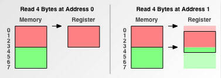
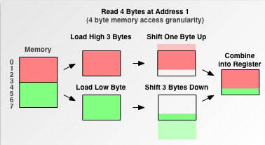
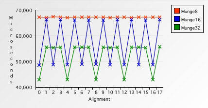

# Understanding data alignment and padding
- The reality of memory access granularity
  - Developers see memory as byte addressable storage
    - In programs storage size has a least count of one byte
    - Memory allocations can be done for as little as a byte of memory
    - The smallest pointer address granularity is one byte
    - A pointer address can be incremented by one byte
  - Processors generally do not address and access memory at one byte granularity for various reasons
    - Speed
      - Reading data from memory one byte at a time will be slower compared to reading a block at a time
      - This is similar to the efficiency of reading larger blocks from secondary storage devices
      - The throughput is better with amortised cost of reading if larger blocks are read
      - This is generally useful as contiguous bytes of memory are required more often than not
      - Generally processors optimally read a word at a time
      - The word size is dependent on the processor architecture (4 bytes for 32 bit machines)
    - Addressing range
      - Architectures can use the same number of address bus lines to address a larger memory
      - 32 address bus lines can address 2^32 bytes of memory if one byte addressing is used
      - If the architecture uses 4 byte words as addressable units, it can address 4 times more memory
        - In this case 4 bytes is called the **memory addressing stride**
        - Each address bus memory address increment will address the memory in strides of 4 bytes
- The need for data alignment based on size of data
  - Speed
    - If word size data is aligned on a word boundary then reading it can happen in one memory operation
    - 
    - Reading unaligned data incurs extra reads and masking and shifting operations making it slower
    - 
    - Speed penalty for unaligned data of different sizes
      - 
      - Operations on byte sized data don't experience any variation at any byte alignment (red line)
      - Although compared to reading larger sized data it is over all slower
      - Double byte data operations experience a penalty if they are not on a double byte boundary (blue line)
      - Four byte data operations experience a penalty if they are not on a four byte boundary (green line)
      - Overall reading properly aligned large byte size data is most efficient
  - Atomicity
    - In case of atomic data types the alignment is important to ensure the operation completes in one cycle
    - Typically atomic types will need to be at least 4 byte boundary aligned
    - Unaligned data types will need multiple operations and atomicity will be harder to achieve
    - This complicates further if the data item crosses a cache line or memory page boundary
  - Processor capabilities
    - Some processors have special purpose instruction extensions that work only or better against aligned addresses
    - The Streaming SIMD Extensions (SSE)
      - This has use in for digital signal processing and graphics processing
      - These are used to process a large number of single precision floating point data in one instruction
      - These require the data to be aligned on a certain boundary (generally 16 byte)
    - The Advanced_Vector_Extensions (AVX)
      - This has use in floating-point-intensive calculations in multimedia, scientific and financial applications
      - These are used to process large number of floating point and integer data in one instruction
      - Most AVX instructions do not need data memory alignment but some do need a 32 byte boundary
  - Processor limitations
    - Some older processors like M68000 do not support unaligned data access
    - They throw an exception if they encounter an unaligned memory operation
    - Data has to be aligned to the correct boundary for these processors
- How is data aligned on required memory boundary
  - The correct alignment for a basic data type is specific to the hardware and is a need of the hardware
    - If writing code in assembly the alignment will have to be managed by the programmer
    - For code that is compiled this is usually taken care of by the compiler
  - Generally the following alignment requirements are common but variations can exist
    - 1 byte data can be aligned on any address
    - 2 byte data needs to be aligned on an even address
    - 4 byte data needs to be aligned on an address divisible by 4
    - 8 byte data needs to be aligned on an address divisible by 8
    - Pointers are aligned on 4 or 8 byte boundaries depending on the machine being 32 bit or 64 bit
    - These are called the **fundamental alignments** of the types
      - The actual values for these are determined by the architecture and complier
      - Fundamental alignments are less than or equal to `alignof(std::max_align_t)`
      - Alignments greater than `alignof(std::max_align_t)` are called **extended alignment** or **over alignment**
  - The compiler manages aligning the variable allocations automatically
    - This makes the basic data types **self aligned** and programmers don't have to do anything explicitly
    - ```cpp
      // data definitions in source
      char *p;
      char c;
      int x;

      // how the compiler might allocate them
      char *p;     // 4 or 8 bytes on 4 or 8 byte boundary
      char c;      // 1 byte
      char pad[3]; // padding of 3 bytes introduced by the compiler
      int x;       // 4 bytes on a 4 byte boundary
      ```
    - To create aligned allocations the compiler skips bytes by adding padding in between variable allocations
    - Arrays of basic data types also get self aligned by the compiler
      - The first element is allocated at a location that follows the alignment requirement for the type
      - Subsequent elements are self aligned without needing any padding
    - Static storage duration variables are allocated in the data segment with the required alignment
    - Automatic variables are allocated on the stack with the required alignment
    - Dynamically allocated blocks of memory are generically aligned to support most common alignment requirements
      - The block returned by `std::malloc()` is aligned suitably for any standard scalar or pointer type
        - The block has a address boundary that is aligned to at least `alignof(std::max_align_t)`
        - Commonly this is 8 or 16 bytes corresponding to the alignment for `long double`
      - The block returned by `operator new` is similarly aligned for any standard scalar or pointer type
        - The block is aligned to `__STDCPP_DEFAULT_NEW_ALIGNMENT__` byte boundary
        - This is also commonly 8 or 16 bytes but can be different from `alignof(std::max_align_t)`
        - `operator new` also has overloads that can be passed an `std::align_val_t` for stricter alignments
  - The compiler aligns the members of a struct to byte boundaries required for their types
    - Generally the alignment requirement of a struct is the alignment requirement of its largest member
      - Other smaller members are made to fit within that **memory stride** by adding padding where ever required
      - The first member, even if smaller than that stride, will still end up aligning with that stride boundary
      - The first member of a struct is aligned with the address of the struct, so no prefix padding is used
        - This may not be true for C++ class depending on how base class and virtual functions are implemented
      - Trailing padding may be required in order to fill up bytes up to the next stride boundary
      - The `sizeof(struct)` includes any intermediate and trailing padding
        - The size of the struct is thus a minimum integral multiple of the alignment requirement of the struct
        - Within an array of the struct each array element doesn't need any additional padding
        - Only the trailing padding within the struct ends up appearing like the inter-element padding
    - ```cpp
      // as defined in source
      struct foo1 {
        char c;
        char *p;
        int x;
        short z;
      };

      // layout by gcc 11.4.0 on x86_64
      struct foo1 {
        char c;       // 1 byte on 8 byte boundary as foo1 needs 8 byte boundary
        char pad1[7]; // 7 bytes of padding to reach 8 byte boundary as p needs that
        char *p;      // 8 bytes on 8 byte boundary
        int x;        // 4 bytes on 4 byte boundary
        short z;      // 2 byte on 2 byte boundary
        char pad2[2]; // 2 bytes of padding to reach 8 byte boundary
      };

      static_assert(sizeof(struct foo1) == 24);
      static_assert(alignof(struct foo1) == 8);
      ```
      - A `char c;` could have otherwise been allocated on any byte boundary
        - But here it needs to be on an 8 byte boundary as `struct foo1` has that alignment requirement
    - If a struct has a nested struct member then also the rules apply similarly
      - The inner struct will have it's own alignment requirement driven by it's largest member
      - The inner struct will have it's size dictated by its padding requirement and alignment stride
      - The inner struct member in the outer struct will behave like any other basic data type
    - ```cpp
      // as defined in source
      struct foo2 {
        char c;
        struct foo3
        {
          char d;
          short e;
        } inn;
      };

      // layout by gcc 11.4.0 on x86_64
      struct foo2 {
        char c;         // 1 byte on 2 byte boundary as foo2 needs 2 byte boundary
        char pad1[1];   // 1 byte of padding to reach 2 byte boundary as inn needs that
        struct foo3 {
          char d;       // 1 byte on 2 byte boundary as foo3 needs 2 byte boundary
          char pad2[1]; // 1 byte of padding to reach 2 byte boundary as e needs that
          short e;      // 2 bytes on 2 byte boundary
        } inn;
      };

      static_assert(sizeof(struct foo2::foo3) == 4);
      static_assert(alignof(struct foo2::foo3) == 2);

      static_assert(sizeof(struct foo2) == 6);
      static_assert(alignof(struct foo2) == 2);
      ```
    - If a struct has bit-fields the alignment and padding rules are slightly different and implementation dependent
      - Bit-fields are generally implemented using larger allocations with word and byte mask and rotate operations
        - The allocation size is dependent on the implementation and can be variable across platforms
        - The type of the bit-field is definitely used for the signed-ness and may determine the allocation size
      - An architecture may or may not allow a bit-field to straddle across an allocation boundary
        - This affects how bit-fields are packed and is implementation dependent
      - Bit-fields may be placed in the lower or higher bits of the allocation and is implementation dependent
      - In general the layout and padding of bit-fields is not portable across platforms
    - ```cpp
      // as defined in source
      struct foo4 {
          short s;
          char c;
          int flip:1;
          int nybble:4;
          int septet:7;
      };

      // layout by gcc 11.4.0 on x86_64
      struct foo4 {
          short s;       // 2 bytes on a 4 byte boundary as foo4 needs 4 byte boundary
          char c;        // 1 byte on a 1 byte boundary
          int flip:1;    // 1 bit on the 1st bit of the 4th byte
          int nybble:4;  // 4 bits starting 2nd bit of 4th byte
          int pad1[3];   // 3 bits of padding to reach end of 4th byte
          int septet:7;  // 7 bits starting 1st bit of 5th byte
          int pad2[25];  // 25 bits of padding to reach end of 8th byte
      };

      static_assert(sizeof(struct foo4) == 8);
      static_assert(alignof(struct foo4) == 4);
      ```
- When is it required to override the compiler driven self data alignment
  - In most common situations the data alignment is handled by the compiler and it should not be overridden
    - The general compiler behaviour is suited for common use cases on the specific hardware
    - The compiler chosen alignment is most suited for the specific hardware and its requirements
    - In these cases performance is favoured in return for a little extra memory usage
    - Trying to fine tune these cases might be pointless and will introduce unwanted complexity and portability issues
  - When working with hardware devices one might have to align members to specific bit and byte boundaries
    - This is required for example when working with a memory mapped hardware port
    - For this it is required to override the architecture's preferred data type alignments
  - In case of using placement new
    - The placement new operator assumes that the passed pointer is suitable for creating an object of the requested type
    - The preallocated buffer passed to placement new should be correctly aligned for the required type
      - If the buffer is not suitably aligned then this leads to undefined behaviour
    - The buffer allocation needs to be suitably aligned using `alignas(T)`
  - In cases where extreme performance enhancement has to be achieved custom alignment controls might be needed
    - It might be possible to enhance overall performance by minutely fine tuning the data layout
    - It might help to even increase the alignment of data when doing heavy vectorised math calculations
      - Specialised instructions can be executed on specifically aligned large blocks of vectorised data
    - It might be useful to avoid false sharing of distributed coherent caches
      - Under very specific access patterns sometimes cache bouncing might occur due to false cache sharing
      - It might be beneficial to increase the alignment of objects in this case
    - For any of such scenarios detailed consideration of data access patterns and performance measurements will be required
  - In cases where memory is heavily constrained and all memory wastage has to be eliminated
    - In embeded use cases where memory is limited it might be a hard requirement to have zero wastage
    - In cases like resident kernel data structures memory wastage might not be tolerated
- Options for overriding the self alignment in structs imposed by compilers
  - These options should be used with caution and a lot of understanding of the underlying issues
    - The behaviour of structure packing options is platform dependent
    - On `x86` / `x86_64` misaligned allocations are managed by the hardware with some performance hit
    - On some platforms like SPARC misaligned allocations result in a runtime error
    - On some other platforms misaligned addresses can end up silently reading from the wrong location
  - The `#pragma pack` directive
    - This is used to tightly pack allocations eliminating any padding
    - This is a non standard compiler extension specific to MSVC and is also ported to GCC for compatibility
    - This sets the maximum alignment boundary for subsequent variable allocations in the source code
    - ```cpp
      #pragma pack(1)  // sets the max alignment boundary to 1 byte
      struct foo_pp {
        char c;        // c aligns on a 1 byte boundary naturally
        long d;        // d is made to align on a 1 byte boundary
      } data_pp;
      #pragma pack()   // sets back the max alignment boundary to the default

      static_assert(sizeof(struct foo_pp) == 9);
      static_assert(alignof(struct foo_pp) == 1);
      ```
    - The default that gets set by `#pragma pack()` is whatever that was set by the structure packing compiler option
      - For MSVC the option is `-ZpN`
        - If the option was not used then for MSVC the default is 8 bytes
      - For GCC the option is `-fpack-struct=N`
        - If the option was not used then for GCC the default is no maximum alignment boundary
  - The `__attribute__((packed, aligned(N)))` attributes
    - This is used to tightly pack allocations eliminating any padding
    - This is a non standard compiler extension specific to GCC
    - It applies to variable definitions and includes one or both of the following attributes
      - `packed` - applies to structures and specifies that members should have the smallest possible alignment
      - `aligned` - applies to variables and structures and specifies the minimum alignment
    - ```cpp
      struct __attribute__((packed, aligned(1))) foo_pa {
        char c; // c aligns on a 1 byte boundary naturally
        long d; // d is made to align on a 1 byte boundary
      } data_pa;

      static_assert(sizeof(struct foo_pa) == 9);
      static_assert(alignof(struct foo_pa) == 1);
      ```
  - The `alignas` specifier
    - This is a standard specifier that was introduced in C++11 and is used for over alignment of data for specific use cases
    - This does not act as a standard supported alternative for the above struct packing options
    - Between the specified and the fundamental alignment of the type this sets the alignment to the greater of the two
      - It does not override the fundamental alignment of the type to pack the members more tightly
        - The standard actually specifies such an alignment conflict as an error
          - GCC is lenient and just ignores the `alignas` specifier if it violates the fundamental alignment
        - The standard cannot specify a uniform cross platform way to safely pack type allocations
        - Structure packing depends on the programmer knowing what they are doing for a specific platform
    - This specifier is an option to specify for a type an alignment requirement higher than the fundamental alignment
      - This is useful in cases where a `char` or `std::byte` buffer is used to placement new larger types
      - This is also needed if the fundamental alignment of data is lesser than what is needed by some specialised instructions
    - ```cpp
      struct alignas(32) foo_al {
        char c; // 1 byte force aligned on a 32 byte boundary
        /* 31 bytes of padding to reach the next 32 byte boundary */
      }
      ```
  - The alignment aware `operator new`
    - In C++11 and C++14 there was a hole in the way `operator new` allocated memory for types with extended alignment
      - The `operator new` was not required to honour the extended alignment requirement of the type
      - ```cpp
        // type with extended alignment
        class alignas(32) Vec3d {
          double x, y, z;
        };
        auto vec = Vec3d{}; // correct allocation on the stack
        auto vecP = new Vec3d[10]; // dynamic allocation not guaranteed to be correct
        ```
      - The allocation of `&vec` on the stack was guaranteed to be correctly aligned
      - The allocation of `vecP` was not guaranteed to be correctly aligned
    - This was corrected in C++17 with a bunch of alignment aware allocator and deallocator functions
      - Alignment aware `operator new` and `operator delete` overloads were added
      - The alignment aware overloads have a second parameter of type `std::align_val_t`
      - The `new` and `delete` expressions perform the `operator new` and `operator delete` overload resolution
        - To maintain limited backward compatibility with C++11/C++14 the overload resolution is done in two phases
          - A program that replaces the global alignment unaware allocator to handle over alignment **is not** backward compatible
          - A program that uses type specific alignment unaware allocator to handle over alignment **is** backward compatible
        - The first phase of overload resolution prefers to pick
          - Alignment aware allocators for over-aligned types
          - Alignment unaware allocators for fundamental aligned types
        - If the first phase doesn't find an allocator then in the second phase the preferences are flipped
      - The deallocator overload resolution is performed similarly
      - The allocator and deallocator functions can also be called directly using regular function call syntax
        - In this case only the memory allocation and deallocation is performed and not the object construction and destruction
        - It is necessary to deallocate a memory block using the same flavour of deallocator as the allocator that was used
        - Wrong mixing of allocators and deallocators leads to undefined behaviour
- Reducing padding by explicit member reordering in source code
  - Generally padding occurs when allocation for a larger type follows one for a smaller type
    - Large types have stricter alignment requirements and the byte after a smaller type may not always be suitable
    - Compilers have to skip some bytes till the next address with suitable alignment
  - Trailing padding occurs when the members of a struct end before the struct's alignment stride
    - Trailing padding is needed to ensure that elements in an array of the struct align properly
  - One way to reduce padding is to manually reorder the members in a struct
    - Place the largest members first followed by the smaller members in decreasing order of size
    - ```cpp
      // as defined in source
      struct foo5 {
        char c;
        struct foo5 *p;
        short x;
      };

      // layout by gcc 11.4.0 on x86_64
      struct foo5 {
        char c;          // 1 byte on an 8 byte boundary as foo5 needs 8 byte boundary
        char pad1[7];    // 7 bytes of padding to reach 8 byte boundary as p needs that
        struct foo5 *p;  // 8 bytes on an 8 byte boundary
        short x;         // 2 bytes on a 2 byte boundary
        char pad2[6];    // 6 bytes of padding to reach 8 byte boundary
      };

      static_assert(sizeof(struct foo5) == 24);
      static_assert(alignof(struct foo5) == 8);

      // same struct with rearranged members
      struct foo6 {
        struct foo6 *p;
        short x;
        char c;
      };

      // layout by gcc 11.4.0 on x86_64
      struct foo6 {
        struct foo6 *p;  // 8 bytes on an 8 byte boundary
        short x;         // 2 bytes on a 2 byte boundary
        char x;          // 1 byte on a 1 byte boundary
        char pad[5];     // 5 bytes of padding to reach 8 byte boundary
      };

      static_assert(sizeof(struct foo6) == 16);
      static_assert(alignof(struct foo6) == 8);
      ```
    - Reordering members by reducing size may not always reduce the struct padding size
  - Sometimes even reordering members by increasing size can yield reduction in padding
  - In general what works is understanding why padding exists and packing it up with some field rearrangement
    - It needs to be understood that this might not work to our advantage portably across platforms
    - It's a smart approach that works with the hardware requirements to optimize on space for a specific platform
- Issues related with struct packing or member reordering
  - Unless it is necessary for other reasons structure packing may or may not be beneficial
    - It has to be tried out on a specific platform for performance and memory efficiency
    - What works for one platform may not work similarly on another platform
  - The order of initialisation of members is dependent on their order of declaration
    - Rearranging the declaration order of members for better packing also changes their order of initialisation
    - ```cpp
      struct Z {
        int64_t c;
        int16_t b;
        int8_t a;

        // The constructor initialiser list actually initialises members in order c, b, a
        // and not a, b, c as the unsuspecting maintainer of this code might think
        Z() : a(0), b(0), c(0) {}
      };
      ```
    - This may not be relevant in POD structures but can be a surprising gotcha if there is a dependency
    - Care has to be taken while member reordering to assess inter member initialisation dependency
  - If struct members are reordered to achieve struct packing it might affect code readability
  - Rearranging struct members can also adversely affect cache line locality
    - Keeping members that are accessed together near each other usually improves cache line locality
  - Concurrent access to different members of a struct can pose the opposite constraint on member placement
    - Cache line bouncing can be a problem if one thread writes a member and another writes another member in tight loops
    - The two members being concurrently written to should ideally be on different cache lines to avoid cache line bouncing
    - Each writing core needs to hold the cache line in exclusive mode
    - Two writing cores competing for exclusive access to the same cache line cause cache coherency overheads
  - In general the performance effects of structure packing are closely linked to data access patterns
  - Any reordering or packing changes should be weighed in with explicit performance measurements
- How to check for padding in structures
  - The `pahole` tool
    - This utility uses DWARF data stored in objects and executables built with debugging information
    - It displays information about types, variables and their location in memory
    - For types it can display the member layout highlighting the intermediate padding and trailing padding
  - To display the layout of type `struct foo` in executable `out/dbg_exe`
    - The following is an example using gcc 11.4.0 on x86_64
    - ```bash
      $ pahole --class_name=foo out/dbg_exe
      ```
    - This generates the following output for type `struct foo` showing the layout and padding
    - ```cpp
      // edited pahole output
      struct foo {
        char                       c;                    /*     0     1 */
        /* XXX 7 bytes hole, try to pack */
        struct foo *               p;                    /*     8     8 */
        short int                  x;                    /*    16     2 */
        /* size: 24, cachelines: 1, members: 3 */
        /* sum members: 11, holes: 1, sum holes: 7 */
        /* padding: 6 */
        /* last cacheline: 24 bytes */
      };
      ```
      - Total size of 24 bytes needing 1 cache line taking up 24 bytes on the cache line
      - There is a 7 bytes padding after `char c;`
      - There is a 6 bytes trailing padding after `short int x;`
- Related C++ functions and operators for alignment management
  - `std::alignment_of` and `alignof`
    - Both are used to get the alignment requirement in number of bytes of a type
    - `std::alignment_of` was introduced along with other templates from the Boost type traits library
    - `alignof` operator was introduced as a language feature in C++11
    - Most of the code in modern C++ should prefer `alignof` since it is a language feature
    - `std::alignment_of` being a template is still useful in template meta programming
      - It can be passed as a parameter of template type to another template where `alignof` cannot
      - ```cpp
        // a template defined like this
        template <template <typename> typename op, typename T>
        std::size_t perform_op_on() {
            return op<T>::value;
        }
        // can be passed std::alignment_of like this
        perform_op_on<std::alignment_of, double>();
        ```
  - `std::align()`
    - This is used to find a suitably aligned and sized sub block of memory in a block of memory
    - Given a void pointer and the block size it finds the next pointer where the required size and alignment can be found
    - ```cpp
      std::align(reqd_align, reqd_size, block_pointer, block_size);
      // if the call returns non nullptr
      // block_pointer is adjusted with the shift required for the alignment
      // block_size is adjusted with the lost size due to alignment
      ```
  - `std::aligned_alloc()`
    - This function allocates a block of memory according to two parameters for size and alignment
      - While `operator new` achieves the same thing it is meant to be used along with the `new` expression
    - This was included in C++17 in order to bring up compatibility for C up to C11
    - There are some advantages to using `std::aligned_alloc()` in certain scenarios
      - This is a standard supported portable way of allocating blocks of a required alignment and size
        - Before C++17 users had to use compiler specific aligned allocation support
        - MSVC provides `_aligned_malloc` and `_aligned_free()`
        - POSIX provides `posix_memalign()` compatible with `free()`
      - Compatibility with older C libraries
        - In case C++ has to allocate a block of memory for a C library it has to be compatible with `std::free()`
        - `std::aligned_alloc()` ensures that it is compatible with `free()`
        - It also ensures thread safety across all flavours of `malloc()` and `free()`
      - Easier for low level memory management
        - The `operator new` and `operator delete` variants have to be used in proper pairing
          - `new` has to be paired with a `delete`
          - `new[]` has to be paired with a `delete[]`
          - Alignment aware `new` has to be paired with an alignment aware `delete`
        - This correct pairing is manageable when using the RAII idiom but not otherwise
        - Use of `std::aligned_alloc()` and `std::malloc()` is easier as both get paired with `std::free()`
- The case of deprecation of `std::aligned_storage` and `std::aligned_union`
  - `std::aligned_storage` was introduced in C++11 inspired by similar features in other libraries
    - The main purpose was to support the decoupling of memory allocation from object creation
    - This is required in niche situations like container types in utility libraries
    - This is also useful for delayed construction of static storage duration objects using placement `new`
  - It was decided to deprecate these in C++23 due to a few design issues
    - The type template does not provide an easy way to access the value
      - ```cpp
        struct T {/*...*/};
        // allocate aligned memory for T
        std::aligned_storage<sizeof(T), alignof(T)>::type t_buff;

        // Access value as T later in code after construction of T
        T& value = *std::launder(reinterpret_cast<T*>(&t_buff));
        ```
      - It would have been cleaner if `std::aligned_storage<>::type` provided a `.data()` accessor function
      - Instead it is required to `reinterpret_cast` the buffer pointer and then dereference it
    - The type of `std::aligned_storage<>::type` does not resolve automatically
      - ```cpp
        struct T {/*...*/};
        // allocate aligned memory for T INCORRECTLY
        std::aligned_storage<sizeof(T), alignof(T)> t_buff;

        // UNDEFINED BEHAVIOUR while accessing value as T
        T& value = *std::launder(reinterpret_cast<T*>(&t_buff));
        ```
      - It is an easily committed mistake to miss out `::type` and get the memory allocation completely wrong
      - The `reinterpret_cast` will force cast whatever address it gets later resulting in undefined behaviour
      - The `std::aligned_storage_t` introduced in C++14 partially covered up for this
        - But this as well is deprecated along with `std::aligned_storage`
    - The template `std::aligned_storage<>` would be expected to have a type parameter
      - The template has two `size_t` parameters instead, for size and alignment
      - In majority of the cases the parameters have to be driven by `T` as `sizeof(T)` and `alignof(T)`
      - The anticipated form of this template was provided by the folly library
      - ```cpp
        template <typename T>
        using aligned_storage_for_t =
            typename std::aligned_storage<sizeof(T), alignof(T)>::type;
        ```
      - The template takes a type parameter and provides correct sized aligned storage for that type
    - The second parameter of `std::aligned_storage<>` has a default value
      - This is not necessarily going to be correct for the type `T` as the default is implementation defined
      - It is an easily committed mistake to miss out the second parameter and silently get the alignment wrong
    - The first parameter of `std::aligned_union<>` is mostly redundant
      - The first parameter is a `size_t` that specifies the minimum size of the union
      - The second parameter is a variadic list of types
      - The maximum required size and alignment for the union is deduced from the types list
      - The first parameter is mostly redundant and commonly developers just pass a 0 there
      - ```cpp
        typename aligned_union<0, TypeA, TypeB, TypeC>::type union_buff;
        ```
    - There is an inconsistency of approach between `std::aligned_storage` and `std::aligned_union`
      - The `std::aligned_storage` specifies the size and alignment where as `std::aligned_union` deduces it
      - The preferred goodness of size and alignment deduction makes people use it in contorted forms
      - ```cpp
        struct T {/*...*/};
        typename std::aligned_union_t<0, T> t_storage;
        ```
      - The intention was to define aligned storage but for size and alignment deduction the union template was used
  - These templates provide parameters for size and alignment but then put lots of restrictions on valid values
    - If the default alignment is not used then the passed alignment has to be `alignof(T)`
    - Size parameter of `std::aligned_storage` cannot be 0
    - If all this heavy lifting has to be done by the programmer then its better to explicitly define aligned storage
      - Instead of using `std::aligned_storage` use the following
      - ```cpp
        struct T {/*...*/};
        alignas(T) std::byte t_buff[sizeof(T)];
        ```
      - Instead of using `std::aligned_union` use the following
      - ```cpp
        struct T1 {/*...*/};
        struct T2 {/*...*/};
        struct T3 {/*...*/};
        alignas(T1, T2, T3) std::byte t_buff[std::max({sizeof(T1), sizeof(T2), sizeof(T3)})];
        ```

### References:
1. [Data alignment: Straighten up and fly right](https://developer.ibm.com/articles/pa-dalign/)
1. [Purpose of memory alignment](https://stackoverflow.com/questions/381244/purpose-of-memory-alignment)
1. [Streaming SIMD Extensions](https://en.wikipedia.org/wiki/Streaming_SIMD_Extensions)
1. [Advanced Vector Extensions](https://en.wikipedia.org/wiki/Advanced_Vector_Extensions)
1. [cache line bouncing](https://arighi.blogspot.com/2008/12/cacheline-bouncing.html)
1. [False sharing](https://en.wikipedia.org/wiki/False_sharing)
1. [Bit-fields](https://eel.is/c++draft/class.bit)
1. [How memory aligment and access granularity work in assembly?](https://stackoverflow.com/questions/65773788/how-memory-aligment-and-access-granularity-work-in-assembly)
1. [is it worth aligning variables?](https://stackoverflow.com/questions/52731279/is-it-worth-aligning-variables)
1. [Do I really have to worry about alignment when using placement new operator?](https://stackoverflow.com/questions/11781724/do-i-really-have-to-worry-about-alignment-when-using-placement-new-operator)
1. [std::malloc](https://en.cppreference.com/w/cpp/memory/c/malloc)
1. [operator new](https://en.cppreference.com/w/cpp/memory/new/operator_new)
1. [Why does the C++ standard allow std::max_align_t and STDCPP_DEFAULT_NEW_ALIGNMENT to be inconsistent?](https://stackoverflow.com/questions/56171482/why-does-the-c-standard-allow-stdmax-align-t-and-stdcpp-default-new-alignm)
1. [pack pragma](https://learn.microsoft.com/en-us/cpp/preprocessor/pack?view=msvc-170)
1. [Structure-Packing Pragmas](https://gcc.gnu.org/onlinedocs/gcc-4.3.6/gcc/Structure_002dPacking-Pragmas.html)
1. [Packed Structures](http://www.gnu.org/software/c-intro-and-ref/manual/html_node/Packed-Structures.html)
1. [Common Variable Attributes](https://gcc.gnu.org/onlinedocs/gcc/Common-Variable-Attributes.html)
1. [What is the difference between "#pragma pack" and "__attribute__((aligned))"](https://stackoverflow.com/questions/14179748/what-is-the-difference-between-pragma-pack-and-attribute-aligned)
1. [alignas specifier](https://en.cppreference.com/w/cpp/language/alignas.html)
1. [How to use alignas to replace pragma pack?](https://stackoverflow.com/questions/18978006/how-to-use-alignas-to-replace-pragma-pack)
1. [Is gcc's __attribute__((packed)) / #pragma pack unsafe?](https://stackoverflow.com/questions/8568432/is-gccs-attribute-packed-pragma-pack-unsafe)
1. [How to use alignas to replace pragma pack?](https://stackoverflow.com/questions/18978006/how-to-use-alignas-to-replace-pragma-pack)
1. [Memory alignment : how to use alignof / alignas?](https://stackoverflow.com/questions/17091382/memory-alignment-how-to-use-alignof-alignas)
1. [Practical use cases for alignof and alignas C++ keywords](https://stackoverflow.com/questions/62489128/practical-use-cases-for-alignof-and-alignas-c-keywords)
1. [Dynamic memory allocation for over-aligned data](https://www.open-std.org/jtc1/sc22/wg21/docs/papers/2016/p0035r4.html)
1. [The C++17's Alignment Parameter for Operator new()](https://www.cppstories.com/2019/08/newnew-align/)
1. [Unary expression New](https://eel.is/c++draft/expr.new)
1. [How to call the overloaded aligned new and delete operators in C++17?](https://stackoverflow.com/questions/53145018/how-to-call-the-overloaded-aligned-new-and-delete-operators-in-c17)
1. [alignment_in_C++](https://github.com/Twon/Alignment/blob/master/docs/alignment_in_C%2B%2B.md)
1. [pahole: Analysing Memory Layout of Complex Data Structures With Ease](https://pramodkumbhar.com/2023/11/pahole-to-analyz-data-structure-memory-layouts-with-ease/)
1. ['std::alignment_of' versus 'alignof'](https://stackoverflow.com/questions/36981968/stdalignment-of-versus-alignof)
1. [std::alignment_of](https://en.cppreference.com/w/cpp/types/alignment_of.html)
1. [alignof operator](https://en.cppreference.com/w/cpp/language/alignof.html)
1. [std::align](https://en.cppreference.com/w/cpp/memory/align.html)
1. [std::aligned_alloc](https://en.cppreference.com/w/cpp/memory/c/aligned_alloc)
1. [C and C++ Alignment Compatibility](https://www.open-std.org/jtc1/sc22/wg14/www/docs/n1507.htm)
1. [Why did C++17 introduce std::aligned_alloc?](https://stackoverflow.com/questions/63871802/why-did-c17-introduce-stdaligned-alloc)
1. [How to invoke aligned new/delete properly?](https://stackoverflow.com/questions/53922209/how-to-invoke-aligned-new-delete-properly)
1. [std::aligned_storage](https://en.cppreference.com/w/cpp/types/aligned_storage.html)
1. [std::aligned_union](https://cppreference.com/w/cpp/types/aligned_union.html)
1. [What is the purpose of std::aligned_storage?](https://stackoverflow.com/questions/50271304/what-is-the-purpose-of-stdaligned-storage)
1. [Deprecate std::aligned_storage and std::aligned_union](https://www.open-std.org/jtc1/sc22/wg21/docs/papers/2021/p1413r3.pdf)
1. [Facebook Open-source Library](https://github.com/facebook/folly/blob/29e6730468df3a3f874abd5bc671650dffcd465f/folly/Traits.h#L590)
