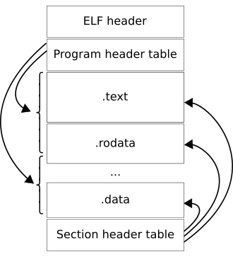

# ELF Files and Dynamic Linking

- Terms
  - PIC - position independent code
    - Position Independent Code is suitable for linking into shared object
    - Can be loaded anywhere in process virtual memory as is necessary for shared objects
    - Constant addresses are resolved through a Global Offset Table (GOT)
    - Allows the code to be shared across multiple processes
    - Allows symbol interposition between different shared objects
  - PIE - position independent executable
    - Position Independent Code suitable for linking into an executable
    - Can be loaded anywhere in process virtual memory space
    - Non-PIE executables are loaded at fixed address
    - Supports ASLR for .text segments in executables
    - Symbols in PIE code are not preempted because of the higher order of precedence of executables
  - Symbol Interposition / Preemption
    - When multiple instances of a symbol, having the same name, exist in different shared objects that have been loaded into a process, one symbol may be hidden/interposed/preempted by another 
    - A symbol defined in the executable cannot be interposed as the executable is searched first for symbol resolution
    - Global or weak, default visibility symbols in shared objects can get preempted by symbols with global or weak, default visibility and with the same name, in a shared object earlier in the list of shared objects
    - Shared objects in the LD_PRELOAD list are checked before others
    - Symbol interposition can behave differently across platforms  
  - ASLR - Address space layout randomization
    - The segments of executables and shared objects are placed randomly in virtual memory so that buffer overrun based attacks won’t know their location
- Parts of an ELF file
  - 
  - ELF header
    - A structure holding fields providing general description of the ELF file
    - Details about file type, ABI, entry points for code, offsets for tables
    - ```bash
      $ readelf --file-header <elf file>
      ```
  - Sections
    - Contain details required for linking objects into runnable executables
    - Sections table with section entries describes sections
    - These are needed at link time but not required at run time
    - Some example sections
      - `.text`: code
      - `.data`: initialised writable data
      - `.data.rel.ro`:
        - Const data initialised via relocations
        - This can be marked as read only after relocations
      - `.rodata`: initialised read-only data
      - `.bss`: uninitialized data
      - `.got`: Global Offset Table
        - Table of addresses for dynamically linked global variables
        - Allocated in the writable non-executable data segment
      - `.got.plt`:
        - GOT entries for dynamically linked functions
        - Logically an extension of the GOT
        - The first few entries of this section are predefined code chunks for lazy resolver
        - These are initialised by the link editor to point back at the corresponding `.plt` entry
        - These are overwritten by the dynamic function resolver at run time
      - `.plt`: Procedure Linkage Table
        - This section is setup by the link editor for lazy binding
        - Contains fixed pattern sequences of executable code called trampolines or thunks
        - Used to redirect control flow for external functions through their corresponding `.got.plt` entry
      - `.plt.got`:
        - This section is setup by the link editor for eager binding
        - Contains a single jump instruction for one time relocation of dynamic functions
        - Eager binding is necessary depending on the code requirements like if function addresses are used
      - `.plt.sec`:
        - This is a version of the PLT that holds instructions specific to processor security extensions
        - Generated when control flow protection is enforced to protect against ROP/COP/JOP
        - Available only on specific platforms like i686 and above
        - GCC Option: `-fcf-protection`
      - `.symtab`:
        - global symbol table that holds all symbol references in the current object
        - Symbols in this have a linked table `.strtab` that holds name strings for these symbols
        - Stripped binaries have this table removed
      - `.strtab`: string table of `.symtab` section
      - `.dynsym`:
        - symbol tables dedicated to dynamically linked symbols
        - Symbols in this have a linked table `.dynstr` that holds name strings for these symbols
        - Stripping does not remove this table as it is needed at runtime
      - `.dynstr`: string table of `.dynsym` section
      - `.dynamic`:
        - Holds tagged values as data required for dynamic linking
        - It’s like a table of contents for dynamic linking data
        - Value items like
          - needed dependency libraries
          - sizes of tables
        - Pointer items like
          - Program file offset of tables
        - Dynamic linker uses this data along with base addresses to calculate absolute virtual address of tables
      - `.rel.dyn` / `.rela.dyn`:
        - Relocation records for non-PLT dynamic symbols
        - This includes relative relocations for local symbols as well
        - Variant with ‘a’ involves an addend which is added to the relocated address
      - `.rel.plt` / `.rela.plt`:
        - Relocation records for PLT dynamic functions
        - These relocations are made in the `.got.plt` section
        - Variant with ‘a’ involves an addend which is added to the relocated address
      - `.interp`:
        - Specifies the interpreter for this ELF file
        - This is usually the dynamic linker shared object specified by a platform dependent path and name
        - The value stored in `.interp` is linked to the libc used to build the ELF
      - `.gnu.hash` / `.hash`:
        - This contains a hash table of symbol names
        - Used to quickly run symbol lookup in symbol tables
    - ```bash
      $ readelf --sections <ELF file>
      ```
  - Segments
    - Correspond to chunks of an ELF file with similar properties
    - Are needed at run time but not needed at link time
    - Helps the loader load multiple sections with similar properties together
    - Sections of type `PT_LOAD` are loaded into memory pages
    - Multiple Sections map to one Segment
    - Segment boundaries have to align to memory page size
      - Because attributes are enforced on memory pages
      - Because segment cannot cross a page boundary
    - ```bash
      $ readelf --segments <ELF file>
      ```
- Symbols in executables and shared objects
  - Symbol reference can be for data (static duration variables) or code (functions)
  - Symbol reference ultimately translates to an absolute virtual address
  - Types of symbol addresses
    - Link time constant
      - Program counter relative addressing
      - Absolute address applicable to non-PIE
    - Load base plus link time constant
      - Applicable to PIC
      - Absolute address of program counter is derived using load base
    - Runtime computed by `ld.so`
      - Driven by relocation records placed in separate sections by the link editor
      - Either in place relocations in code or via separate address tables
  - ELF sections hold details about symbols
    - These details are used by tools like dynamic linker and debugger
    - Symbol name is optionally held in separate string table sections
    - Symbol categorisation
      - Defined Symbols
        - Static storage duration symbols that have a definition
        - Placed in .data or .bss section
      - Undefined Symbols
        - Symbols that do not have a definition but only a reference
        - Extern symbols that are provided by shared libraries
        - Marked by the special section index `SHN_UNDEF`
      - Common Symbols
        - This category is used for supporting older code that didn't use `extern`
        - Historically tentative definitions in C were placed in a common block in assembled object files, and multiple such symbols with the same name could be merged by the linker into a single `.bss` section variable
        - A better way that is followed today is one definition and multiple `extern` declarations by the same name
        - Options `-fno-common` and `-fcommon` are relevant where `-fno-common` is the default since gcc 10
    - Symbol binding property
      - This property is primarily relevant when assembling .o files and linking them into an executable or shared object
      - This property drives how symbol references are resolved within one executable or shared object by the link editor
      - This also has some impact on symbol visibility from outside the final executable or shared object
      - `STB_LOCAL`
        - Not visible outside the object file containing the definition
        - Same name symbols in other object files don't interfere
        - Corresponds to static variable in compilation unit
      - `STB_GLOBAL`
        - Visible across all object files being combined by the linker
        - The link editor doesn't allow multiple definition of same name within one executable or shared object
        - Correspond to global definitions and `extern` references
      - `STB_WEAK`
        - Similar to global but with lower precedence
        - Global symbols override weak ones
        - The link editor allows multiple weak definition of same name within one executable or shared object and picks one of the definitions for the final symbol
        - Used in libraries as default placeholder definitions that are overridable by user provided definitions
        - Corresponds to `__attribute__((weak))` definitions
    - Symbol visibility property
      - This property defines how symbols within an executable or shared object may be accessed
      - `STV_DEFAULT`
        - Lets the symbol binding take effect for visibility
        - Global and weak are visible while local are hidden
        - Allows visible symbols to be preempted by symbols in other executables or shared objects
      - `STV_PROTECTED`
        - Visible to references in other executables and shared objects but not preemptable for internal references
        - SHN_UNDEF symbols in other components can resolve to this symbol
        - Component local references will always resolve to this symbol
      - `STV_HIDDEN`
        - Not visible to references in other components
        - This does not qualify as a dynamic symbol
        - Used to control the external interface of a component
        - Global hidden symbols are reduced to local symbols
        - Local references will be resolved by this symbol
        - It may still be referenced from outside if it is passed out
      - `STV_INTERNAL`
        - This has processor dependent semantics
- Dynamic symbol resolution by dynamic linker
  - Symbols needing runtime resolution
    - Symbol references in PIC code
    - Symbol references and definitions across shared objects
  - Symbol relocation records
    - Records that specify how the address translation has to be done
    - The structure of the records depends on the architecture for which the ELF is built
    - Relocation records are stored in sections with names like `.rel*` where the suffix has the name of the relocation target section
    - Relocation sections have linked symbol table sections where symbol details are specified
    - Relocation sections have linked target sections where relocations are applied
    - Some of the info contained in the records
      - Offset within linked target section where a relocation has to be applied
      - Index of the symbol in the linked symbol table
      - Type of relocation that determines the relocation calculation
    - Relocation records may be created for link time constant symbols as well if at compile time it is not decided
    - ```bash
      $ readelf --relocs <elf file>
      ```
  - ELF Interpreter
    - The platform’s dynamic linker is specified as the ELF interpreter
    - The kernel loads the executable’s specified interpreter
    - This is usually some form of `ld.so`
    - The dynamic linker relocates itself
  - The dynamic linker’s sequence of operations
    - Load the executable’s loadable (`PT_LOAD`) segments to memory
    - Refer to the .dynamic section’s entries and set up the environment
    - Setup dynamic linker’s options like eager linking via DT_FLAGS
    - Load required shared objects recursively based on `DT_NEEDED`
    - Apply relocations on all loaded shared objects
    - Invoke each shared object’s initialization functions
    - Finally pass control to the executable’s entry point
  - TEXTRELs
    - Direct relocations performed in `.text` sections are called TEXTREL
    - Present in old insecure non-PIC code
    - Can also occur due to improper embedded assembly code
    - These are inefficient as this code is not shareable across processes
    - These are insecure because it requires `.text` section to be writable
  - Relocation of non-local variables in PIC
    - The relative placement of text and data sections is known at link time
    - The text section is hard coded by using predetermined offsets to reference locations in the data segment
    - The data segment holds the GOT which holds relocated addresses of global variables
    - The GOT slots for global variables are set up by the linker and its references are placed in relocation records (`rel[a].dyn`)
    - In the ELF file the GOT is only a slot placeholder and has no data
    - In the run time process the GOT is writable and is populated by the dynamic linker
    - Even locally defined but globally visible symbols are relocated through the GOT to provide for interposition
    - This is efficient because
      - Only one relocation is required per global variable instead of multiple references to a single global variable being relocated
      - The text segment can be shared across processes with each having their own GOT
  - Lazy relocation of dynamic functions in PIC
    - This is achieved by double indirection using the PLT which is in the text segment
    - Dynamically linked functions have their trampolines in the `.plt` section
    - The text section is hard coded by calling predetermined offsets to the `.plt`
    - First few entries in the PLT are fixed resolver instructions
    - The data segment holds the `.got.plt` section part of the GOT which holds slots for relocatable function address 
    - These are initialised with the next instruction of the `.plt` entry at load time
    - First call to the function goes through the `.plt` -> `.got.plt` -> `.plt` next instruction to a resolver `.plt` entry
    - The resolver resolves the final address and stores it in the `.got.plt` entry
    - Subsequent calls to the function go through `.plt` -> `.got.plt` -> final function call
    - For this the `.got.plt` needs to be writable during execution
  - Eager relocation of dynamic functions - RELRO
    - This is a security enhancement feature
      - GOT and PLT are at fixed offsets from the `.text` section
      - Leaving GOT writable during execution is vulnerable to buffer overrun exploits
    - The GOT relocation is done at load time before start of execution
    - Post eager relocation, the GOT section is marked as read only
    - The `.got.plt` entries are merged into the `.got` section
    - The single jump PLT entries are placed in `.plt.got` section
    - Relocation records are placed in `.rel[a].dyn` instead of `.rel[a].plt`
    - Partial RELRO
      - The `.got` is resolved eagerly and marked as read only
      - The `.got.plt` is resolved lazily and left writable
      - The `.got` and `.got.plt` sections are kept in different segments
    - Linker option: `-z,relro,-z,now/lazy`
    - Run time env variables to tweak the behaviour
      - `LD_BIND_NOW` tells the dynamic loader to always perform eager resolution
      - `LD_BIND_NOT` tells the dynamic loader to resolve each call
  - Performance improvement for resolver lookup
    - Resolver searches for symbols in multiple libraries and a symbol not found in one library is looked up in the next
    - Multiple symbol tables might have to be searched before a match is found
    - Negative searches can be time consuming
    - `DT_GNU_HASH` uses a bloom filter that quickly check if the symbol is missing in a library
    - If the bloom filter doesn’t give a negative then a bucket is picked using the symbol hash and its chain is searched sequentially for the symbol
- Notes on related GCC options
  - `-fpic` / `-fPIC`
    - This is used to generate Position Independent Code
    - The lower case option generates code that is smaller but has limitations for certain situations on certain platforms
    - The upper case option generates code that is larger but work in all cases
  - `-fno-plt`
    - Applicable if eager binding is activated
    - Eliminates the .plt and .plt.got and a direct call to the GOT is made
    - For preemptible symbols this generates a data relocation treating the function as a function address value
    - For non-preemptible symbols adding `__attribute__((noplt))` on the symbol is better
    - This is useful only if at compile time it is not known if the symbol is preemptible or not
    - PLT has benefits hence this should be used with good reason
  - `-fno-pie` / `-fno-pic`
    - These options disable generation of position independent code
    - The corresponding linker option is -no-pie
    - This option disables ASLR
  - `-Wl,-z,norelro`
    - Used to disable RELRO during compilation
  - `-fno-semantic-interposition`
    - This is relevant for shared libraries which face interposition
    - It prevents symbol interposition in shared libraries
    - This allows the compiler to perform some optimisations like inlining
    - It can cause behavioural changes
    - Better option is to use proper visibility control of symbols
- Notes on runtime testing techniques
  - Since ASLR can make checking runtime binary behaviour difficult, one approach of checking load time addresses of shared objects is demonstrated [here](https://eli.thegreenplace.net/2011/08/25/load-time-relocation-of-shared-libraries/)


# Useful commands
- View file header entries of ELF file
  - ```bash
    $ readelf --file-header <ELF file>
    ```
- View section entries of ELF file
  - ```bash
    $ readelf --sections <ELF file>
    ```
- View segment entries of ELF file
  - ```bash
    $ readelf --segments <ELF file>
    ```
- Print size and address of ELF sections
  - ```bash
    $ size --format=sysv <ELF file>
    ```
- Check security properties of ELF files
  - ```bash
    $ checksec --file=<elf file>
    ```
- Print dynamic relocation records (`.rel[a].dyn` and `.rel[a].plt`) of ELF
  - ```bash
    $ readelf --relocs <elf file>
    ```
- Print symbols (`.symtab` and `.dynsym`) of an ELF
  - ```bash
    $ readelf --symbols <elf file>
    ```
- Print dynamic symbols (`.dynsym`) of an ELF
  - ```bash
    $ readelf --dyn-syms <elf file>
    ```
- Print dynamic section (`.dynamic`) of an ELF
  - ```bash
    $ readelf --dynamic <elf file>
    ```
- Print hex dump of named section of and ELF
  - ```bash
    $ readelf --hex-dump <section name> <elf file>
    ```
- Print disassembly of executable sections of ELF
  - ```bash
    $ objdump --disassemble <elf file>
    ```
- Print source of executable sections of ELF with demangled names
  - ```bash
    $ objdump --source <elf file> | c++filt
    ```
- Check the libs used by an executable
  - ```bash
    $ ldd <executable>
    ```


### References:

1. [ELF Specification](https://refspecs.linuxfoundation.org/elf/elf.pdf)
1. [ELF 101 - Part 1 Sections and Segments](https://intezer.com/blog/executable-linkable-format-101-part1-sections-segments/)
1. [ELF 101 - Part 2 Symbols](https://intezer.com/blog/executable-linkable-format-101-part-2-symbols/)
1. [ELF 101 - Part 3 Relocations](https://intezer.com/blog/executable-and-linkable-format-101-part-3-relocations/)
1. [ELF 101 - Part 4 Dynamic Linking](https://intezer.com/blog/executable-linkable-format-101-part-4-dynamic-linking/)
1. [Symbol Table](https://refspecs.linuxbase.org/elf/gabi4+/ch4.symtab.html)
1. [ELF symbol: GLOBAL+HIDDEN](https://unix.stackexchange.com/questions/701556/elf-symbol-globalhidden)
1. [Symbol binding types in ELF](https://binarydodo.wordpress.com/2016/05/12/symbol-binding-types-in-elf-and-their-effect-on-linking-of-relocatable-files/)
1. [GCC Code Gen Options](https://gcc.gnu.org/onlinedocs/gcc/Code-Gen-Options.html)
1. [GCC Link Options](https://gcc.gnu.org/onlinedocs/gcc/Link-Options.html)
1. [What are weak functions](https://stackoverflow.com/questions/35507446/what-are-weak-functions-and-what-are-their-uses-i-am-using-a-stm32f429-micro-co)
1. [ELF interposition and -Bsymbolic](https://maskray.me/blog/2021-05-16-elf-interposition-and-bsymbolic)
1. [Textrels Guide](https://wiki.gentoo.org/wiki/Hardened/Textrels_Guide)
1. [Hardening ELF using RELRO](https://www.redhat.com/en/blog/hardening-elf-binaries-using-relocation-read-only-relro)
1. [Load-time relocation of shared libraries](https://eli.thegreenplace.net/2011/08/25/load-time-relocation-of-shared-libraries/)
1. [PIC in shared libraries](https://eli.thegreenplace.net/2011/11/03/position-independent-code-pic-in-shared-libraries)
1. [gcc link with '-z now' by default](https://stackoverflow.com/questions/62527697/why-does-gcc-link-with-z-now-by-default-although-lazy-binding-is-the-default)
1. [.plt .plt.got what is different?](https://stackoverflow.com/questions/58076539/plt-plt-got-what-is-different)
1. [How to disable relro while compilation?](https://reverseengineering.stackexchange.com/questions/27680/how-to-disable-relro-while-compilation)
1. [the key to code sharing and dynamic libraries](https://www.technovelty.org/linux/plt-and-got-the-key-to-code-sharing-and-dynamic-libraries.html)
1. [All about Global Offset Table](https://maskray.me/blog/2021-08-29-all-about-global-offset-table)
1. [All about Procedure Linkage Table](https://maskray.me/blog/2021-09-19-all-about-procedure-linkage-table)
1. [What symbol tables stay after a strip In ELF format?](https://reverseengineering.stackexchange.com/questions/2539/what-symbol-tables-stay-after-a-strip-in-elf-format)
1. [ELF - .symtab section](https://stackoverflow.com/questions/50323303/elf-symtab-section)
1. [Fno-semantic-interposition](https://maskray.me/blog/2021-05-09-fno-semantic-interposition)
1. [Isn't `-no-plt` always preferrable to `-z now`?](https://stackoverflow.com/questions/77197493/isnt-no-plt-always-preferrable-to-z-now)
1. [Program Instrumentation Options](https://gcc.gnu.org/onlinedocs/gcc/Instrumentation-Options.html)
1. [symbol lookup via DT_HASH](https://flapenguin.me/elf-dt-hash)
1. [better symbol lookup via DT_GNU_HASH](https://flapenguin.me/elf-dt-gnu-hash)
1. [What is -no-pie used for?](https://stackoverflow.com/questions/47778099/what-is-no-pie-used-for)
1. [Difference between "-fno-pie" and "-no-pie"](https://stackoverflow.com/questions/74300190/difference-between-fno-pie-and-no-pie)
1. [New option in GCC 5.3: -fno-semantic-interposition](https://stackoverflow.com/questions/35745543/new-option-in-gcc-5-3-fno-semantic-interposition)
1. [Special Sections](https://refspecs.linuxbase.org/LSB_3.1.1/LSB-Core-generic/LSB-Core-generic/specialsections.html)
