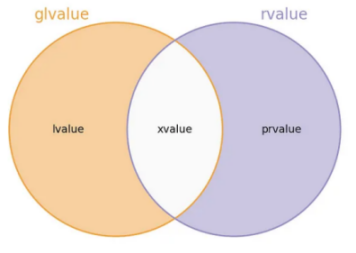
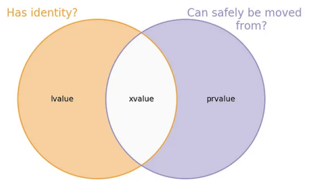

# Expressions and their value categories
- Value categories are categories of expressions, not of objects
- In C++03 an expression is either an rvalue or an lvalue
  - lvalues were expressions that could appear on the left of an assignment
  - rvalues were defined as those that are not lvalues
- Aberration in old definitions of lvalue and rvalue
  - There are lvalues that can’t appear on the left of an assignment
    - Eg. arrays or user-defined types without an assignment operator
  - There are rvalues that can appear on the left of an assignment
    - Eg. all rvalues of class types with an assignment operator
- In C++11 with the introduction of move semantics the value categories were redefined
  - Two orthogonal properties of values were identified
    - **Has identity** - has an address, can have a pointer point to it
    - **Can be moved from** - is not referenced independently and its resources can be salvaged
  - Combinations of these 2 made 3 valid and 1 invalid categories
    - Has identity and cannot be moved from
    - Has identity and can be moved from
    - Does not have identity and can be moved from
    - Invalid one - does not have identity and cannot be moved from
    - 
    - 
  - Value category of an expression is independent of its type
    - An expression can be an lvalue but its type can be an rvalue reference
      - ```cpp
        Widget makeWidget();
        Widget&& widget = makeWidget();
        ```
      - `widget` is an lvalue of type rvalue reference
    - An expression can be an rvalue but its type can be an rvalue reference
      - ```cpp
        Widget&& widget = makeWidget();
        Widget other = static_cast<Widget&&>(widget);
        ```
      - `static_cast<Widget&&>(widget)` is an rvalue of type rvalue reference
- Since C++17 these value categories fall as follows
  - lvalue
    - lvalues are names of variables, functions or data member
    - lvalues are expressions that have an identity in the form of a memory location
    - lvalues and are not safe to be moved from because they can be accessed from their named references
    - The result of calling a function whose return type is an lvalue reference is an lvalue
    - A named variable of type rvalue reference is itself an lvalue since it is named
  - xvalue
    - xvalues are so called because they are expiring lvalues
    - xvalues also have an identity in the form of a memory location but don’t have a name referencing them
    - xvalues refer to objects, usually near the end of their lifetime or temporarily materialised
    - xvalues can have their lifetime extended if they are bound to an rvalue reference 
    - xvalues can be safely moved from since they are not named and are not going to be accessed from other parts of the code
    - xvalue is the result of calling a function whose return type is an rvalue reference
  - prvalue
    - prvalues are so called because they are pure rvalues
    - Examples of prvalue expressions
      - a literal
      - a call to function returning by value
      - the computed value of the operand of an operator
      - type name followed by parentheses or braces with arguments (constructor call)
    - prvalues are not objects and they do not have an address in memory
    - prvalues are like the recipe for creating an object; something that an object can be created from
    - prvalues are represented internally as elements in the abstract syntax tree used for expression evaluation and are stored in the context of the AST nodes that they represent
    - the internal representation of prvalues is implementation dependent, it could be in registers, or in some other memory location
    - prvalues can get materialised to xvalues if the context requires it 
  - glvalue
    - glvalues are so called because they are generalised lvalues
    - an expression whose evaluation determines the identity of an object, bit-field, or function
    - glvalue has an identity in the form of a memory location
    - xvalues and lvalues together constitute glvalues
  - rvalue
    - rvalues are those expressions that are safe to move from
    - Only rvalues can bind to rvalue references
    - rvalues can also bind to const lvalue references
    - prvalues and xvalues together constitute rvalues


### References:
1. [Value categories](https://en.cppreference.com/w/cpp/language/value_category)
1. [What are rvalues, lvalues, xvalues, glvalues, and prvalues?](https://stackoverflow.com/questions/3601602/what-are-rvalues-lvalues-xvalues-glvalues-and-prvalues)
1. [Why are string literals l-value while all other literals are r-value?](https://stackoverflow.com/q/10004511/2130670)
1. [Value Categories in C++17](https://medium.com/@barryrevzin/value-categories-in-c-17-f56ae54bccbe)
1. [C++ Value Categories](https://samiurkh1n.github.io/posts/2020/03/27/cpp-value-categories/)
1. [“New” Value Terminology](https://www.stroustrup.com/terminology.pdf)
1. [Clarifying the value categories of expressions](https://stackoverflow.com/questions/69125113/clarifying-the-value-categories-of-expressions)
1. [Understanding lvalues and rvalues in C and C++](https://eli.thegreenplace.net/2011/12/15/understanding-lvalues-and-rvalues-in-c-and-c/)
1. [What is move semantics?](https://stackoverflow.com/questions/3106110/what-is-move-semantics)
1. [Rvalues redefined](https://akrzemi1.wordpress.com/2018/05/16/rvalues-redefined/)
1. [Result of a prvalue](https://stackoverflow.com/questions/53909077/result-of-a-prvalue)
1. [How are rvalues in c++ stored in memory?](https://stackoverflow.com/questions/34221287/how-are-rvalues-in-c-stored-in-memory)
1. [C++ Draft - Expressions](https://eel.is/c++draft/expr.prop)
