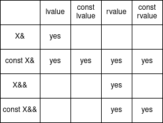

# Use of rvalue references and move semantics
- Movable and copyable objects
  - A general user defined class syntactically might be both copyable and movable, one or the other, or neither
  - Semantically it makes sense for an object to also be movable if it is copyable but a movable object may not necessarily be copyable
  - Example of non-movable and non-copyable object is `std::mutex`
    - this is due to the concept of mutexes and the fact that the underlying mechanism used for mutexes can be memory location sensitive on certain platforms
  - Example of movable but non-copyable object is `std::unique_ptr`
    - Unique ownership prohibits copying but moving is enabled for it to be useful
  - Example of movable and copyable objects are most common objects
    - If copying is not expensive, movability may not be specifically provided for as a user defined function
    - The compiler provides an implicit move/copy constructor and move/copy assignment if none of the special functions have a user specified version
    - The general concept of the rule of three and (post C++ 11) the rule of five is for the user to make explicit decisions about all the special functions
  - Example of copyable but non-movable object is hard to find unless it is contrived
- Move semantics
  - Typical copy construction and copy assignment keep the source intact and perform a deep copy if required
  - This is the required behaviour when the source is an lvalue that can be referenced afterwards by other parts of the code
  - If the source is an rvalue that cannot be referenced by any other part of the code then instead of performing a deep copy it would be more optimal if the resources could be salvaged from the source
  - Move of an object means to transfer ownership of some resource it manages to another object
  - An rvalue reference is a new kind of reference that only binds to rvalues, and the syntax is `X&&`
    - `X&&` is not to be thought of as a reference to a reference
  - Move constructors and move assignments take rvalue reference parameters and are called when the passed parameter is an rvalue whose resources can be salvaged
  - Inside the move functions, names of rvalue reference variables are lvalues
    - These have to be converted to xvalues to be bound to the function overloads that accept rvalue reference parameters
    - That is why move constructors and move assignment operators typically use `std::move()`
  - The move assignment operator transfers ownership of a managed resource into the current object, releasing the old resource
    - The _move-and-swap idiom_ simplifies the implementation of move assignment
  - Separate move semantics do not make sense and copy semantics suffice in following cases
    - Objects for which a deep copy is not required where it doesn’t manage an external resource
    - Objects where a salvage is no less costly than a deep copy
  - Objects for which copying should be prohibited can explicitly be made non-copyable and move only
    - Deleting the copy constructor and copy assignment
    - Implementing the move constructor and move assignment
    - Eg. `std::unique_ptr`
  - Rvalue references and their binding rules
    - 
  - Rvalue references of type `X` can also bind to rvalues and lvalues of other type `Y` if
    - There are implicit conversions available from `Y` to `X`
    - `Y` converts to a temporary of type `X` that binds to the rvalue reference
- Notes on rvalue reference to const
  - At first sight `const X&&` might seem useless for move semantics
    - Move semantics don’t necessarily require modification of the source
    - It just requires the source to be rendered moved from and unusable
    - The const only prevents modification of direct members
    - The `const X&&` can be used to salvage content embedded under its direct members
    - Ex. In case of a Pimpl idiom class
  - Another use of `const X&&` is to prevent calling functions with rvalues
    - Overloads with `const X&&` parameter preferentially bind to const and non-const rvalues
    - Calls with rvalue parameters can be prevented by deleting these overloads
    - Ex. `void func(const T&&) = delete;`
- Notes on `std::move()`
  - `std::move()` just casts an lvalue to an rvalue and makes the object _movable from_, but it doesn’t do any moving
  - `std::move()` takes a formal parameter that is a forwarding reference to an object
  - It returns an rvalue reference to the object referenced by the parameter
  - `std::move()` preserves the cv-qualification of its parameter
    - A const lvalue gets cast to a const rvalue
  - The call to `std::move()` passes an actual parameter that is an lvalue
  - `std::remove_reference` is applied to the type of the parameter to ensure that the returning rvalue reference is applied to a type that isn’t itself a reference
    - Otherwise reference collapsing would occur changing the semantics
  - `std::move()` should be applied only to object reference that can actually be moved from semantically
    - A const object cannot be moved from, so applying `std::move()` to such an object results in a rvalue reference to a const object
    - This will not bind to non-const rvalue reference parameters and will not invoke move semantics

### References:

1. [A Brief Introduction to Rvalue References](https://www.artima.com/articles/a-brief-introduction-to-rvalue-references)
1. [A Proposal to Add Move Semantics Support to the C++ Language](https://www.open-std.org/jtc1/sc22/wg21/docs/papers/2002/n1377.htm)
1. [When to make a type non-movable in C++11?](https://stackoverflow.com/questions/14302834/when-to-make-a-type-non-movable-in-c11)
1. [What is move semantics?](https://stackoverflow.com/questions/3106110/what-is-move-semantics)
1. [std::move](https://en.cppreference.com/w/cpp/utility/move)
1. [What is std::move(), and when should it be used?](https://stackoverflow.com/questions/3413470/what-is-stdmove-and-when-should-it-be-used)
1. [Are there any use cases for a class which is copyable but not movable?](https://stackoverflow.com/questions/14323093/are-there-any-use-cases-for-a-class-which-is-copyable-but-not-movable)
1. [Effective Modern C++](https://moodle.ufsc.br/pluginfile.php/2377667/mod_resource/content/0/Effective_Modern_C__.pdf)
1. [Why do C++11-deleted functions participate in overload resolution?](https://stackoverflow.com/questions/14085620/why-do-c11-deleted-functions-participate-in-overload-resolution)
1. [Do rvalue references to const have any use?](https://stackoverflow.com/questions/4938875/do-rvalue-references-to-const-have-any-use)
1. [How is it possible to get a reference to an rvalue?](https://stackoverflow.com/questions/28458616/how-is-it-possible-to-get-a-reference-to-an-rvalue)
1. [Why can we use `std::move` on a `const` object?](https://stackoverflow.com/questions/28595117/why-can-we-use-stdmove-on-a-const-object)

