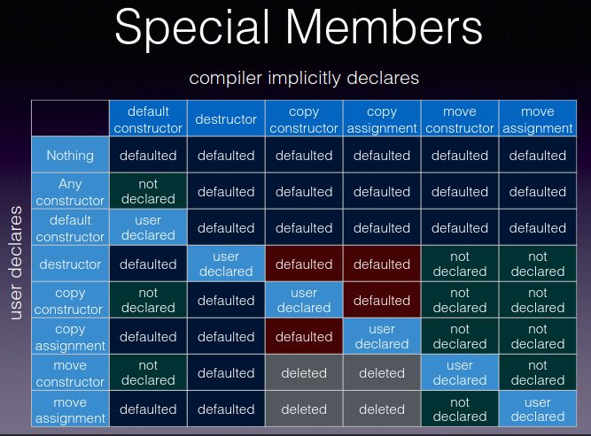

# Special member functions and the rule of five
- The special member functions
  - 
  - Default constructor
    - A constructor that can be called without arguments
      - `T::T()`
    - If no user-declared constructors are provided the compiler will always declare a default constructor
    - The compiler provided version does the following
      - Call default constructors of the bases
      - Call default constructors of non static members
  - Copy constructor
    - A constructor which can be called with an argument of the same type
      - `T::T(const T&)`
      - `T::T(T&)`
      - Copies the content of the argument 
      - Does not mutate the argument
    - If no user-declared copy constructors are provided, and the other rule of three functions are also not defined, the compiler will declare a copy constructor
      - Some compilers may provide a defaulted copy constructor even if the other rule of three functions are defined, but **this behaviour is deprecated**
      - Compiler declares `T::T(const T&)` if all bases and members have a copy constructor with a const ref parameter
      - Compiler declares `T::T(T&)` otherwise
    - A class can have multiple copy constructors
      - `T::T(const T&)` and `T::T(T&)`
    - Even if user-declared copy constructors are present, the default one can be declared by `= default`
    - The compiler provided version does the following
      - For union types it does a copy of object memory representation
      - For others, it does a member wise copy of bases and non static members
    - Copy constructors can get implicitly called during variable initialisation, function parameter passing and function value returning
  - Move constructor
    - A constructor which can be called with an rvalue argument of the same type
      - `T::T(T&&)`
      - Copies the content of the argument
      - Possibly mutating the argument
      - Typically called when an object is initialised by an rvalue
    - If no user-defined move constructors are provided and the other special functions are also not defined only then the compiler declares one
      - `T::T(T&&)`
    - A class can have multiple move constructors
      - `T::T(const T&&)` and `T::T(T&&)`
      - `T::T(const T&&)` is used primarily for overload disambiguation
    - Even if user-declared move constructors are present, the default one can be declared by `= default`
    - The compiler provided version does the following
      - For union types it does a copy of object memory representation
      - For others, it does a member wise move of bases and non static members from an xvalue
    - Move constructors can get implicitly called during variable initialisation, function parameter passing and function value returning
  - Copy assignment operator
    - An `operator=` that can be called with an argument of the same type
      - `T& T::operator=(const T&)`
      - `T& T::operator=(T&)`
      - `T& T::operator=(T)`
      - Called when object of type `T` appears on left of `=` but not during definition
    - If no user-declared copy assignment operators are provided, and the other rule of three functions are also not defined, the compiler will declare a copy assignment operator
      - Some compilers may provide a defaulted copy assignment even if the other rule of three functions are defined, but **this behaviour is deprecated**
      - Compiler declares `T& T::operator=(const T&)` if all bases and members have an assignment operator with a const ref parameter
      - Compiler declares `T& T::operator=(T&)` otherwise
    - A class can have multiple assignment operators
      - `T& T::operator=(T&)` and `T& T::operator=(T)`
    - Even if user-declared assignment operators are present, the default one can be declared by `= default`
    - Derived class copy assignment operator hides the copy assignment operator of the base class
      - A copy assignment operator is always declared, either user defined or implicit
      - The base class assignment operator is always hidden due to name hiding
      - The base assignment operator can be brought to the derived by a `using` declaration
        - As per name resolution rules, if the signature for this is the same as the operator defined in derived then the derived operator still hides the base operator
        - Otherwise they overload each other and both are visible
    - The compiler provided version does the following
      - For union types it does a copy of object memory representation
      - For others, it does a member wise copy assignment of bases and non static members
  - Move assignment operator
    - An `operator=` that can be called with an rvalue argument of the same type or implicitly convertible type
      - `T& T::operator=(T&&)`
      - Typically steals the resource from the source than just copying it
      - May, but is not required to, modify the source
    - If no user-defined move assignment operators are provided and the other special functions are also not defined only then the compiler declares one
      - `T& T::operator=(T&&)`
    - A class can have multiple move assignment operators
      - `T& T::operator=(T&&)` and `T& T::operator=(const T&&)`
      - `T& T::operator=(const T&&)` is used for overload disambiguation
    - Even if user-declared move assignment operators are present, the default one can be declared by `= default`
    - Similar to the copy assignment operator, derived class move assignment operator hides the copy/move assignment operator of the base class
    - The compiler provided version does the following
      - For union types it does a copy of object memory representation
      - For others, it does a member wise move assignment of bases and non static members
  - Destructor
    - `T::~T()`
    - Called automatically when an object's lifetime ends
    - Can also be called directly 
      - On an object created via placement `new`
      - On an object created by an allocator
    - In templates the destructor syntax can be used on non class objects
      - It works through pseudo destructor call
    - If no user-declared destructors are provided the compiler will always declare a destructor
    - The implicitly defined destructor has an empty body
- Rule of three
  - If a class requires a destructor, a copy constructor, or a copy assignment operator to be user defined then it requires all three to be user defined
  - If none of these are user defined then they are implicitly defined by the compiler
  - The implicitly defined versions are appropriate unless the class is managing some external resource
  - For a class that manages a non copyable resource
    - Declare the copy constructor and copy assignment as private or deleted
- Rule of five
  - If a class needs move semantics then all five copy and move constructor, copy and move assignment and destructor have to be defined
  - For a class that has the rule of three functions user defined, the move functions are not implicitly defined
    - This is to ensure that pre C++11 code is still backward compatible
    - If the move functions are defined as deleted they will participate in overload resolution
    - Constructors using rvalue parameters will start failing
  - Not providing the move functions is not an error, just loss for optimization
- Rule of zero
  - Classes that define the rule of five functions should deal only with a single resource ownership as per single responsibility principle
  - Other classes should not have custom destructors, copy/move constructors or copy/move assignment operators
  - Classes that delete any of the rule of five functions should delete them all
  - Polymorphic base classes might need a public virtual destructor
    - This blocks implicit definitions for the other functions
    - The other functions should be defined as `= default`

### References:
1. [Non-static member functions](https://en.cppreference.com/w/cpp/language/member_functions)
1. [The rule of three/five/zero](https://en.cppreference.com/w/cpp/language/rule_of_three)
1. [why the move constructor/move assignment are not implicitly declared](https://stackoverflow.com/questions/28545644/why-the-move-constructor-move-assignment-are-not-implicitly-declared-and-defined)
1. [Core Guidelines - Default Operations](https://isocpp.github.io/CppCoreGuidelines/CppCoreGuidelines#cdefop-default-operations)
1. [Move Semantics - Howard Hinnant](https://accu.org/conf-docs/PDFs_2014/Howard_Hinnant_Accu_2014.pdf)
