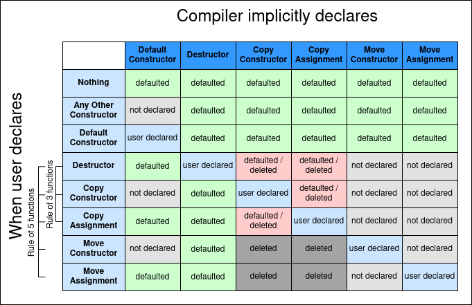

# Special member functions and the rule of five
- Some preliminary definitions
  - The following definitions are in the context of the special member functions
  - User-declared
    - ```cpp
      struct A {
        A();     // A::A() is user-declared
        int x;
      }
      struct B { // B::B() is not user-declared
                 // B::B() is implicitly-declared by the compiler
        int y;
      }
      ```
  - Implicitly-declared
    - If a function is not user-declared then it can be implicitly-declared
    - If the standard rules allow it to be implicitly-declared then the compiler declares it
    - If the standard rules do not allow it to be implicitly-declared then it remains not declared
  - Implicitly-defined
    - If the implementation of a function is entirely provided by the compiler it is implicitly-defined
    - Such a special member function may or may not be trivial depending on conditions of triviality
    - This does not include the case where the function is defined as deleted
  - User-defined
    - This is not a formally defined term in the C++ standards
    - This refers broadly to anything that is defined explicitly by the user in code
    - These are definitions that have to be defined by the user as the compiler cannot provide them
  - User-provided
    - This is a well defined term in the C++ standards
    - Broadly it seems to mean the same as something being user-defined but has a subtle difference
    - A function is user-provided if it is user-declared and not explicitly defaulted or deleted on its first declaration
    - ```cpp
      struct A {
        A() { /*...*/ }; // A::A() is user-provided and explicitly-defined
      }

      struct B {
        B();             // B::B() is explicitly defaulted but not on first declaration
      }
      B::B() = default;  // B::B() is user-provided and implicitly-defined

      struct C {
        C() = default;   // C::C() is NOT user-provided as it is defaulted on first declaration
                         // C::C() is implicitly-defined if not defined as deleted
      }

      struct B {
        B() = delete;    // B::B() is NOT user-provided as it is deleted on first declaration
      }
      ```
  - Defaulted functions
    - Explicitly defaulted and implicitly declared functions are called defaulted functions
    - ```cpp
      struct B {
        int y;         // B::B() is an implicitly defaulted function
      }
      struct C {
        C() = default; // C::C() is an explicitly defaulted function
        int y;
      }
      ```
    - The default implementation for these is provided by the compiler
    - These could also be defined as deleted if the compiler cannot provide the default implementation
- The special member functions
  - 
    - The blocks marked as defaulted in green can actually be defined as deleted
      - This is under conditions where the behaviour is defaulted as deleted
      - Check the defaulted as deleted behaviour for each of the special member functions
    - The blocks marked as defaulted/deleted in pink are implemented by compilers as defaulted
      - This behaviour is deprecated in order to be consistent with the *rule of three*
      - The behaviour is implemented as defaulted to maintain backward compatibility with pre C++11 code
        - The current behaviour is accompanied with a deprecation warning
        - Users are expected to align their code by explicitly defaulting or deleting the special member functions
      - In the future the compilers might implement these as deleted
  - Default constructor
    - A constructor that can be called without arguments
      - `T::T()`
      - `T::T(int i = 10)`
    - If no user-declared constructors are provided the compiler will always implicitly declare a default constructor
      - It is not implicitly declared if a constructor (default/copy/move/conversion) is declared by the user
    - The compiler provided default constructor does the following
      - Call default constructors of the base class sub-objects
      - Call default constructors of non-static data members of class type
      - No initialization is done for non-static data members of primitive types
      - This is same as the working of a user provided default constructor without constructor initializers and an empty body
    - The compiler provided default constructor is a **trivial default constructor** if
      - The class has no virtual functions and virtual base classes
        - Virtual components require hidden data fields to be initialized for their correct function
      - The class has no non-static data members with member initializers
        - Member initializers bring in custom initialization logic
      - The class has trivial default constructors for all its base classes
        - These are called from the generated default constructor of the class
      - The class has trivial default constructors for all its non-static data members of class type
        - These are also called from the generated default constructor of the class
    - The implicitly or explicitly defaulted default constructor is **defined as deleted** if
      - The compiler cannot provide a default implementation of the default constructor
      - This can happen in the following scenarios
      - The type has a `const` or reference non-static data member without a default member initializer
        - ```cpp
          struct T {
            int& x;        // no default member initializer
            const int y;   // no default member initializer
            T() = default; // even this is defined as deleted
          };
          T t1; // ERROR: no value to initialize x and y with
          static_assert(not std::is_default_constructible_v<T>);
          ```
        - The `const` or reference member needs to be initialized with a value, and that is unavailable in default construction
      - The type has a sub-object of a type that does not have a usable default constructor or destructor
        - This sub-object can be a non-static data member or a base class sub-object
        - The compiler generated default construction of a type needs default construction of all its sub-objects
        - This also needs the destructor of all sub-objects to be usable
          - The destructors need to be called if the sequential construction of sub-objects runs into an exception
          - If the third sub-object default construction throws an exception then the first two sub-objects need to be destructed
        - ```cpp
          struct T {
            int& x; // default constructor for T is deleted due to this
          };
          struct U : public T { // U has T as a base class sub-object
            int y;
          };
          struct V {
            T t; // V has T as a non-static data member
          };
          U u; // ERROR: no value to initialize x in T
          V v; // ERROR: no value to initialize x in T
          // default constructors for both U and V are defined as deleted
          static_assert(not std::is_default_constructible_v<U>);
          static_assert(not std::is_default_constructible_v<V>);

          struct X {
          private:
            ~X() = default; // destructor of X is inaccessible
          };
          struct Y : public X { // Y has X as a base class sub-object
          };
          struct Z {
            X x; // Z has X as a non-static data member
          };
          Y y; // ERROR: default constructor is defined as deleted
          Z z; // ERROR: default constructor is defined as deleted
          // default constructors for both Y and Z are defined as deleted
          static_assert(not std::is_default_constructible_v<Y>);
          static_assert(not std::is_default_constructible_v<Z>);
          ```
        - This can happen if the default constructor or destructor are inaccessible due to being private
        - This can happen even if the default constructor or destructor are ambiguous in overload resolution
          - Such overload ambiguity is possible in constrained templates code since C++20
      - The type is a union like type with some union member that has a non-trivial default constructor
        - If one of the union members has a default member initializer, then the default constructor is not deleted
          - In this case the implicit default constructor initializes the union member with the initializer
          - This initialized member is made the active member of the union
          - Only one union member is allowed to have a member initializer
          - Such an implicitly defined default constructor is considered non trivial
          - ```cpp
            union U1 {
              int i = 10; // member initializer for at most one member
              float f;
            };
            U1 u;
            static_assert(std::is_default_constructible_v<U1>);
            static_assert(not std::is_trivially_default_constructible_v<U1>);
            ```
        - Otherwise, the implicit default constructor is defined as deleted
          - Unlike a struct, a union shares its memory allocation between all its members
          - While default constructing a union instance none of the members can be constructed
          - Accordingly the implicitly defined default constructor is required to do nothing
          - This is feasible when all union members can be trivially default constructed
            - Then the corresponding union destructor also is defaulted to do nothing
          - But this cannot be done if one member needs non-trivial default construction
            - The destructor might have to be non-trivial and a trivial default destructor might be inappropriate
          - So the defaulted default constructor is defined as deleted if any member needs non-trivial default construction
            - This forces the user to provide any specific default construction and destruction definition as required
            - The case is same even for a not defined or deleted default constructor for the union member
          - ```cpp
            struct A {
              int i;
              A() {}; // non-trivial default constructor
            };
            union U2 {
              A a;
              float f;
            };
            U2 u; // ERROR: default constructor is implicitly deleted
            static_assert(not std::is_default_constructible_v<U2>);
            ```
  - Copy constructor
    - A constructor which can be called with an argument of the same type
      - `T::T(T&)`
      - `T::T(const T&)`
      - `T::T(volatile T&)`
      - `T::T(const volatile T&)`
      - Any of the above forms with any additional parameters all having default values
      - A copy constructor copies the content of the argument and does not mutate the argument
    - If no user-declared copy constructors are present, the compiler will implicitly declare a copy constructor
      - If any of the other *Rule of 5 functions* are user-declared, then the implicitly declared copy constructor is **defined as deleted**
        - This behaviour is different from that of move constructor which under this situation is not even declared
          - A move constructor should not be defined as deleted in this situation
          - A defined as deleted function still participates in overload resolution
          - If this gets selected, it can fail code that earlier had a fall back to the copy constructor
      - Some compilers may provide a defaulted copy constructor even if any of the other *Rule of 3 functions* are user-declared
        - But **this behaviour is deprecated**
        - This behaviour is maintained for now for compatibility with pre C++11 code
        - Older code that expects an implicitly defaulted copy constructor should be changed to explicitly default it
      - Compiler declares `T::T(const T&)` if all bases and members have a copy constructor with a `const` ref parameter
      - Compiler declares `T::T(T&)` otherwise
    - The compiler provided version does the following
      - For union types it does a copy of object memory representation and the same member is active as in the source
        - It also starts the lifetime of the destination union sub-objects
      - For others, it does a member wise copy of bases and non-static data members
    - The compiler provided copy constructor is a **trivial copy constructor** if
      - The class does not have any virtual base classes or virtual functions
      - The base class and non-static data member sub-objects are all initialized by trivial copy constructors
    - The implicitly or explicitly defaulted copy constructor is **defined as deleted** if
      - The type has a sub-object of a type that does not have a usable copy constructor or destructor
        - This sub-object can be a non-static data member or a base class sub-object
        - The reasons for this are similar to those in case of default constructor being deleted
      - The type has a union like non-static data member with a non-trivial constructor that gets used
        - The reasons for this are similar to those in case of default constructor being deleted
      - The type has a rvalue reference as a non-static data member
        - An rvalue reference is intended to be the source of a move operation
        - A shallow copy of an rvalue reference will most probably not be the appropriate operation
    - A class can have multiple copy constructors
      - `T::T(const T&)` and `T::T(T&)`
    - Even if user-declared copy constructors are present, the default one can be declared by `= default`
    - Copy constructors can get implicitly called during variable initialization, function parameter passing and function value returning
  - Move constructor
    - A constructor which can be called with an rvalue argument of the same type
      - `T::T(T&&)`
      - `T::T(const T&&)`
      - `T::T(volatile T&&)`
      - `T::T(const volatile T&&)`
      - Any of the above forms with any additional parameters all having default values
      - A move constructor copies the content of the argument possibly mutating the argument
      - It is typically called when an object is initialised by an rvalue
    - The compiler implicitly declares a move constructor as defaulted if
      - No user-declared move constructors are provided and
      - None of the other *Rule of 5 functions* are user-declared
      - These rules are stricter than those for copy constructor because
        - Move operations were introduced in C++11 and any code that uses move operations is not pre-C++11 code
        - C++11 code is expected to follow the *Rule of 5* and these rules are in sync with that
      - The implicitly declared move constructor has the form `T::T(T&&)`
    - The compiler provided version does the following
      - For union types it does a copy of object memory representation and the same member is active as in the source
        - It also starts the lifetime of the destination union sub-objects
      - For others, it does a member wise move of base class and non-static data member sub-objects from an xvalue
    - The compiler provided move constructor is a **trivial move constructor** if
      - The class does not have any virtual base classes or virtual functions
      - The base class and non-static data member sub-objects are all initialized by trivial move constructors
    - The implicitly or explicitly defaulted move constructor is **defined as deleted** if
      - The type has a sub-object of a type that does not have a usable move constructor or destructor
        - This sub-object can be a non-static data member or a base class sub-object
        - The reasons for this are similar to those in case of default constructor being deleted
      - The type has a union like non-static data member with a non-trivial constructor that gets used
        - The reasons for this are similar to those in case of default constructor being deleted
    - A class can have multiple move constructors
      - `T::T(const T&&)` and `T::T(T&&)`
      - `T::T(const T&&)` is used primarily for overload disambiguation
    - Even if user-declared move constructors are present, the default one can be declared by `= default`
    - Move constructors can get implicitly called during variable initialization, function parameter passing and function value returning
  - Copy assignment operator
    - An `operator=` that can be called with an argument of the same type
      - `T& T::operator=(T)`
      - `T& T::operator=(T&)`
      - `T& T::operator=(const T&)`
      - `T& T::operator=(volatile T&)`
      - `T& T::operator=(const volatile T&)`
      - It is called when object of type `T` appears on left of `=` but not during definition
      - It typically returns an lvalue reference to the object that was assigned to
    - If no user-declared copy assignment operators are present, the compiler will implicitly declare a copy assignment operator
      - If any of the other *Rule of 5 functions* are user-declared, then the implicitly declared copy assignment operator is **defined as deleted**
        - This behaviour is different from that of move assignment operator which under this situation is not even declared
          - A move assignment operator should not be defined as deleted in this situation
          - A defined as deleted function still participates in overload resolution
          - If this gets selected, it can fail code that earlier had a fall back to the copy assignment operator
      - Some compilers may provide a defaulted copy assignment operator even if any of the other *Rule of 3 functions* are user-declared
        - But **this behaviour is deprecated**
        - This behaviour is maintained for now for compatibility with pre C++11 code
        - Older code that expects an implicitly defaulted copy assignment operator should be changed to explicitly default it
      - Compiler declares `T& T::operator=(const T&)` if all bases and members have an assignment operator with a `const` ref parameter
      - Compiler declares `T& T::operator=(T&)` otherwise
    - The compiler provided version does the following
      - For union types it does a copy of object memory representation and the same member is active as in the source
        - It also starts the lifetime of the destination union sub-objects
      - For others, it does a member wise copy assignment of bases and non-static data members
      - It returns an lvalue reference to the object that is assigned to
    - The compiler provided copy assignment operator is a **trivial copy assignment operator** if
      - The class does not have any virtual base classes or virtual functions
      - The base class and non-static data member sub-objects are all copy assigned by trivial copy assignment operators
    - The implicitly or explicitly defaulted copy assignment operator is **defined as deleted** if
      - The type has a `const` or reference non-static data member
        - The reasons for this are similar to those in case of default constructor being deleted
      - The type has a base class or non-static data member sub-object without a usable copy assignment operator
        - Either it is deleted, inaccessible or ambiguous in overload resolution
        - The reasons for this are similar to those in case of default constructor being deleted
      - The type is union like and has a member with a non-trivial assignment operator that gets used
        - The reasons for this are similar to those in case of default constructor being deleted
    - A class can have multiple assignment operators
      - `T& T::operator=(T&)` and `T& T::operator=(T)`
    - Even if user-declared assignment operators are present, the default one can be declared by `= default`
    - Derived class assignment operator hides the assignment operator of the base class
      - The copy or move assignment operators have the same function name and hence cause name hiding
      - A copy assignment operator is always declared, either user-declared or compiler declared
        - It may be defined as deleted under specific conditions
        - Even if defined as deleted it still participates in overload resolution
      - The base class assignment operator can be brought to the derived class by a `using` declaration
        ```cpp
        struct B {
          B& operator=(const B&) {
            return *this;
          }
        };
        struct D : public B {
          using B::operator=; // makes B's operator available to D
          D& operator=(const D&) {
            return *this;
          }
        };
        D d1, d2;
        B b1;
        d1 = d2; // calls D's operator with D& parameter
        d1 = b1; // calls B's operator with B& parameter also available in D
        ```
        - If the signature of the assignment operator defined in the base class is the same as the one in derived class then the derived operator still hides the base operator
          - This is possible if the derived class also defines an operator that takes a base class object reference
        - Otherwise they overload each other and both are visible
  - Move assignment operator
    - An `operator=` that can be called with an rvalue argument of the same type or implicitly convertible type
      - `T& T::operator=(T&&)`
      - `T& T::operator=(const T&&)`
      - `T& T::operator=(volatile T&&)`
      - `T& T::operator=(const volatile T&&)`
      - It typically steals the resource from the source than just copying it and may modify the source
      - It typically returns an lvalue reference to the object that was assigned to
    - The compiler implicitly declares a move assignment operator as defaulted if
      - No user-declared move assignment operators are provided and
      - None of the other *Rule of 5 functions* are user-declared
      - These rules are stricter than those for copy assignment operator because
        - Move operations were introduced in C++11 and any code that uses move operations is not pre-C++11 code
        - C++11 code is expected to follow the *Rule of 5* and these rules are in sync with that
      - The implicitly declared move assignment operator has the form `T& T::operator=(T&&)`
    - The compiler provided version does the following
      - For union types it does a copy of object memory representation and the same member is active as in the source
        - It also starts the lifetime of the destination union sub-objects
      - For others, it does a sub-object wise move assignment of base classes and non-static data members
      - It returns an lvalue reference to the object that is assigned to
    - The compiler provided move assignment operator is a **trivial move assignment operator** if
      - The class does not have any virtual base classes or virtual functions
      - The base class and non-static data member sub-objects are all assigned to by trivial move assignment operators
    - The implicitly or explicitly defaulted move assignment operator is **defined as deleted** if
      - The type has a `const` or reference non-static data member
        - The reasons for this are similar to those in case of default constructor being deleted
      - The type has a base class or non-static data member sub-object without a usable move assignment operator
        - Either it is deleted, inaccessible or ambiguous in overload resolution
        - The reasons for this are similar to those in case of default constructor being deleted
      - The type is union like and has a member with a non-trivial assignment operator that gets used
        - The reasons for this are similar to those in case of default constructor being deleted
    - A class can have multiple move assignment operators
      - `T& T::operator=(T&&)` and `T& T::operator=(const T&&)`
      - `T& T::operator=(const T&&)` is used for overload disambiguation
    - Even if user-declared move assignment operators are present, the default one can be declared by `= default`
    - Derived class move assignment operator hides the copy/move assignment operator of the base class
      - This is similar to the case of the copy assignment operator
      - But unlike the copy assignment operator a move assignment operator will not always be declared
      - The copy and move assignment operators both have the same function name but different parameter signatures
  - Destructor
    - `T::~T()`
    - Called automatically when an object's lifetime ends
    - Can also be called directly 
      - On an object created via placement `new`
      - On an object created by an allocator
    - In templates the destructor syntax can be used on non class objects
      - It works through pseudo destructor call
    - If no user-declared destructors are provided the compiler will always declare a destructor
      - The compiler declared destructor is of the form `T::~T()`
    - The implicitly defined destructor has an empty body
      - It does not have any destruction steps of its own
      - It implicitly calls the destructors of non-virtual base class and non-static data member sub-objects
      - For `virtual` base classes, the destructor is classed only from the destructor of the most derived class
      - A user-defined destructor does the above destructor calling after performing its own destruction steps
    - The compiler provided destructor is a **trivial destructor** if
      - The destructor is not `virtual`, which a compiler provided destructor will never be
      - The base class and non-static data member sub-objects are all destructed by trivial destructors
    - The implicitly or explicitly defaulted destructor is **defined as deleted** if
      - The destructor is `virtual` and the deallocation function lookup results in a not usable deallocator
        - Either it is deleted, inaccessible or ambiguous in overload resolution
      - The type has a base class or non-static data member sub-object without a usable destructor
        - Either it is deleted, inaccessible or ambiguous in overload resolution
        - The reasons for this are similar to those in case of default constructor being deleted
      - The type is union like and has a member with a non-trivial destructor that gets used
        - The reasons for this are similar to those in case of default constructor being deleted
- Rule of three
  - If a class requires a destructor, a copy constructor, or a copy assignment operator to be user defined then it requires all three to be user defined
  - If none of these are user defined then they are implicitly defined by the compiler
  - The implicitly defined versions are appropriate unless the class is managing some external resource
  - For a class that manages a non copyable resource
    - Declare the copy constructor and copy assignment as private or deleted
- Rule of five
  - If a class needs move semantics then all five copy and move constructor, copy and move assignment and destructor have to be defined
  - For a class that has the rule of three functions user defined, the move functions are not implicitly defined
    - This is to ensure that pre C++11 code is still backward compatible
    - If the move functions are defined as deleted they will participate in overload resolution
    - Constructors that earlier worked with rvalue parameters will start failing
  - Not providing the move functions is not an error, just loss for optimization opportunity
- Rule of zero
  - Classes that define the rule of five functions should deal only with a single resource ownership as per single responsibility principle
  - Other classes should not have custom destructors, copy/move constructors or copy/move assignment operators
  - Classes that delete any of the rule of five functions should delete them all
  - Polymorphic base classes might need a public virtual destructor
    - This blocks implicit definitions for the other functions
    - The other functions should be defined as `= default`
- Notes on the difference between defaulted on first declaration versus defaulted later
  - ```cpp
    struct A {
      A();
    }
    A::A() = default; // defaulted after the first declaration

    struct B {
      B() = default;  // defaulted on the first declaration
    }
    ```
  - Defaulting after the first declaration as in case of `A` is considered better as it
    - Enables a stable application binary interface (ABI)
      - Decoupling the interface and implementation is always considered a best practice
        - The declaration of `A();` is recommended to be done in a `.h` file
        - The implementation of `A::A()` is correspondingly done in a `.cpp` file
        - The out-of-line definition contributes towards making interfaces including ABI more stable
      - Minimises recompilation footprint
        - If the implementation in the `.cpp` file changes from `{}` to `= default;` then only the cpp file is recompiled
        - Other cpp files importing only the header file do not have to be recompiled
      - ABI stability by preserving non-triviality trait
        - This is applicable if the type is not required to be a trivial type
        - The handling of trivial versus non-trivial types is different at the binary level
        - Trivial types can be passed as parameters more optimally by register allocation or `memcpy`
        - Non-trivial types need more elaborate operations in parameter passing
        - If a type switches between being trivial and non-trivial due to a code change it affects ABI stability
        - A function defined after the first declaration always remains a non-trivial type as it is always user-provided
        - The definition can switch between `{}` and `= default;` or actual user-provided `{ ... }` and still remain non-trivial
    - Enables efficient execution
      - A defaulted special member function allows the compiler to generate optimal code that may not be possible for `{}`
      - Employing optimization techniques like `memcpy` is much simpler if the implementation is defaulted
    - Enables a concise definition
      - Defaulting the implementation is much more concise than expressly listing out all members in the case of code change

### References:
1. [Non-static member functions](https://en.cppreference.com/w/cpp/language/member_functions)
1. [The rule of three/five/zero](https://en.cppreference.com/w/cpp/language/rule_of_three)
1. [why the move constructor/move assignment are not implicitly declared](https://stackoverflow.com/questions/28545644/why-the-move-constructor-move-assignment-are-not-implicitly-declared-and-defined)
1. [Core Guidelines - Default Operations](https://isocpp.github.io/CppCoreGuidelines/CppCoreGuidelines#cdefop-default-operations)
1. [Move Semantics - Howard Hinnant](https://accu.org/conf-docs/PDFs_2014/Howard_Hinnant_Accu_2014.pdf)
1. [C++23 Standard](https://www.open-std.org/jtc1/sc22/wg21/docs/papers/2023/n4950.pdf)
1. [Warning: definition of implicit copy constructor is deprecated](https://stackoverflow.com/questions/51863588/warning-definition-of-implicit-copy-constructor-is-deprecated)
1. [If a destructor is deleted, will the compiler still implicitly generate a default constructor?](https://stackoverflow.com/questions/77741671/if-a-destructor-is-deleted-will-the-compiler-still-implicitly-generate-a-defaul)
1. [Why is the defaulted default constructor deleted for a union or union-like class?](https://stackoverflow.com/questions/65404305/why-is-the-defaulted-default-constructor-deleted-for-a-union-or-union-like-class)
1. [What is the behavior of a defaulted default constructor with in-class initialization?](https://stackoverflow.com/questions/26182734/what-is-the-behavior-of-a-defaulted-default-constructor-with-in-class-initializa)
1. [How do you initialize a union member after the union itself was initialized?](https://stackoverflow.com/questions/66251568/how-do-you-initialize-a-union-member-after-the-union-itself-was-initialized)
1. [Why do unions have a deleted default constructor if just one of its members doesn't have one?](https://stackoverflow.com/questions/26572240/why-do-unions-have-a-deleted-default-constructor-if-just-one-of-its-members-does)
1. [Union declaration](https://en.cppreference.com/w/cpp/language/union.html)
1. [Default constructors](https://en.cppreference.com/w/cpp/language/default_constructor.html)
1. [Copy constructors](https://en.cppreference.com/w/cpp/language/copy_constructor.html)
1. [Move assignment operator](https://en.cppreference.com/w/cpp/language/move_operator.html)
1. [Can the default destructor be generated as a virtual destructor automatically?](https://stackoverflow.com/questions/1117481/can-the-default-destructor-be-generated-as-a-virtual-destructor-automatically)
1. [Does a C++ destructor always or only sometimes call data member destructors?](https://stackoverflow.com/questions/19872072/does-a-c-destructor-always-or-only-sometimes-call-data-member-destructors)
1. [Destructors](https://en.cppreference.com/w/cpp/language/destructor.html)
1. [C++ zero initialization - Why is `b` in this program uninitialized, but `a` is initialized?](https://stackoverflow.com/questions/54350114/c-zero-initialization-why-is-b-in-this-program-uninitialized-but-a-is-i)
1. [Declaring a function as defaulted after its first declaration](https://stackoverflow.com/questions/22711901/declaring-a-function-as-defaulted-after-its-first-declaration)
